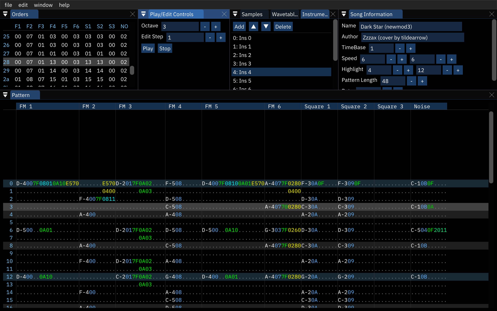

# Furnace



this is a work-in-progress chiptune tracker compatible with DefleMask modules (.dmf).

## features

- supports Sega Genesis, Master System, Game Boy, PC Engine, NES, C64, YM2151/PCM and Neo Geo!
- multiple sound chips in a single song!
- clean-room design (zero reverse-engineered code and zero decompilation; using official DMF specs, guesswork and ABX tests only)
- bug/quirk implementation for increased playback accuracy
- accurate emulation cores whether possible (Nuked, MAME, SameBoy, Mednafen PCE, puNES, reSID and ymfm)
- additional features on top:
  - SSG envelopes in Neo Geo
  - full duty/cutoff range in C64
  - ability to change tempo mid-song with `Cxxx` effect (`xxx` between `000` and `3fff`)
- open-source. GPLv2.

## downloads

check out the Releases page. available for Windows, macOS and Linux (AppImage).

# developer info

## dependencies

- CMake
- SDL2
- zlib
- JACK (optional)

SDL2 and zlib are included as submodules.

## compilation

your typical CMake project. clone (including submodules) and:

### Windows using MSVC

**no longer tested!** as of now tildearrow uses MinGW for Windows builds...

from the developer tools command prompt:

```
mkdir build
cd build
cmake ..
msbuild ALL_BUILD.vcxproj
```

### macOS and Linux

```
mkdir build
cd build
cmake ..
make
```

## usage

```
./furnace
```

this opens the program.

```
./furnace -console <file>
```

this will play a .dmf file.

```
./furnace -console -view commands <file>
```

this will play a .dmf file and enable the commands view.

```
./furnace -output audio.wav <file>
```

this will render a .dmf file to .wav.

# notes

> how do I use Neo Geo SSG envelopes?

the following effects are provided:

- `22xy`: set envelope mode.
  - `x` sets the envelope shape, which may be one of the following:
    - `0: \___` decay
    - `4: /___` attack once
    - `8: \\\\` saw
    - `9: \___` decay
    - `A: \/\/` inverse obelisco
    - `B: \¯¯¯` decay once
    - `C: ////` inverse saw
    - `D: /¯¯¯` attack
    - `E: /\/\` obelisco
    - `F: /___` attack once
  - if `y` is 1 then the envelope will affect this channel.
- `23xx`: set envelope period low byte.
- `24xx`: set envelope period high byte.
- `25xx`: slide envelope period up.
- `26xx`: slide envelope period down.

a lower envelope period will make the envelope run faster.

> how do I use C64 absolute filter/duty?

on Instrument Editor in the C64 tab there are two options to toggle these.
also provided are two effects:

- `3xxx`: set fine duty.
- `4xxx`: set fine cutoff. `xxx` range is 000-7ff.

> my song sounds very odd at a certain point

file a bug report. use the Issues page.

it's probably another playback inaccuracy.

> my song sounds correct, but it doesn't in DefleMask

file a bug report **here**. it still is a playback inaccuracy.

> my C64 song sounds terrible after saving as .dmf!

that's a limitation of the DefleMask format. save in Furnace song format instead (.fur).
