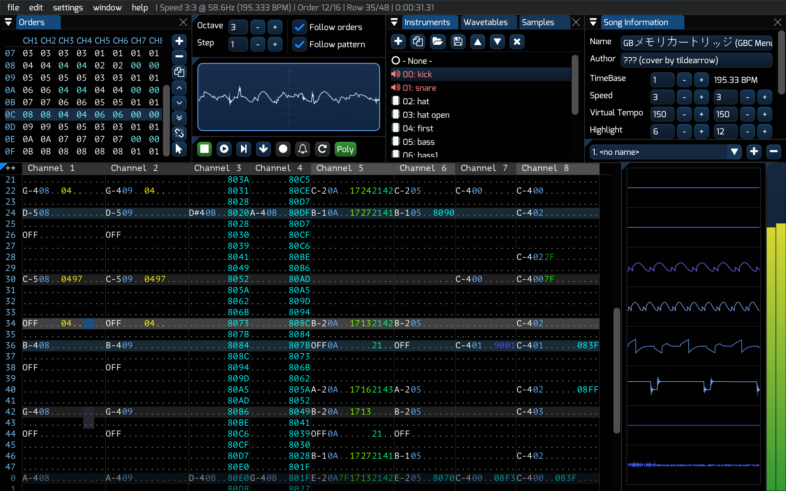

# Furnace (chiptune tracker)



the biggest multi-system chiptune tracker ever made!

[downloads](#downloads) | [discussion/help](#quick-references) | [developer info](#developer-info) | [unofficial packages](#unofficial-packages) | [FAQ](#frequently-asked-questions)

---
## downloads

check out the [Releases](https://github.com/tildearrow/furnace/releases) page. available for Windows, macOS and Linux (AppImage).

[see here](https://nightly.link/tildearrow/furnace/workflows/build/master) for unstable developer builds.

## features

- over 50 sound chips - and counting:
  - Yamaha FM chips:
    - YM2151 (OPM)
    - YM2203 (OPN)
    - YM2413 (OPLL)
    - YM2414 (OPZ) used in Yamaha TX81Z
    - YM2608 (OPNA) used in PC-98
    - YM2610 (OPNB) used in Neo Geo
    - YM2610B (OPNB2)
    - YM2612 (OPN2) used in Sega Genesis and FM Towns
    - YM3526 (OPL) used in C64 Sound Expander
    - YM3812 (OPL2)
    - YMF262 (OPL3) with full 4-op support!
    - Y8950 (OPL with ADPCM)
  - square wave chips:
    - AY-3-8910/YM2149(F) used in several computers and game consoles
    - Commodore VIC used in the VIC-20
    - Microchip AY8930
    - TI SN76489 used in Sega Master System and BBC Micro
    - PC Speaker
    - Philips SAA1099 used in SAM Coupé
    - OKI MSM5232 used in some arcade boards
  - sample chips:
    - SNES
    - Amiga
    - SegaPCM - all 16 channels
    - Capcom QSound
    - Yamaha YMZ280B (PCMD8)
    - Ricoh RF5C68 used in Sega CD and FM Towns
    - OKI MSM6258 and MSM6295
    - Konami K007232
    - Irem GA20
  - wavetable chips:
    - HuC6280 used in PC Engine
    - Konami Bubble System WSG
    - Konami SCC/SCC+
    - Namco arcade chips (WSG/C15/C30)
    - WonderSwan
    - Seta/Allumer X1-010
  - NES (Ricoh 2A03/2A07), with additional expansion sound support:
    - Konami VRC6
    - Konami VRC7
    - MMC5
    - Famicom Disk System
    - Sunsoft 5B
    - Namco 163
    - Family Noraebang (OPLL)
  - SID (6581/8580) used in Commodore 64
  - Mikey used in Atari Lynx
  - ZX Spectrum beeper (SFX-like engine)
  - Pokémon Mini
  - Commodore PET
  - TIA used in Atari 2600
  - POKEY used in Atari 8-bit computers
  - Game Boy
  - Virtual Boy
  - modern/fantasy:
    - Commander X16 VERA
    - tildearrow Sound Unit
- mix and match sound chips!
  - over 200 ready to use presets from computers, game consoles and arcade boards...
  - ...or create your own - up to 32 of them or a total of 128 channels!
- DefleMask compatibility
  - loads .dmf modules from all versions (beta 1 to 1.1.5)
  - saves .dmf modules - both modern and legacy
    - Furnace doubles as a module downgrader
  - loads/saves .dmp instruments and .dmw wavetables as well
  - clean-room design (guesswork and ABX tests only, no decompilation involved)
  - some bug/quirk implementation for increased playback accuracy through compatibility flags
- VGM export
- modular layout that you may adapt to your needs
- audio file export - entire song, per chip or per channel
- quality emulation cores (Nuked, MAME, SameBoy, Mednafen PCE, NSFplay, puNES, reSID, Stella, SAASound, vgsound_emu and ymfm)
- wavetable synthesizer
  - available on wavetable chips
  - create complex sounds with ease - provide up to two wavetables, select and effect and let go!
- MIDI input support
- additional features:
  - FM macros!
  - negative octaves
  - advanced arp macros
  - arbitrary pitch samples
  - sample loop points
  - SSG envelopes and ADPCM-B in Neo Geo
  - pitchable OPLL drums
  - full duty/cutoff range in C64
  - full 16-channel SegaPCM
  - ability to change tempo mid-song
  - decimal tempo/tick rate
  - multiple sub-songs in a module
  - per-channel oscilloscope with waveform centering
  - built-in sample editor
  - chip mixing settings
  - built-in visualizer in pattern view
- open-source under GPLv2 or later.

---
# quick references

 - **discussion**: see the [Discussions](https://github.com/tildearrow/furnace/discussions) section, or (preferably) the [official Discord server](https://discord.gg/EfrwT2wq7z).
 - **help**: check out the [documentation](papers/doc/README.md). it's mostly incomplete, but has details on effects.

## unofficial packages

[](https://repology.org/project/furnace/versions)

some people have provided packages for Unix/Unix-like distributions. here's a list.
 - **Arch Linux**: [furnace](https://archlinux.org/packages/community/x86_64/furnace/) is now in the community repo!
 - **FreeBSD**: [a package in ports](https://www.freshports.org/audio/furnace/) is available courtesy of ehaupt.
 - **Nix**: [package](https://search.nixos.org/packages?channel=unstable&show=furnace&from=0&size=50&sort=relevance&type=packages&query=furnace) thanks to OPNA2608.
 - **openSUSE**: [a package](https://software.opensuse.org/package/furnace) is available, courtesy of fpesari.

---
# developer info

[](https://github.com/tildearrow/furnace/actions/workflows/build.yml)

if you can't download these artifacts (because GitHub requires you to be logged in), [go here](https://nightly.link/tildearrow/furnace/workflows/build/master) instead.

**NOTE: do not download the project's source as a .zip or .tar.gz as these do not include the project's submodules which are necessary to proceed with building. please instead use Git as shown below.**

## dependencies

- CMake
- JACK (optional, macOS/Linux only)

if building under Windows or macOS, no additional dependencies are required.
otherwise, you may also need the following:

- libpulse
- libx11
- libasound
- libGL

some Linux distributions (e.g. Ubuntu or openSUSE) will require you to install the `-dev` versions of these.

## getting the source

type the following on a terminal/console: (make sure Git is installed)

```
git clone --recursive https://github.com/tildearrow/furnace.git
cd furnace
```

(the `--recursive` parameter ensures submodules are fetched as well)

## compilation

your typical CMake project.

### Windows using MSVC

as of now tildearrow uses MinGW for Windows builds, but thanks to OPNA2608 this works again!

from the developer tools command prompt:

```
mkdir build
cd build
cmake ..
msbuild ALL_BUILD.vcxproj
```

### macOS and Linux

```
mkdir build
cd build
cmake ..
make
```
Alternatively, build scripts are provided in the `scripts/` folder in the root of the repository.

### CMake options

To add an option from the command-line: `-D<NAME>=<VALUE>`  
Example: `cmake -DBUILD_GUI=OFF -DWARNINGS_ARE_ERRORS=ON ..`

Available options:

| Name | Default | Description |
| :--: | :-----: | ----------- |
| `BUILD_GUI` | `ON` | Build the tracker (disable to build only a headless player) |
| `USE_RTMIDI` | `ON` | Build with MIDI support using RtMidi |
| `USE_SDL2` | `ON` | Build with SDL2 (required to build with GUI) |
| `USE_SNDFILE` | `ON` | Build with libsndfile (required in order to work with audio files) |
| `USE_BACKWARD` | `ON` | Use backward-cpp to print a backtrace on crash/abort |
| `WITH_JACK` | `ON` if system-installed JACK detected, otherwise `OFF` | Whether to build with JACK support. Auto-detects if JACK is available |
| `SYSTEM_FFTW` | `OFF` | Use a system-installed version of FFTW instead of the vendored one |
| `SYSTEM_FMT` | `OFF` | Use a system-installed version of fmt instead of the vendored one |
| `SYSTEM_LIBSNDFILE` | `OFF` | Use a system-installed version of libsndfile instead of the vendored one |
| `SYSTEM_RTMIDI` | `OFF` | Use a system-installed version of RtMidi instead of the vendored one |
| `SYSTEM_ZLIB` | `OFF` | Use a system-installed version of zlib instead of the vendored one |
| `SYSTEM_SDL2` | `OFF` | Use a system-installed version of SDL2 instead of the vendored one |
| `WARNINGS_ARE_ERRORS` | `OFF` (but consider enabling this & reporting any errors that arise from it!) | Whether warnings in furnace's C++ code should be treated as errors |
| `WITH_DEMOS` | `ON` | Install demo songs on `make install` |
| `WITH_INSTRUMENTS` | `ON` | Install demo instruments on `make install` |

## console usage

```
./furnace
```

this opens the program.

```
./furnace -console <file>
```

this will play a compatible file.

```
./furnace -console -view commands <file>
```

this will play a compatible file and enable the commands view.

**note that these commands only actually work in Linux environments. on other command lines, such as Windows' Command Prompt, or MacOS Terminal, it may not work correctly.**

---
# frequently asked questions

> woah! 50 sound chips?! I can't believe it!

yup, it's real.

> where's the manual?

see [papers/](papers/doc/README.md). it's kind of incomplete, but at least the sound chips section is there.

> it doesn't open under macOS!

this is due to Apple's application signing policy. a workaround is to right click on the Furnace app icon and select Open.

**as of Monterey, this workaround no longer works (especially on ARM).** yeah, Apple has decided to be strict on the matter.
if you happen to be on that version, use this workaround instead (on a Terminal):

```
xattr -d com.apple.quarantine /path/to/Furnace.app
```

(replace /path/to/ with the path where Furnace.app is located)

you may need to log out and/or reboot after doing this.

> .spc export?

**not yet!** coming in 0.7 though, eventually...

> how do I use C64 absolute filter/duty?

on Instrument Editor in the C64 tab there are two options to toggle these.
also provided are two effects:

- `3xxx`: set fine duty.
- `4xxx`: set fine cutoff. `xxx` range is 000-7ff.
additionally, you can change the cutoff and/or duty as a macro inside an instrument by clicking the `absolute cutoff macro` and/or `absolute duty macro` checkbox at the bottom of the instrument. (for the filter, you also need to click the checkbox that says `volume macro is cutoff macro`.)

> how do I use PCM on a PCM-capable chip?

two possibilities:
- the recommended way is by creating the "Sample" type instrument and assigning a sample to it.
- otherwise you may employ the DefleMask-compatible method, using `17xx` effect.

> my .dmf song sounds very odd at a certain point

file a bug report. use the Issues page. it's probably another playback inaccuracy.

> my .dmf song sounds correct, but it doesn't in DefleMask

file a bug report **here**. it still is a playback inaccuracy.

> my song sounds terrible after saving as .dmf!

the DefleMask format has several limitations. save in Furnace song format instead (.fur).

> how do I solo channels?

right click on the channel name.

---
# footnotes

copyright (C) 2021-2022 tildearrow and contributors.

This program is free software; you can redistribute it and/or modify it under the terms of the GNU General Public License as published by the Free Software Foundation; either version 2 of the License, or (at your option) any later version.

This program is distributed in the hope that it will be useful, but WITHOUT ANY WARRANTY; without even the implied warranty of MERCHANTABILITY or FITNESS FOR A PARTICULAR PURPOSE.  See the GNU General Public License for more details.

You should have received a copy of the GNU General Public License along with this program; if not, write to the Free Software Foundation, Inc., 51 Franklin Street, Fifth Floor, Boston, MA 02110-1301 USA.


despite the fact this program works with the .dmf file format, it is NOT affiliated with Delek or DefleMask in any way, nor it is a replacement for the original program.
