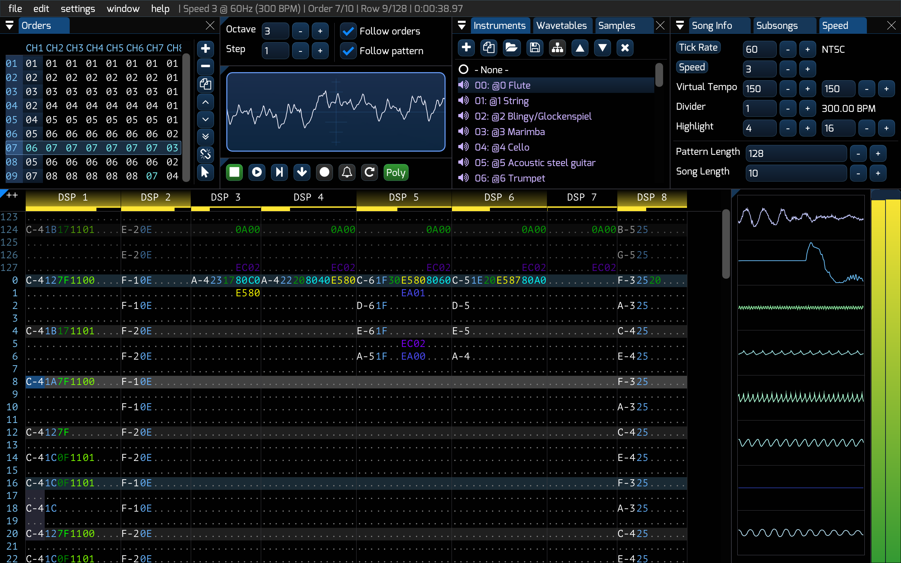

# Furnace (chiptune tracker)



the biggest multi-system chiptune tracker ever made!

[downloads](#downloads) | [discussion/help](#quick-references) | [developer info](#developer-info) | [Unix/Linux packages](#packages)

---
## downloads

check out the [Releases](https://github.com/tildearrow/furnace/releases) page. available for Windows, macOS and Linux.

for other operating systems, you may [build the source](#developer-info).

[see here](https://nightly.link/tildearrow/furnace/workflows/build/master) for the latest unstable build.

## features

- a large selection of sound chips:
  - Yamaha FM chips:
    - YM2151 (OPM)
    - YM2203 (OPN)
    - YM2413 (OPLL)
    - YM2414 (OPZ) used in Yamaha TX81Z
    - YM2608 (OPNA) used in PC-98
    - YM2610 (OPNB) used in Neo Geo
    - YM2610B (OPNB2)
    - YM2612 (OPN2) used in Sega Genesis and FM Towns
    - YM3526 (OPL) used in C64 Sound Expander
    - YM3812 (OPL2)
    - YMF262 (OPL3) with full 4-op support!
    - Y8950 (OPL with ADPCM)
  - ESS ESFM (like OPL3 but with more features)
  - square wave chips:
    - AY-3-8910/YM2149(F) used in several computers and game consoles
    - Commodore VIC used in the VIC-20
    - Microchip AY8930
    - TI SN76489 used in Sega Master System, BBC Micro, and many others
    - PC Speaker
    - Philips SAA1099 used in SAM Coupé
    - OKI MSM5232 used in some arcade boards
  - sample chips:
    - SNES
    - Amiga
    - SegaPCM - all 16 channels
    - Capcom QSound
    - Yamaha YMZ280B (PCMD8)
    - Ricoh RF5C68 used in Sega CD and FM Towns
    - OKI MSM6258 and MSM6295
    - Konami K007232
    - Konami K053260
    - Irem GA20
    - Ensoniq ES5506
    - Namco C140
    - Namco C219
  - wavetable chips:
    - HuC6280 used in PC Engine
    - Konami Bubble System WSG
    - Konami SCC/SCC+
    - Namco arcade chips (WSG/C15/C30)
    - WonderSwan
    - Seta/Allumer X1-010
    - Sharp SM8521 used in Tiger Game.com
  - NES (Ricoh 2A03/2A07), with additional expansion sound support:
    - Konami VRC6
    - Konami VRC7
    - MMC5
    - Famicom Disk System
    - Sunsoft 5B
    - Namco 163
    - Family Noraebang (OPLL)
  - SID (6581/8580) used in Commodore 64
  - Mikey used in Atari Lynx
  - ZX Spectrum beeper
    - SFX-like engine
    - QuadTone engine
  - Pokémon Mini
  - Commodore PET
  - TED used in Commodore Plus/4
  - Casio PV-1000
  - TIA used in Atari 2600
    - including software tuning engine (TIunA)
  - POKEY used in Atari 8-bit computers
  - **Game Boy**
    - including SOFTWARE ENVELOPES (zombie mode)
  - Virtual Boy
  - Game Boy Advance
    - DMA (direct memory access) two channel mode
    - MinMod software driver by Natt Akuma
  - Nintendo DS
  - modern/fantasy:
    - Commander X16 VERA
    - tildearrow Sound Unit
    - PowerNoise
    - Bifurcator
    - SID2
    - Generic PCM DAC
- mix and match sound chips!
  - over 200 ready to use presets from computers, game consoles and arcade boards...
  - ...or create your own presets - up to 32 chips or a total of 128 channels!
- DefleMask compatibility
  - loads .dmf modules from all versions (beta 1 to 1.1.9)
  - saves .dmf modules - both modern and legacy
    - Furnace doubles as a module downgrader
  - loads/saves .dmp instruments and .dmw wavetables as well
  - clean-room design (guesswork and ABX tests only, no decompilation involved)
  - some bug/quirk implementation for increased playback accuracy through compatibility flags
- VGM export
- ZSM export for Commander X16
- TIunA export for Atari 2600
- modular layout that you may adapt to your needs
- audio file export - entire song, per chip or per channel
- quality emulation cores (Nuked, MAME, SameBoy, Mednafen PCE, NSFplay, puNES, reSID, Stella, SAASound, vgsound_emu and ymfm)
- wavetable synthesizer
  - available on wavetable chips
  - create complex sounds with ease - provide up to two wavetables, select an effect and let go!
- MIDI input support
- additional features:
  - FM macros!
  - negative octaves
  - advanced arp macros
  - arbitrary pitch samples
  - sample loop points
  - SSG envelopes and ADPCM-B in Neo Geo
  - pitchable OPLL drums
  - full duty/cutoff range in C64
  - full 16-channel SegaPCM
  - ability to change tempo mid-song
  - decimal tempo/tick rate
  - multiple sub-songs in a module
  - per-channel oscilloscope with waveform centering
  - built-in sample editor
  - chip mixing settings
  - built-in visualizer in pattern view
- open-source under GPLv2 or later.

---
# quick references

- **help**: check out the [documentation](doc/README.md), [quick start guide](doc/1-intro/quickstart.md), and [frequently asked questions (FAQ)](doc/1-intro/faq.md).
- **discussion**: see the [Discussions](https://github.com/tildearrow/furnace/discussions) section, or the [Discord](https://discord.gg/QhA26dXD23).

## packages

[](https://repology.org/project/furnace/versions)

some people have provided packages for Unix/Unix-like distributions. here's a list.

- **Flatpak**: yes! Furnace is now available on [Flathub](https://flathub.org/apps/org.tildearrow.furnace) thanks to ColinKinloch.

- **Arch Linux**: [furnace](https://archlinux.org/packages/extra/x86_64/furnace/) is in the official repositories.
- **Chimera Linux**: [furnace](https://pkgs.chimera-linux.org/package/current/contrib/x86_64/furnace) is in the contrib repository.
- **FreeBSD**: [a package in ports](https://www.freshports.org/audio/furnace/) is available courtesy of ehaupt.
- **Nix**: [package](https://search.nixos.org/packages?channel=unstable&show=furnace&from=0&size=50&sort=relevance&type=packages&query=furnace) thanks to OPNA2608.
- **openSUSE**: [a package](https://software.opensuse.org/package/furnace) is available, courtesy of fpesari.
- **Void Linux**: [furnace](https://github.com/void-linux/void-packages/tree/master/srcpkgs/furnace) is available in the official repository.

---
# developer info

[](https://github.com/tildearrow/furnace/actions/workflows/build.yml)

if you can't download these artifacts (because GitHub requires you to be logged in), [go here](https://nightly.link/tildearrow/furnace/workflows/build/master) instead.

**NOTE: do not download the project's source as a .zip or .tar.gz as these do not include the project's submodules which are necessary to proceed with building. please instead use Git as shown below.**

## dependencies

- CMake
- Git (for cloning the repository)
- a C/C++ compiler (e.g. Visual Studio or MinGW on Windows, Xcode (the command-line tools are enough) on macOS or GCC on Linux)

if building under Windows or macOS, no additional dependencies are required.
otherwise, you may also need the following:

- libpulse
- libx11
- libasound
- libGL
- JACK (optional, macOS/Linux only)
- any other libraries which may be used by SDL

some Linux distributions (e.g. Ubuntu or openSUSE) will require you to install the `-dev`/`-devel` versions of these.

on Linux, having libintl is recommended for locale support, but if it isn't present, Furnace will use its own implementation.

## development environment setup (Windows)

this little section will teach you how to get either Visual Studio or MinGW ready for building Furnace.

### MinGW through MSYS2

I recommend you to use this because the compiler produces faster builds and it doesn't use a lot of disk space.
there's some command line-fu in here, so I hope you're prepared.

install it through [MSYS2](https://www.msys2.org/), a Linux-like environment for Windows.
follow the guide up to step 4.

MSYS2 provides a variety of environments, but we'll work with the MINGW64 one. don't "run MSYS2 now". go to the Start menu and launch MSYS2 with the MINGW64 environment (blue icon).

we'll install a couple packages, including GCC, CMake, Git and Ninja.
type the following in the MSYS2 console, and then press Enter.

```
pacman -S mingw-w64-x86_64-cmake mingw-w64-x86_64-ninja mingw-w64-x86_64-gcc git
```

when prompted to, type Y and press Enter again.

proceed to the "getting the source" section.

### Visual Studio (the real one)

if you are patient enough, can stand 50GB of stuff and want the Microsoft experience, you may install [Visual Studio](https://visualstudio.microsoft.com) (no, not "Code"... that's just a text editor with IDE features). it is an easy-to-use IDE and compiler that comes in both free and paid versions.

the installer also lets you install Git and CMake. Visual Studio integrates nicely with these.
however I recommend you install Git standalone so you can clone the repo correctly.

## development environment setup (macOS)

install the Xcode command line tools. open a Terminal and type:

```
xcode-select --install
```

if you would like to, and are able to use the App Store, feel free to get Xcode instead.

## development environment setup (Linux/Unix-like)

get GCC, Git and CMake through your package manager.

## getting the source

type the following on a terminal/console: (make sure Git is installed)

```
git clone --recursive https://github.com/tildearrow/furnace.git
cd furnace
```

(the `--recursive` parameter ensures submodules are fetched as well)

## compilation

### Windows using MSVC/Visual Studio

if you've downloaded the entirety of Visual Studio, including the IDE:

#### let Visual Studio do the work for you

make sure you installed CMake through the Visual Studio installer.
just open the CMake project and you're good to go.

#### nah, leave it to me instead

make sure CMake is installed. `cd` to the Furnace directory and then:

```
mkdir build
cd build
cmake -G "Visual Studio 17 2022" ..
```

then open the solution file in Visual Studio and build.

### Windows using MSVC/Visual Studio (command line tools only)

open a developer tools command prompt, and run CMake as described in the previous section.

afterwards, build Furnace by using:

```
msbuild ALL_BUILD.vcxproj
```

### Windows using MinGW (through MSYS2)

open the MSYS2 MINGW64 environment. `cd` to the Furnace directory and then do:

```
mkdir build
cd build
cmake ..
ninja
```

### bonus: Windows using MinGW (standalone)

although I recommend you install MSYS2 and get MinGW from there, there also is [a standalone MinGW](https://www.mingw-w64.org/downloads/#mingw-w64-builds) available.
if you happen to use that, then do:

```
mkdir build
cd build
cmake -G "MinGW Makefiles" ..
mingw32-make
```

### macOS, Linux and other Unix/Unix-like

the process is straightforward.

```
mkdir build
cd build
cmake ..
make
```

#### I like Xcode

on macOS you may do the following instead:

```
mkdir build
cd build
cmake -G Xcode ..
```

...and then load the project on Xcode or type `xcodebuild`.

### CMake options

to add an option from the command-line, add it before the two dots: `-D<NAME>=<VALUE>`  
Example: `cmake -DBUILD_GUI=OFF -DWARNINGS_ARE_ERRORS=ON ..`

Available options:

| Name                          |Default| Description
| :---------------------------: | :---: | ---------------------------------------------------------------------------------------------
| `BUILD_GUI`                   | `ON`  | Build the tracker (disable to build only a headless player)
| `WITH_LOCALE`                 | `ON`  | Enable language support
| `USE_RTMIDI`                  | `ON`  | Build with MIDI support using RtMidi
| `USE_SDL2`                    | `ON`  | Build with SDL2 (required to build with GUI)
| `USE_SNDFILE`                 | `ON`  | Build with libsndfile (required in order to work with audio files)
| `USE_BACKWARD`                | `ON`  | Use backward-cpp to print a backtrace on crash/abort
| `USE_FREETYPE`                | `OFF` | Build with FreeType support
| `USE_MOMO`                    | auto¹ | Build a libintl implementation instead of using the system one
| `WITH_JACK`                   | auto² | Whether to build with JACK support. Auto-detects if JACK is available
| `WITH_PORTAUDIO`              | `ON`  | Whether to build with PortAudio.
| `SYSTEM_FFTW`                 | `OFF` | Use a system-installed version of FFTW instead of the vendored one
| `SYSTEM_FMT`                  | `OFF` | Use a system-installed version of fmt instead of the vendored one
| `SYSTEM_LIBSNDFILE`           | `OFF` | Use a system-installed version of libsndfile instead of the vendored one
| `SYSTEM_RTMIDI`               | `OFF` | Use a system-installed version of RtMidi instead of the vendored one
| `SYSTEM_ZLIB`                 | `OFF` | Use a system-installed version of zlib instead of the vendored one
| `SYSTEM_SDL2`                 | `OFF` | Use a system-installed version of SDL2 instead of the vendored one
| `SYSTEM_FREETYPE`             | `OFF` | Use a system-installed version of FreeType instead of the vendored one
| `SUPPORT_XP`                  | `OFF` | Build a Windows XP-compatible binary
| `WARNINGS_ARE_ERRORS`         | `OFF`³| Whether warnings in furnace's C++ code should be treated as errors
| `WITH_DEMOS`                  | `OFF` | Install demo songs on `make install`
| `WITH_INSTRUMENTS`            | `ON`  | Install demo instruments on `make install`
| `WITH_WAVETABLES`             | `ON`  | Install wavetables on `make install`
| `SHOW_OPEN_ASSETS_MENU_ENTRY` | `OFF` | Show option to open built-in assets directory (on supported platforms)
| `CONSOLE_SUBSYSTEM`           | `OFF` | Build with subsystem set to Console on Windows
| `FORCE_APPLE_BIN`             | `OFF` | Enable installation of binaries (when doing `make install`) to PREFIX/bin on Apple platforms

(¹) enabled by default if both libintl and setlocale aren't present (MSVC and Android), or on macOS

(²) `ON` if system-installed JACK detected, otherwise `OFF`

(³) but consider enabling this and reporting any errors that arise from it!

## CMake Error

if it says something about a missing subdirectory in `extern`, then either:

1. you didn't set up submodules, or
2. you downloaded the source as a .zip or .tar.gz. don't do this.

if 1, you may run `git submodule update --init --recursive`. this will initialize submodules.

if 2, clone this repo.

## console usage

(note: if on Windows, type `furnace.exe` instead, or `Debug\furnace.exe` on MSVC)

```
./furnace
```

this opens the program.

```
./furnace -console <file>
```

this will play a compatible file.

```
./furnace -console -view commands <file>
```

this will play a compatible file and enable the commands view.

**note that console mode may not work correctly on Windows. you may have to quit using the Task Manager.**

---

# footnotes

copyright (C) 2021-2025 tildearrow and contributors.

This program is free software; you can redistribute it and/or modify it under the terms of the GNU General Public License as published by the Free Software Foundation; either version 2 of the License, or (at your option) any later version.

This program is distributed in the hope that it will be useful, but WITHOUT ANY WARRANTY; without even the implied warranty of MERCHANTABILITY or FITNESS FOR A PARTICULAR PURPOSE.  See the GNU General Public License for more details.

You should have received a copy of the GNU General Public License along with this program; if not, write to the Free Software Foundation, Inc., 51 Franklin Street, Fifth Floor, Boston, MA 02110-1301 USA.


Furnace is NOT affiliated with Delek or DefleMask in any form, regardless of its ability to load and save the .dmf, .dmp and .dmw file formats.
additionally, Furnace does not intend to replace DefleMask, nor any other program.
