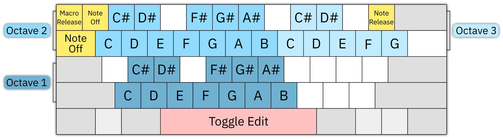

<!--
NOTES TO AUTHOR:
* keep it casual, don't ELI5 it
* put graphics where {{ subject }} placeholders are
* provide a quickstart.fur with example assets of each type
-->

# quick start guide

first things first: thank you for taking the time to understand Furnace, the world's most comprehensive chiptune tracker. it's amazingly versatile, but it can also be intimidating, even for those already familiar with trackers. this quick start guide will get you on the road to making the chiptunes of your dreams! it will probably take about an hour <!-- estimate, test and revise it when done --> from start to finish.

this guide makes a few assumptions:
* you've already installed Furnace.
* you haven't changed any configuration or layout yet.
* you're working with a PC keyboard. Mac users should already know the equivalents to the `Ctrl` and `Alt` keys.
* you're comfortable with keyboard shortcuts. if not, a lot of this can also be done using buttons or menus, but please try the keyboard first. it's worth it to smooth out the tracking workflow.

if an unfamiliar term comes up or you need more clarification on a term, refer to the [basic concepts](concepts.md) and [glossary](glossary.md) docs.

if you're not already familiar with the ImGui style of interface, you might want to take a quick glance at the [UI components](../2-interface/components.md) documentation. if at any point something goes wrong with the interface – something gets moved to where it's inaccessible, something closes a window or tab unexpectedly, or the like – it can always be reverted to its original state by selecting "reset layout" from the "settings" menu.

with all that said, start up the program and let's get going!

## I've opened Furnace – now what?

there's a lot going on, but the most prominent part of Furnace's interface is the **pattern view** – the spreadsheet-like table that takes up most of the screen.

{{ pattern view }}

click to place the cursor somewhere in this view. it will appear as a medium-blue highlight. try moving around with the up and down arrow keys. also try the `PgUp` and `PgDn` keys to move around faster. the vertical axis represents time, and the view scrolls around a highlighted row that stays put in the center; this is called the **playhead**, and it will follow along when the song is playing.

now try the left and right arrow keys to move between columns. while we're at it, use the `Home` and `End` keys to quickly get to the first and last columns. pressing them twice will also shuttle you to the top or bottom row. when you're done, hit `Home` twice to return to the top-left.

if the playhead is dark red, use the space bar to turn it grey. this puts the keyboard in play mode, which will let us try out notes before committing them to the track.

now, let's play a little! try the first seven letters on the bottom row of the keyboard (for QWERTY, these are `ZXCVBNM`). they should sound out the seven notes of a C major scale, like the white keys of a piano. similarly, the row above that has the black keys. once you're tried those, move two rows up to find the same arrangement but one octave higher, and it extends a little further into the next octave also. to change octaves, use the `/` and `*` keys on the numeric pad. (if you don't have a numeric pad, the keys can be remapped; the [keyboard](../2-interface/keyboard.md) doc explains how.)

press the space bar to change from play to edit mode. now try playing some notes; they should appear in the pattern view, one after another.

{{ notes in one channel }}

each **channel** is a group of columns separated from the others by a faint vertical line, and each channel can only ever play one note at a time. to hear this in action, move the cursor back to the top and press the `Return` key to start playback. you should hear the notes you entered played back quickly, one after another, each cutting off the previous note. if you let it play long enough, it'll wrap around to the start to go through them again; press `Return` again to stop playback.

now let's clear out those notes. you could delete them individually with the `Del` key, but let's try something else first. click and drag to select them all. you'll know they're selected when they have a medium grey background. try moving them around by clicking in the selected area and dragging it to another channel. (this may not work with some input devices.) then hit `Del` to delete them all at once.

{{ selection area? }}

you'll usually want more than one note playing at a time. move back to the start of the pattern in the leftmost column of the leftmost channel – this should clear the selection area. put some different notes next to each other in the same row. only enter notes in the first column of each channel; we'll get to those other columns later. (don't do more than six notes at once yet. we want to stay in the channels labelled "FM" for now.) once those are in place, go back to the top row and use the `Return` key to start playback. they should all sound at the same time as one single chord.

{{ notes across three channels }}

that chord will ring out for quite some time, but let's try stopping it early. a few rows after that chord, use the `Tab` or `1` key to enter a **note off** (sometimes called "note cut") in each channel that has a note. it'll appear as `OFF` in the note column. now try the shortcut `F5` to play from the start without having to move there. you should hear the chord as before, then it will abruptly stop where the note offs are, as though letting off the keys of a piano.

{{ notes across channels with note offs beneath them }}

of course, errors can happen. let's pretend those note offs were a bad idea and undo them with `Ctrl-Z`. Furnace keeps track of multiple levels of undo. undo will work for the pattern view, any text entry box, and a few other places; try it out here and there along the way to get a sense for what it can undo for you! for now, let's change our minds again and put those note offs back with redo, which is `Ctrl-Y`.

before the next part of this guide, save the current **module** – the tracker file that contains everything needed for a song. use `Ctrl-S` and pick a good spot on your computer for the file. Furnace modules always have a filename that ends in a `.fur` extension.

## how do I get different sounds?

at the top of the interface, just right of center, is the **instrument** list. there are also tabs for wavetables and samples, but we'll get to those later. just like physical instruments, these define the sounds we can use in the track. unlike physical instruments, these sounds can be endlessly redefined.

{{ empty instrument list }}

click the `+` button to add a new instrument. a small list of instrument types will pop up, one for each type supported by the chips in use. select "FM (OPN)", and the new instrument will appear in the list as "00: Instrument 0". this will sound the same as the default instrument (listed as "- None -").

we still need something new and different, so let's pull from another module. open up a second instance of Furnace and use `Ctrl-O` to open the `quickstart.fur` <!-- this filename? --> file included with Furnace in its `demos` <!-- this location? --> directory. the instrument list will contain "00: synth brass" <!-- this name? -->; select it, then use the floppy-disk save icon above it to save it wherever you like. Furnace instrument filenames end with the `.fui` extension.

let's return to the first instance with our slowly-evolving practice track. load up the new instrument; click the folder button left of the "save instrument" button and select the file. it will appear in the list as "01: synth brass" <!-- this name? -->, and it should already be highlighted.

{{ less empty instrument list }}

click into the pattern view and add some notes. the number `01` appears next to them; this is the instrument column, and it can be edited directly by typing in the number desired. generally, each note should have an associated instrument value.

{{ small chunk of pattern view showing filled-in instrument value }}

<!--
making new sounds for FM synthesis (the type of sound we've been using) is well beyond the scope of this guide, but when you've worked through this and are ready to try, YouTube user "funute" has assembled a fantastic ["crash course"](https://www.youtube.com/watch?v=cDJ1z-4YsYM) that will help. until then, let's move on.
-->

## how do I change volume?

next to the instrument column is the **volume** column. typing in it will change the loudness of the associated note... but it's not always as straightforward as it seems.

for one thing, this column operates in [hexadecimal](hex.md). in fact, so does the instrument column, and so will the others when we get to them. if you're ever uncertain what the decimal equivalent is, put your cursor over the volume in question and look to the menu bar, which doubles as a status bar. after the menus, it will show "Set volume:", then the decimal value, hexadecimal value, and percentage of full volume.

also, if you haven't saved your recent edits, there will be an indicator at the end which shows the "modified status". it might be worth saving now.

try typing `6C` into the volume column of an existing note, then play it back. it should be much quieter than those before it in the column because they default to full volume  – in this case, `7F`. everything in the column after our `6C` will inherit that volume level until it's changed again, so you don't have to enter volumes for every single note.

{{ chunk of pattern view showing volume entry }}

now try putting `90` in the volume column. it automatically changes to `7F` because that's the maximum volume available for this channel. different channels may have different maximum volumes because of how each chip works.

it gets a little stranger yet. some chips use "linear" volume, which translates directly to amplitude; dividing the value in half results in half the volume. other chips, such as the one we're using right now, use "logarithmic" volume; subtracting from it lowers the volume based on how loud it _sounds._ in this particular case, subtracting 8 to get `77` lowers the volume by half; subtracting 8 again to get `6F` lowers it to one-quarter. this takes some getting used to, but it's more convenient in some ways.

there are more ways to change volume using **effects**. clear out all but one note using our synth brass instrument, and set it to full volume (`7F`). next to the volume column are the effect columns. the first of them is the effect type column, and it stores... the type of effect. in that column, type `0A`; this corresponds to the "volume slide" effect. next to that, in the effect value column, type `02`. hit the `F5` key to play from the start, and you'll hear the note play, but instead of staying at a steady volume it'll smoothly fade out.

{{ chunk of pattern view showing effect entry }}

`0A` is an interesting effect because its two-digit value is split. look to the "effect list" to the right of the pattern view and find `0Axy`. the description includes "(0y: down; x0: up)". this means that while value `01` is a slow fade out and `0F` is the fastest, a value of `10` is a slow fade in and `F0` is the fastest. try it now; go to row 16 in the same channel and type an effect of `0A20`, then play again. the note will fade out until it hits that new effect, then fade back in to full volume! also note that putting the cursor on an effect will show the effect type and description in the status bar.

it's important to know that _most_ effects are continuous, meaning they will continue to do what they do until explicitly stopped. volume slides are like this. place an effect type of `0A` on row 24. you can leave the effect value blank or type `00` there; these are equivalent, and both will stop the effect. play from the start, and when the note fades back in, it'll stop short and remain at less than full volume.

common effects are explained more thoroughly in the [effects](../3-pattern/effects.md) documentation. each chip may have its own specialized effects, which are covered in the [systems](../7-systems/) docs. however, those are best explored later.

on row 8, add a different note without a volume. play from the start, and you'll hear that the new note plays at the volume the previous one left off at. the result of the volume slide is kept in the "memory" of the channel. enter a value of `7F` and play again; it will start at full volume, then ramp down because the `0A` volume slide is still going.

## how do I make the song longer?

right now, our track is only about six and a half seconds long. this is because we only have one **order**. see, the term "pattern view" is slightly misleading in that a **pattern** is just one channel's worth of data; the pattern view shows all the patterns in an order at once. this can get confusing because sometimes both terms are both used to mean what we call an order, sometimes even within Furnace itself.

{{ default order view }}

at the top left of the interface we find the order view. similar to the pattern view, it's like a spreadsheet, but even simpler. from left to right, the top line shows short names for all the channels. each row of numbers beneath that shows which patterns play in that order. for the moment, only the first order `00` appears. click on the `+` button to the right of the row of channel labels, and another order row appears, not only labeled `01` but filled with that same number. click in the pattern view and move to the top-left (remember the `Home Home` shortcut?). you'll see that the new patterns are empty, though the pattern view does show the end of the previous pattern but faded out. try moving between these by clicking on their order numbers in the order list.

{{ order view with added row }}

go to the first order and make sure there are some notes in the first channel. now click on the pattern number to the right of the order number (in the "F1" column); it will increase to `01`, and the notes we could see in the pattern view have disappeared! not to worry, they're still stored in the that channel's pattern `00`. select order `01` and right-click that first pattern number; it will decrease to `00`, and the notes in it will reappear. this way, you can rearrange and reuse parts of your track without having to duplicate them all the time.

{{ order view with changed patterns }}

go back to the first order and put some notes in the first channel's pattern. next, right-click the button showing two overlaid pages; this is the "duplicate" button. clicking it normally will add a row that repeats the current order. right-clicking it creates a "deep clone", meaning that all the patterns in it are duplicated to new pattern numbers. when you want to make variations of the same patterns, this is somewhat faster than cut-and-paste (`Ctrl-X` and `Ctrl-V`, by the way, with `Ctrl-C` for copy).

the important take away here is that patterns exist independently of orders. the order list is a playlist of patterns that can be freely rearranged.

## how do I change tempo?

**tempo** and **speed** are a little tricky – in fact, for the purposes of Furnace, they mean different things! first, let's put some evenly-spaced notes in our first order.

{{ chunk of pattern with evenly-spaced notes }}

the most basic unit of time is the **tick**. almost always, videogame systems take actions based on each frame of video, and these most often happen at 60 times per second, usually expressed as 60Hz. (this is for NTSC systems; systems that expect PAL will use 50Hz, and arcade games can use all sorts of different values...) because of this timing, everything that happens during playback will happen on a tick, never in between ticks.

if we click on the "Speed" tab at the top-right of the interface, we'll see the "Base Tempo" line at the top has the tick rate shown as "60Hz" to the right. we could change the base tempo to something arbitrary and the tick rate would change accordingly, but this wouldn't be authentic to the system's capabilities, so let's leave the base tempo at 150. we see the calculated tempo two lines down, after the input for "Divider"; it reads 150.00 BPM.

{{ speed tab with tempo readout circled }}

beneath that is "Speed", set to 6. right now, each row takes 6 ticks to complete before moving to the next row. let's say we want things to be a little faster. play the current set of notes to hear their tempo first. then, change speed to 5; the tempo after "Divider" will now show 180.00 BPM. play our notes back, and they're definitely faster... perhaps faster than desired. it's possible to get tempos in between by alternating speeds; if you're interested, check out the documentation on [speeds and grooves](../8-advanced/grooves.md) later on.

<!--
* change row highlights for other time signatures?
-->

## what about those other channels?

here's where we really get into the nitty-gritty of our emulated videogame system. we've been using Furnace's default system, the Sega Genesis. it employs two very different sound chips. the first is the Yamaha YM2612, also known as the Yamaha OPN2; it uses frequency modulation (FM) synthesis to generate sounds, and that's what we've heard so far. the other sound chip is the Sega PSG; it's a programmable sound generator (PSG) that can only make square waves and variations of noise. it's nowhere near as versatile, but don't ignore it – it's an important part of the classic Genesis sound.

let's start by creating a new instrument, this time choosing "Sega PSG" from the list. the new "Instrument 2" appears in the instrument list, already selected. now click in the pattern view and change one of our existing notes to use the new instrument. the number will change color from soft blue to bright yellow; this means that the chosen instrument isn't meant for the chip it's being used on, and if played back, we'll only hear that familiar default FM instrument.

{{ chunk of pattern view showing normal instruments and one incorrect one }}

go ahead and undo that edit, then move to the channel labelled "Square 1", the first of the PSG's channels. try adding notes with the new instrument, and they'll work just fine without complaint. of course, they're plain, no-frills square waves. while we're here, try making them quieter by entering new volumes; since this chip only uses sixteen volume levels, `0F` is the maximum.

let's move to the noise channel now. the same instrument will work here, but playing different notes gets us different "pitches" of noise. this channel is both more and less versatile than it seems, with several notable quirks that we won't get into here, but take a look at [the chip's documentation](../7-systems/sms.md) later on.

## what about samples?

the FM side of the Sega Genesis has a special feature; channel 6 can be used to play back digital **samples**. this means that any recording – a snare drum, an orchestra hit, somebody talking, whatever you have – can be part of the music.

go back to that second instance of Furnace. just as we saved an instrument last time, let's switch to the "Samples" tab and select the lone sample there, "0: woodwind" <!-- or whatever we dig up -->, then save it as a `.wav` file. swap back to the instance of Furnace we've been working in, and load it.

{{ samples tab? }}

in order to use the sample, we want to make an instrument that references it. right-click on it in the list and select "make instrument". the "Instrument Editor" window will pop up to show us that we have an instrument 3 named "woodwind", a type of "Generic Sample", and below that, the sample selected is "woodwind". while we're at it, let's change the instrument name to "flute" since that's what it sounds like; just select that first "woodwind" and type over it.

now, let's hear it in action. close the instrument editor, then clear out everything in the patterns of our first order. (either delete what's there, or adjust orders to get it out of the way.) switch to our brass instrument and put a C-4 note in channel "FM 5". now switch back to our new flute instrument and put a C-4 note in channel "FM 6". wait a second – that's not a C-4 note!

it turns out the sample was recorded at F-3, but Furnace has no way to know that. we can fix this. there's a more detailed explanation in the [sample tuning guide](../9-guides/tuning-samples.md) but for now, go back to the sample editor. click the Note dropdown near the center of the top half, select "F-3", and play the track again. much better!

{{ sample editor }}

an important note: in this case, we can use a Generic Sample instrument type just fine, but there are chips that use samples in specialized ways. always check [the chip's documentation](../7-systems/) to find the best way to use samples with it.

## what about wavetables?

some chips can use **wavetables**, which are a lot like very short looping samples. one of these is the Game Boy. let's start a new file, either from the menu or with `Ctrl-N`. a dialog box pops up to ask which system we want; type "boy" in the search and it can be easily located in the results.

in our brand new song, we'll want to add a new wavetable. between the "Instruments" and "Samples" tabs, select "Wavetables". add a new one with the `+` button. Furnace will generate a wavetable of the right size for the current chip, and it will already have a sawtooth wave in it.

{{ wavetables list }}

double-click that new entry to open the "Wavetable Editor". you'll see a line of large pixel-like blocks. this is our sawtooth wave; nice as those are, let's get creative. click anywhere in that area and "draw" a new wave, something interesting. note that at the bottom of the window, there's a line of numbers that change as you edit. you can edit the numbers directly to change the values above; keep this in mind for later. once you're happy with this one, make at least two more, just for later demonstration purposes.

{{ wavetable editor }}

right now, we can't do much with this wavetable; as with samples, it needs an instrument. this time we can't just create one directly from the wavetable, so go to the instruments list and add a new one. open it up in the instrument editor, name it whatever you like, then select its "Macros" tab.

we'll get to macros in more detail in a bit, but for now, simply click the down-arrow next to "Wavetable". click the `+` button that appears; a column will turn grey in the box to the right. click in the middle of that column and it turns half orange; this is how you select which wavetable to use for this instrument. it's like a bar graph.

{{ instrument editor on macros tab }}

close the wavetable editor, move the instrument editor off to the side, and click into the "Wavetable" channel in the pattern view. add a few notes to get a good sense of their tone. in the instrument editor, change that macro to a different value, and play the notes again to hear the difference between the wavetables you made.

## but... what's a macro?

the **macro** is perhaps Furnace's most powerful feature. formally defined, it automates a note's parameters while it plays. a lot of what can be achieved with effects can be done with macros, but on a per-tick basis instead of per-row.

let's start with clearing out the notes we've entered. then move the cursor to the top-left into the "Pulse 1" channel. create a new instrument and go into the instrument editor. we'll want to work with the volume macro, but before we can do that, we have to select the "Game Boy" tab and check the box labelled "Use software envelope". the Game Boy's sound hardware can do its own limited volume envelopes, but those won't help us right now, and if we leave the box unchecked, the volume macro won't work (though the others will).

{{ instrument editor on Game Boy tab with that box checked? }}

in the macros tab, click the down arrow next to "Volume" to open it up. the number that appears beneath the word "Volume" is the length of the macro; let's set it to 30. in the large box next to it, draw a ramp from near minimum volume (1) to maximum volume (15) at the left, then another down to minimum volume (0) at the right. if it's a little uneven, that's okay; you can always edit the numbers directly beneath the box, just as with the wavetable editor.

you may have a little trouble navigating the whole macro at once. use the scrollbar at the top to move around it. even better, use the `-` button to the left of it to narrow the bars until it's all visible!

{{ completed macro }}

while in the instrument editor (and as long as you're not in a text box) you can play notes on the keyboard without affecting anything in the pattern view. give it a try, and you'll notice that when held down, each note does its own quick fade in then fade to silence. you could do this with effects, but doing it with the instrument itself would save a lot of typing!

in the pattern view, add a few notes spaced far enough apart that the whole rise and fall is audible (at speed 6, five rows will do). then look to the thin bar underneath the macro view. it may not look like much, but if you hold the `Shift` key and click directly underneath the peak of the macro, it will light up green. we've just set a **release point**. play with it a little here, and notice that holding the key down holds the note in place at top volume until released. now play the song from the start; each note will rise to max volume then stay there until the next note plays.

{{ macro view }}

finally, somewhere after the last note in our song, move to about ten rows beneath it and place a note off. the final note rises to maximum, then is suddenly cut off! to get the rest of the macro to play, delete the note off and use the `~` key to put in a **macro release** instead, which will appear as `REL`. now when the song played back, the final note will rise and hold steady until it reaches the macro release, then we'll hear the rest of the macro play out.

macros are absurdly powerful tools. read the [macro documentation](../4-instrument/README.md) to make the most of them!

## now what?

now you know the basics of how to make music with Furnace. from here, the rest of the documentation should make more sense, and it should be your primary reference. if you have questions that aren't answered there, <!-- point to Discord? -->. most of all, don't be afraid to experiment. go play!
