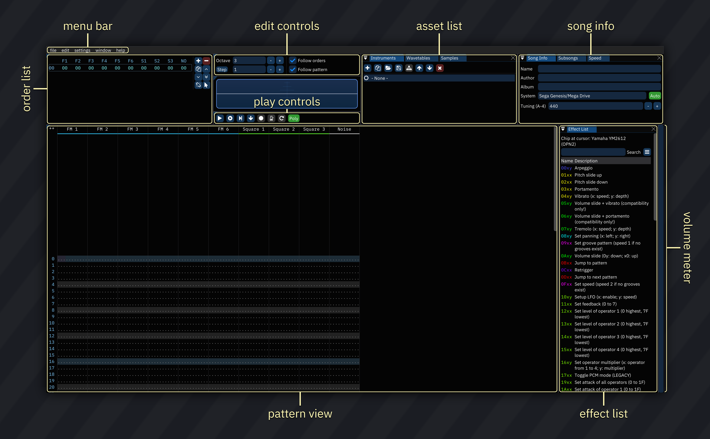

# interface

the Furnace user interface is where the job gets done.

the default layout of Furnace is depicted below.

## general info

- [UI components](components.md): read first!
- [global keyboard shortcuts](keyboard.md)
- [menu bar](menu-bar.md)

## primary windows

- [orders](order-list.md)
- [play/edit controls](play-edit-controls.md)
- [instrument/wavetable/sample list](asset-list.md)
- [song information](song-info.md)
- [pattern view](../3-pattern/README.md)
- [effect list window](effect-list-window.md)
- [instrument editor](../4-instrument/README.md)
- [wavetable editor](../5-wave/README.md)
- [sample editor](../6-sample/README.md)

## advanced topics

- [song comments](../8-advanced/comments.md)
- [channels](../8-advanced/channels.md)
- [chip manager](../8-advanced/chip-manager.md)
- [pattern manager](../8-advanced/pat-manager.md)
- [mixer](../8-advanced/mixer.md)
- [compatibility flags](../8-advanced/compat-flags.md)
- [oscilloscope](../8-advanced/osc.md)
- [oscilloscope (per channel)](../8-advanced/chanosc.md)
- [oscilloscope (X-Y)](../8-advanced/xyosc.md)
- [tuner](../8-advanced/tuner.md)
- [spectrum](../8-advanced/spectrum.md)
- [clock](../8-advanced/clock.md)
- [grooves](../8-advanced/grooves.md)
- [log viewer](../8-advanced/log-viewer.md)
- [register view](../8-advanced/regview.md)
- [statistics](../8-advanced/stats.md)
- [memory composition](../8-advanced/memory-composition.md)

## other topics

- [piano/input pad](../8-advanced/piano.md)
- [reference music player](../8-advanced/refPlayer.md)
- [multi-ins setup](../8-advanced/multi-ins.md)
- [settings](settings.md)
