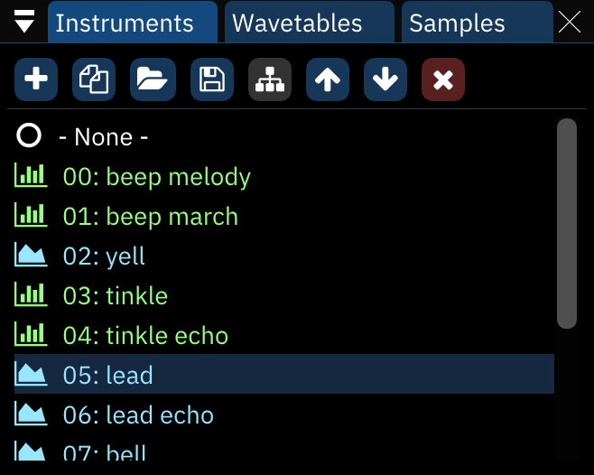

# asset list

an "asset" refers to an instrument, wavetable or sample.

## instrument list

this window displays the list of instruments. each entry contains an icon representing an instrument's type and its name.

the following actions can be done when hovering on an entry:

- left click to set it as the current instrument.
- double click to open the instrument editor.
- right click to open a menu with options.
- shift-left click to start multi-instrument playback. in this mode you will be able to play more than one instrument at once. see [multi-instrument](../8-advanced/multi-ins.md) for more information.

buttons from left to right:

- **Add**: pops up a menu to select which type of instrument to add. if only one instrument type is available, the menu is skipped.
  - if the "Display instrument type menu when adding instrument" setting is disabled, this skips the menu and creates an instrument according to the chip under the cursor.
  - right-clicking always brings up the menu.
- **Duplicate**: duplicates the currently selected instrument.
- **Open**: brings up a file dialog to load a file as a new instrument at the end of the list.
  - if the file is an instrument bank, a dialog will appear to select which instruments to load.
- **Save**: brings up a file dialog to save the currently selected instrument.
  - instruments are saved as Furnace instrument (.fui) files.
  - right-clicking brings up a menu with the following options:
    - **save instrument as .dmp...**: saves the selected instrument in DefleMask format.
    - **save all instruments...**: saves all instruments to the selected folder as .fui files.
- **Toggle folders/standard view**: enables (and disables) folder view, explained below.
- **Move up**: moves the currently selected instrument up in the list. pattern data will automatically be adjusted to match.
- **Move down**: same, but downward.
- **Delete**: deletes the currently selected instrument. pattern data will be adjusted to use the next available instrument in the list.

instruments may be dragged and dropped to reorder them. this will change instrument numbers throughout the module accordingly.

## folder view

in folder view, the "Move up" and "Move down buttons disappear and a new one appears:
- **New folder**: creates a new folder.

assets may be dragged from folder to folder and even rearranged within folders without changing their associated numbers.

right-clicking on a folder allows one to rename or delete it. deleting a folder does not remove the instruments in it.

## wavetable list

everything from the instrument list applies here also, with one major difference: moving waves around with the buttons or dragging them will change their associated numbers in the list but **not** in pattern or instrument data. be careful!

wavetables are saved as Furnace wavetable (.fuw) files. 

right-clicking the Save button brings up a menu with the following options:
- **save wavetable as .dmw...**: saves the selected wavetable in DefleMask format.
- **save raw wavetable...**: saves the selected wavetable as raw data.
- **save all wavetables...**: saves all wavetables to the selected folder as .fuw files.

## sample list

everything from the wavetables list applies here also, with the addition of one button before the Delete button:
- **Preview**: plays the selected sample at its default note.
  - right-clicking stops the sample playback.

samples are saved as standard wave (.wav) files.

right-clicking the Save button brings up a menu with the following options:
- **save raw sample...**: saves the selected sample as raw data.
- **save all samples...**: saves all samples to the selected folder as .wav files.

right-clicking a sample in the list brings up a menu:
- **make instrument**: creates a new instrument which is set to use the selected sample.
- **make me a drum kit**: allows you to instantly create a drum kit using all the samples in the list. see the next section for more information.
- **duplicate**: makes a copy of the selected sample.
- **replace...**: opens a file dialog to choose a replacement sample.
- **save**: opens a file dialog to choose where to save the sample.
- **delete**: removes the sample.

### make me a drum kit

I have added this option to make it easier for you to create a drum kit.
it puts all the samples into a new instrument with sample map.

after selecting this option, a list of parameters appears:

- **Drum kit mode**: select how to arrange the samples in the sample map.
  - **Normal**: put all samples from the starting octave onwards.
  - **12 samples per octave**: map the first 12 samples to all octaves, DefleMask-style.
- **Starting octave**: change the octave where the first sample will be at.

following that is a list of viable instrument types. click on one of them to proceed with drum kit creation!
