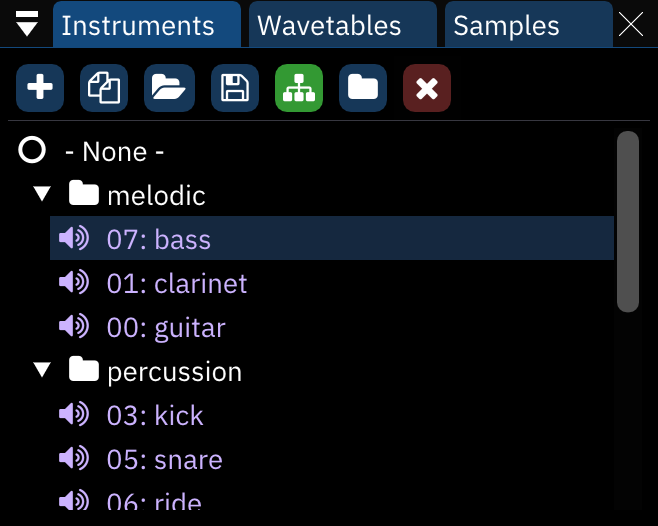
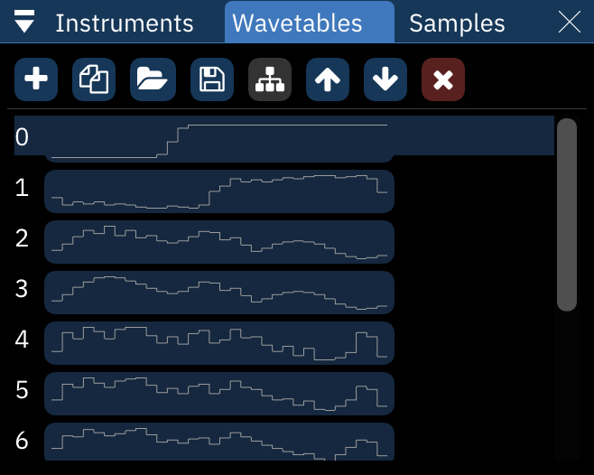
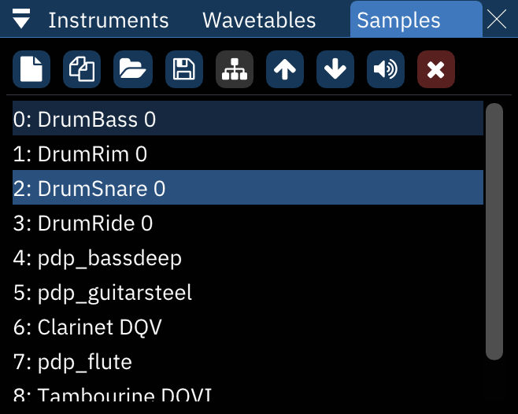

# asset list

an "asset" refers to an instrument, wavetable or sample.

## instrument list

buttons from left to right:

- **Add**: pops up a menu to select which type of instrument to add. if only one instrument type is available, the menu is skipped.
  - if the "Display instrument type menu when adding instrument" setting is disabled, this skips the menu and creates an instrument according to the chip under the cursor.
  - right-clicking always brings up the menu.
- **Duplicate**: duplicates the currently selected instrument.
- **Open**: brings up a file dialog to load a file as a new instrument at the end of the list.
- **Save**: brings up a file dialog to save the currently selected instrument.
  - instruments are saved as Furnace instrument (.fui) files.
  - right-clicking brings up a menu with the following options:
    - **save instrument as .dmp...**: saves the selected instrument in DefleMask format.
- **Toggle folders/standard view**: enables (and disables) folder view, explained below.
- **Move up**: moves the currently selected instrument up in the list. pattern data will automatically be adjusted to match.
- **Move down**: same, but downward.
- **Delete**: deletes the currently selected instrument. pattern data will be adjusted to use the next available instrument in the list.

## folder view

in folder view, the "Move up" and "Move down buttons disappear and a new one appears:
- **New folder**: creates a new folder.

assets may be dragged from folder to folder and even rearranged within folders without changing their associated numbers.

right-clicking on a folder allows one to rename or delete it. deleting a folder does not remove the instruments in it.

## wavetable list

everything from the instrument list applies here also, with one major difference: moving waves around with the buttons will change their associated numbers in the list but **not** in pattern or instrument data. be careful!

wavetables are saved as Furnace wavetable (.fuw) files. 

- right-clicking the Save button brings up a menu with the following options:
  - **save wavetable as .dmw...**: saves the selected wavetable in DefleMask format.
  - **save raw wavetable...**: saves the selected wavetable as raw data.

## sample list

everything from the wavetables list applies here also, with the addition of one button before the Delete button:
- **Preview**: plays the selected sample at its default note.
  - right-clicking stops the sample playback.

samples are saved as standard wave (.wav) files.

right-clicking the Save button brings up a menu with the following options:
- **save raw sample...**: saves the selected sample as raw data.

right-clicking a sample in the list brings up a menu:
- **make instrument**: creates a new instrument which is set to use the selected sample.
- **duplicate**: makes a copy of the selected sample.
- **replace...**: opens a file dialog to choose a replacement sample.
- **save**: opens a file dialog to choose where to save the sample.
- **delete**: removes the sample.
