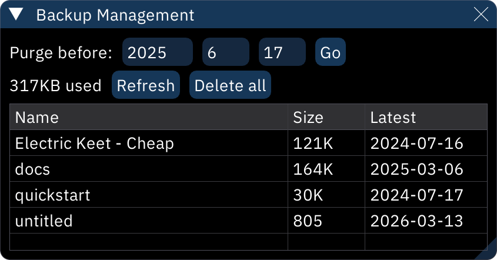

# backup management

Furnace makes multiple automatic rolling backups of all songs edited in it. the number of backups stored and the frequency of backups are configurable in [the Settings window's "Backup Configuration" section](settings.md#Backup-Configuration).

- **Purge before**: enter a year, month, and day, then click the **Go** button to delete all backups from that date and older.
- **Refresh**: refreshes list of backups.
- **Delete all**: deletes all backups.
