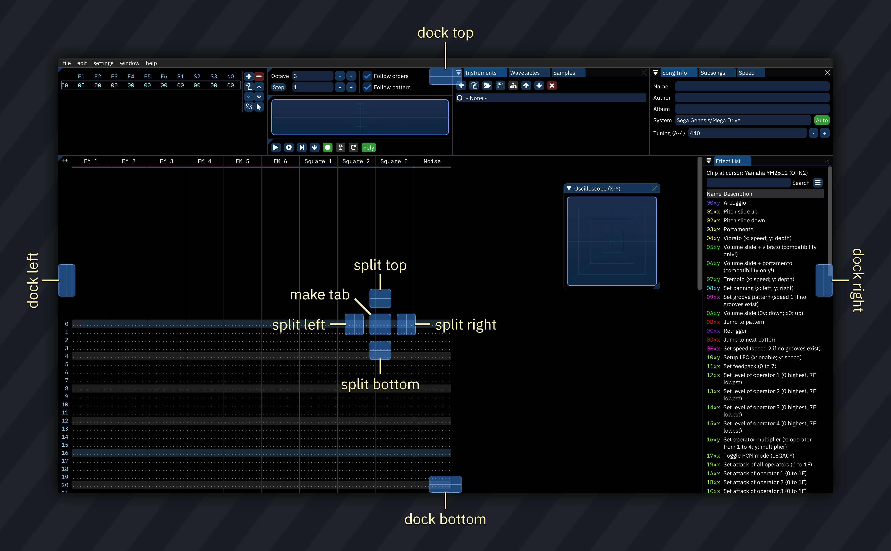

# UI components

the user interface consists of several kinds of components, some of which benefit from explanation.

## text fields

text fields are able to hold... text.

click on a text field to start editing, and click away to stop editing.

the following keyboard shortcuts work while on a text field:

- `Ctrl-X`: cut
- `Ctrl-C`: copy
- `Ctrl-V`: paste
- `Ctrl-A`: select all

(replace Ctrl with Command on macOS)

## number input fields

these work similar to text fields, but you may only input numbers.

they often have `+` and `-` buttons which allow you to increase/decrease the value when clicked (and rapidly do so when holding). additionally, Ctrl-clicking these buttons may increase/decrease the value by a coarse amount.

## sliders

sliders are used for controlling values in a quick manner by being dragged.

using the scroll wheel while holding Ctrl will change the slider's value by small amounts.

right-clicking or Ctrl-clicking on a slider (Command-click on macOS) will turn it into a number input field, allowing you to input precise values.
once you click away it will become a slider again.

## color selectors

this will appear as a colored square (swatch) anywhere a color may be selected. they may also have numeric entry to the left.

left-click the swatch to open the color panel.
- click directly within the panel area to select saturation and value, and to the rainbow bar on the right to select hue.
- further to the right there may be "Current" and "Original" swatches. click the "Original" swatch to revert to that color.
- below that are numeric entry boxes for RGBA (red, green, blue, alpha/opacity) and HSVA (hue, saturation, value, alpha/opacity) formats. click and drag on a number to raise or lower it. double-click to edit it as text. right-click to choose whether numbers are entered as integers between 0 and 255 or decimals between 0.0 and 1.0.
- below that is a directly editable web-style hexadecimal RGBA color value in a text input field.

right-click the swatch or its numeric entry boxes to select the color format and numbers in use.

## windows

windows may be moved, collapsed, closed or even docked around the workspace.

to move a window, press and hold the left mouse button while on the title bar or any empty space on it.
then drag your mouse, and release it to stop moving.

to resize a window, drag the bottom right corner (marked by a triangular tab) or the borders.

to collapse a window, click on the triangle in the title bar.
clicking again expands the window.

to close a window, click on the `X` at the top right corner, or select it from the "window" menu.

### arrangement and docking

windows may be docked, which comes in handy.

to dock a window, drag it from its title bar to another location in the workspace or to the location of another window.

while dragging, an overlay with some options will appear, allowing you to select where and how to dock that window.
the options are:

drag your mouse cursor to any of the options to dock the window.

if you drag to the sides, the window will cover that side of the workspace.

if you drag it to a window or empty space, five docking positions will appear.

if you drag the window to the center of another window, it will appear as another tab.

if you drag the window to the center of empty space, the window will cover aforementioned empty space.

otherwise the window will be split in two, with the first half covered by the window you docked and the second half covered by the other window.

when a window is docked, its title bar turns into a tab bar, and the function provided by the "collapse" triangle at the top left changes.

if this triangle is clicked, a menu will appear with a list of tabs, or a single option if there's only one tab: "Hide tab bar".
selecting this option will hide the tab bar of that window.

to bring it back, click on the top left corner.

to undock a window, drag its tab away from where it is docked. then it will be floating again.
