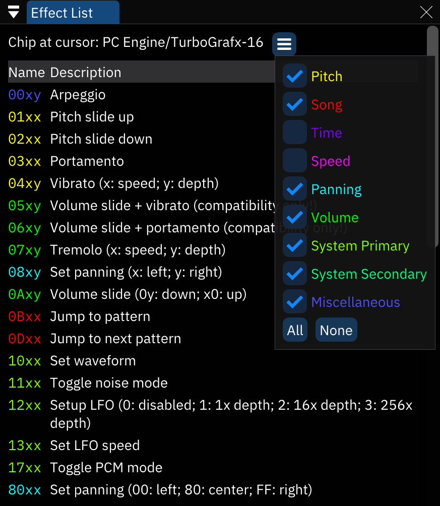

# effect list window

this window provides a list of the effects that are available.

for more details about these effects, see [the effects page](../3-pattern/effects.md).

- **Chip at cursor**: the currently selected chip. the list only shows available effects for this chip.
- filter bar: search for effects.
- menu button: opens a small list of effect categories. toggle each to change whether effects belonging to such categories will be shown in the list.
  - **All**: show all effects.
  - **None**: don't show any effects.
