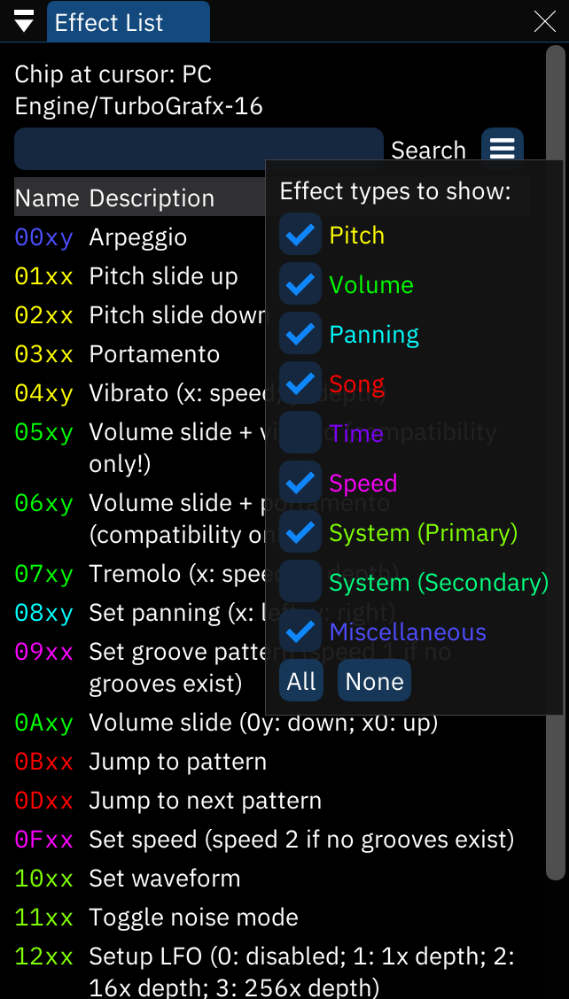

# effect list window

(for more details about these effects, see [the effects page](../3-pattern/effects.md))

this window provides a list of the effects that are available.

- **Chip at cursor**: the currently selected chip. the list only shows available effects for this chip.
- menu button: opens a small list of effect categories. toggle each to change whether they're shown in the list.
