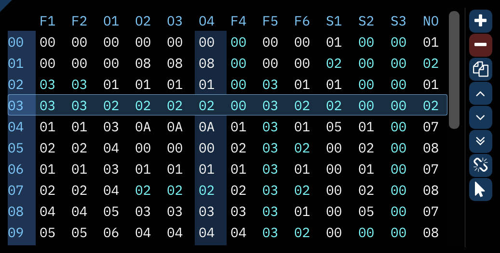

# orders

this window displays the order list. a spreadsheet that contains the order of patterns that will play, from top to bottom.

along the top are the available channels. their abbreviations can be set in the [channels window](../8-advanced/channels.md). the highlighted channel follows the channel the pattern view cursor is in.

along the left are the order numbers. the highlighted row follows the order the pattern view cursor is in.

each cell in the table is the pattern that will play during that order. these can be changed according to the order edit mode.
middle-clicking on a cell will set it to a new, unique empty pattern.

hovering over a pattern number will pop up a tooltip showing the name of that pattern, if it has one.

the buttons are:
- **Add new order**: adds a new order.
- **Remove order**: removes the currently selected order.
- **Duplicate order**: adds a new order with patterns matching the selected one directly below it.
  - right-click to "deep clone"; this copies all patterns involved to new ones.
- **Move order up**: swaps the selected order with the one above it.
- **Move order down**: swaps the selected order with the one below it.
- **Duplicate order at end of song**: same as "Duplicate order" except the new order is added at the bottom of the list.
- **Order change mode**: selects how much of the order will change with an edit. only applies if "Order edit mode" is set to "Click to change".
  - **one**: only current channel's pattern will change.
  - **entire row**: all patterns in the order will change.
- **Order edit mode**: selects the method of changing orders.
  - **Click to change**: a click will add one to the pattern number. a right-click will subtract one.
  - **Select and type (don't scroll)**: select a pattern number and type.
  - **Select and type (scroll horizontally)**: as above, but after entering two digits, the cursor moves to the next channel.
  - **Select and type (scroll vertically)**: as above, but after entering two digits, the cursor moves to the next order.
