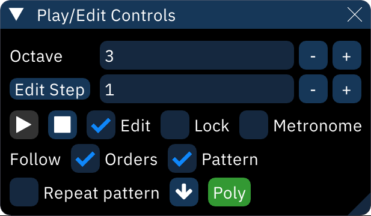
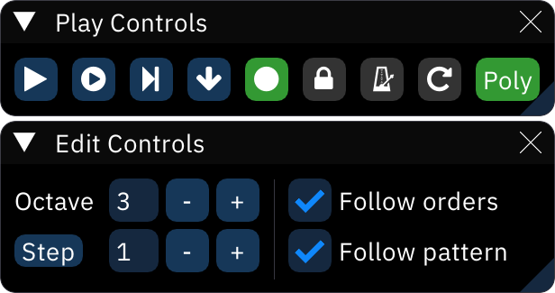

# play/edit controls

The "Play/Edit Controls" are used to control playback and change parameters of the pattern view.

-  **Play:** Plays from cursor position.
-  **Stop:** Stops all playback.
-  **Play from the beginning of this pattern:** Plays from the start of current pattern.
-  **Repeat from the beginning of this pattern:** Repeats current pattern from its start.
-  **Step one row:** Plays only the row at cursor position and moves down one.
-  **Edit:** Toggles edit mode. If off, nothing can be edited in the pattern window. (Great for playing around on the keyboard!)
-  **Metronome:** Toggles the metronome, which only sounds during playback.
-  **Repeat pattern:** Toggles pattern repeat. During playback while this is on, the current pattern will play over and over instead of following the order list.
- **Poly:** Turns on polyphony for previewing notes. Toggles to **Mono** for monophony (one note at a time only).
- **Octave:** Sets current input octave.
- **Step:** Sets edit step. If this is 1, entering a note or effect will move to the next row. If this is a larger number, rows will be skipped. If this is 0, the cursor will stay in place.
- **Follow orders:** If on, the selected order in the orders window will follow the song during playback.
- **Follow pattern:** If on, the cursor will follow playback and the song will scroll by as it plays.

## layouts

The layout can be changed in Settings > Appearance to one of these:

### classic

### compact

### compact (vertical)

### split

