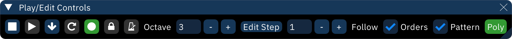

# play/edit controls

the "Play/Edit Controls" are used to control playback and change parameters of the pattern view.

-  **Play**: plays from cursor position.
-  **Stop**: stops all playback.
-  **Play from the beginning of this pattern**: plays from the start of current pattern.
-  **Repeat from the beginning of this pattern**: repeats current pattern from its start.
-  **Step one row**: plays only the row at cursor position and moves down one.
-  **Edit**: toggles edit mode. when turned off, you won't be able to enter notes.
-  **Lock**: toggles the order lock, which keeps the cursor in the currently selected order.
-  **Metronome**: toggles the metronome, which only works during playback.
-  **Repeat pattern**: toggles pattern repeat. during playback while this is on, the current pattern will play over and over instead of following the order list.
- polyphony toggle: cycles through the following options.
  - **Mono**: monophony. preview one note at a time only.
  - **Poly**: polyphony. preview multiple notes at once, using other channels of the same type on the same chip. default.
  - **Chord**: chord input. same as polyphony, with the added feature that while keys are held, notes past the first are entered on the same row in adjacent channels.
    - some keyboards have limits on the number of keys that can be held at the same time. this is not a Furnace issue.
- **Octave**: sets current input octave.
- **Edit Step**: sets edit step. if this is 1, entering a note or effect will move to the next row. if this is a larger number, rows will be skipped. if this is 0, the cursor will stay in place.
  - if clicked, Step becomes **Coarse**, which sets the number of rows moved with `PgUp`, `PgDn`, and related movement shortcuts. clicking again will revert it to Step.
- **Follow orders**: if on, the selected order in the orders window will follow the song during playback.
- **Follow pattern**: if on, the cursor will follow playback and the song will scroll by as it plays.

## layouts

the layout can be changed in Settings > Appearance to one of these:

### classic

### compact

### compact (vertical)

### split

