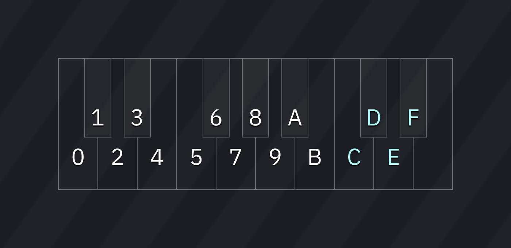
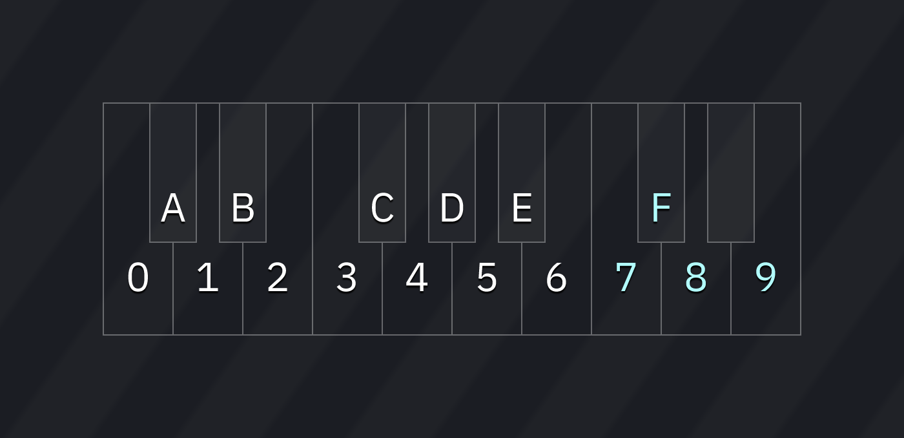

# settings

the Settings window allows you to change Furnace settings.

settings are saved when clicking the **OK** or **Apply** buttons at the bottom of the window, and when closing the program. several backups are kept in the Furnace settings directory.

## General

### Program

- **Language**: select the language used for the interface. some languages are incomplete, and are listed with their approximate completion percentage.
- **Render backend**: changing this may help with performace or compatibility issues. the available render backends are:
  - SDL Renderer: this was the only available render backend prior to the addition of dedicated OpenGL/DirectX backends in 0.6. default on macOS.
    - it is slower than the other backends.
  - DirectX 11: works with the majority of graphics chips/cards and is optimized specifically for Windows.
  - DirectX 9: use if your hardware is incompatible with DirectX 11.
  - OpenGL 3.0: works with the majority of graphics chips/cards (from 2010 onwards). default on Linux.
  - OpenGL 2.0: use if you have a card without OpenGL 3.0 support.
  - OpenGL 1.1: use if your card doesn't even support OpenGL 2.0.
  - Software: this is a last resort backend which renders the interface in software. very slow!
- **Advanced render backend settings**: only applicable with some render backends.
  - **Render driver**: this setting only appears when using the SDL Renderer backend. it allows you to select an SDL render driver.
  - OpenGL settings: these only appear when using an OpenGL backend, and should only be adjusted if the display is incorrect.
- **VSync**: synchronizes rendering to VBlank and eliminates tearing.
- **Frame rate limit**: allows you to set a frame rate limit (in frames per second).
  - only has effect when VSync is off or not available (e.g. software rendering or force-disabled on driver settings).
- **Display render time**: displays frame rate and frame render time at the right side of the menu bar.
- **Late render clear**: this option is only useful when using old versions of Mesa drivers. it force-waits for VBlank by clearing after present, reducing latency.
- **Power-saving mode**: saves power by lowering the frame rate to 2fps when idle.
  - may cause issues under Mesa drivers!
- **Disable threaded input (restart after changing!)**: processes key presses for note preview on a separate thread (on supported platforms), which reduces latency.
- **Enable event delay**: may cause issues with high-polling-rate mice when previewing notes.
- **Per-channel oscilloscope threads**: runs the per-channel oscilloscope in separate threads for a performance boost when there are lots of channels.
- **Oscilloscope rendering engine**: allows you to select between the following rendering engines for oscilloscope views (master and per-channel):
  - **ImGui line plot**: the default engine. uses Dear ImGui line plotting functions for rendering.
  - **GLSL**: uses OpenGL shaders for rendering. higher quality, but very GPU-intensive! only available in OpenGL 3.0 backend.

### File

- **Use system file picker**: uses native OS file dialog instead of Furnace's.
- **Number of recent files**: number of files that will be remembered in the _open recent..._ menu.
- **Compress when saving**: uses zlib to compress saved songs.
- **Save unused patterns**: stores unused patterns in a saved song.
- **Use new pattern format when saving**: stores patterns in the new, optimized and smaller format. only disable if you need to work with older versions of Furnace.
- **Don't apply compatibility flags when loading .dmf**: does exactly what the option says. your .dmf songs may not play correctly after enabled.
- **Play after opening song:**
  - No
  - Only if already playing
  - Yes
- **Audio export loop/fade out time:**
  - **Set to these values on start-up:**
    - **Loops**: number of additional times to play through `0Bxx` song loop.
    - **Fade out (seconds)**: length of fade out after final loop.
  - **Remember last values**
- **Store instrument name in .fui**: when enabled, saving an instrument will store its name. this may increase file size.
- **Load instrument name from .fui**: when enabled, loading an instrument will use the stored name (if present). otherwise, it will use the file name.
- **Auto-fill file name when saving**: pre-fill the file name field when saving or exporting.
  - when saving a module, the existing file name will be auto-filled.
  - when saving an instrument or sample, its name will be auto-filled.

### New Song

- **Initial system**: the system of chips loaded on starting Furnace.
  - **Current system**: sets current chips as default.
  - **Randomize**: sets default to a random system.
    - this will not choose a random system at each start.
  - **Reset to defaults**: sets default to "Sega Genesis/Mega Drive".
  - **Name**: name for the default system. may be set to any text.
  - **Configure**: same as in the [chip manager](../8-advanced/chip-manager.md) and [mixer](../8-advanced/mixer.md).
- **When creating new song**:
  - **Display system preset selector**
  - **Start with initial system**
  - **Default author name**

### Start-up

- **Play intro on start-up:**
  - **No**: skips intro entirely.
  - **Short**: shows silent title screen briefly.
  - **Full (short when loading song)**: shows animated musical intro unless started with a song (command line, double-clicking a .fur file, etc.)
  - **Full (always)**: always shows animated musical intro.
- **Disable fade-in during start-up**
- **About screen party time**
  - _warning:_ may cause epileptic seizures.

### Behavior

- **New instruments are blank**: when enabled, adding FM instruments will make them blank (rather than loading the default one).

### Configuration
- **Import**: select an exported `.ini` config file to overwrite current settings.
- **Export**: select an `.ini` file to save current settings.
- **Factory Reset**: resets all settings to default and purges settings backups.

### Import

- **Use OPL3 instead of OPL2 for S3M import**: changes which system is used for the import of S3M files that contain FM channels.

## Audio

### Output

- **Backend**: selects a different backend for audio output.
  - SDL: the default one.
  - JACK: the JACK Audio Connection Kit (low-latency audio server). only appears on Linux, or MacOS compiled with JACK support.
  - PortAudio: this may or may not perform better than the SDL backend.
- **Driver**: select a different audio driver if you're having problems with the default one.
  - only appears when Backend is SDL.
- **Device**: audio device for playback.
  - if using PortAudio backend, devices will be prefixed with the audio API that PortAudio is going to use:
    - Windows WASAPI: a modern audio API available on Windows Vista and later, featuring an (optional) Exclusive Mode. be noted that your buffer size setting may be ignored.
    - Windows WDM-KS: low-latency, direct to hardware output mechanism. may not work all the time and prevents your audio device from being used for anything else!
    - Windows DirectSound: this is the worst choice. best to move on.
    - MME: an old audio API. doesn't have Exclusive Mode.
    - Core Audio: the only choice in macOS.
    - ALSA: low-level audio output on Linux. may prevent other applications from using your audio device.
- **Sample rate**: audio output rate.
  - a lower rate decreases quality and isn't really beneficial.
  - if using PortAudio backend, be careful about this value.
- **Outputs**: number of audio outputs created, up to 16. default is 2 (stereo).
- **Buffer size**: size of buffer in both samples and milliseconds.
  - setting this to a low value may cause stuttering/glitches in playback (known as "underruns" or "xruns").
  - setting this to a high value increases latency.
- **Exclusive mode**: enables Exclusive Mode, which may offer latency improvements.
  - only available on WASAPI devices in the PortAudio backend!
- **Low-latency mode**: reduces latency by running the engine faster than the tick rate. useful for live playback/jam mode.
  - only enable if your buffer size is small (10ms or less).
- **Force mono audio**: use if you're unable to hear stereo audio (e.g. single speaker or hearing loss in one ear).
- **want:** displays requested audio configuration.
- **got:** displays actual audio configuration returned by audio backend.

### Mixing

- **Quality**: selects quality of resampling. low quality reduces CPU load by a small amount.
- **Software clipping**: clips output to nominal range (-1.0 to 1.0) before passing it to the audio device.
  - this avoids activating Windows' built-in limiter.
  - this option shall be enabled when using PortAudio backend with a DirectSound device.
- **DC offset correction**: apply a filter to remove DC bias, where the output is overall above or below zero. default is on.

### Metronome

- **Volume**: sets volume of metronome.

### Sample preview

- **Volume**: sets volume of sample preview.

## MIDI

### MIDI input

- **MIDI input**: input device.
  - **Rescan MIDI devices**: repopulates list with all currently connected MIDI devices. useful if a device is connected while Furnace is running.
- **Note input**: enables note input. disable if you intend to use this device only for binding actions.
- **Velocity input**: enables velocity input when entering notes in the pattern.
- **Map MIDI channels to direct channels**: when enabled, notes from MIDI channels will be mapped to channels rather than the cursor position.
- **Program change pass-through**: when enabled, program change events are sent to each channel as instrument change commands.
  - this option is only available when the previous one is enabled.
- **Map Yamaha FM voice data to instruments**: when enabled, Furnace will listen for any transmitted Yamaha SysEx patches.
  - this option is only useful if you have a Yamaha FM synthesizer (e.g. TX81Z).
  - selecting a voice or using the "Voice Transmit?" option will send a patch, and Furnace will create a new instrument with its data.
  - this may also be triggered by clicking on "Receive from TX81Z" in the instrument editor (OPZ only).
- **Program change is instrument selection**: changes the current instrument when a program change event is received.
  - this option is not available when "Program change pass-through" is enabled.
- **Value input style**: changes the way values are entered when the pattern cursor is not in the Note column. the following styles are available:
  - **Disabled/custom**: no value input through MIDI.
  - **Two octaves (0 is C-4, F is D#5)**: maps keys in two octaves to single nibble input. the layout is:
    
  - **Raw (note number is value)**: the note number becomes the input value. not useful if you want to input anything above 7F.
  - **Two octaves alternate (lower keys are 0-9, upper keys are A-F)**: maps keys in two octaves, but with a different layout:
    
  - **Use dual control change (one for each nibble)**: maps two control change events to the nibbles of a value.
    - **CC of upper nibble**: select the CC number that will change the upper nibble.
    - **CC of lower nibble**: select the CC number that will change the lower nibble.
  - **Use 14-bit control change**: maps two control change events that together form a single 14-bit CC. some MIDI controllers do these.
    - **MSB CC**: select the CC containing the upper portion of the control.
    - **LSB CC**: select the CC containing the lower portion of the control.
  - **Use single control change**: maps one control change event. not useful if you want to input odd numbers.
    - **Control**: select the CC number that will change the value.
- **Per-column control change**: when enabled, you can map several control change events to a channel's columns.
- **Volume curve**: adjust the velocity to volume curve.
  - the default is 2.0, which matches General MIDI standard.
- **Actions**: this allows you to bind note input and control change events to actions.
  - **`+`** button: adds a new action.
  - window-with-arrow button: new action with learning! press a button or move a slider/knob/something on your device.
  - each action has the following:
    - **Type**: type of event.
    - **Channel**: channel of event.
    - **Note/Control**: the note/control change number.
    - **Velocity/Value**: the velocity or control value
    - **Action**: the GUI action to perform.
    - **Learn**: after clicking on this button, do something in your MIDI device and Furnace will map that to this action.
    - **Remove**: remove this action.

### MIDI output

- **MIDI output**: output device.
- **Output mode:**
  - **Off (use for TX81Z)**: don't output anything. use if you plan to use Furnace as sync master, or the "Receive from TX81Z" button in the OPZ instrument editor.
  - **Melodic**: output MIDI events.
- **Send Program Change**: output program change events when instrument change commands occur.
- **Send MIDI clock**: output MIDI beat clock.
- **Send MIDI timecode**: output MIDI timecode.
  - **Timecode frame rate**: sets the timing standard used for MIDI timecode.
    - **Closest to Tick Rate**: automatically sets the rate based on the song's Tick Rate.
    - **Film (24fps)**: output at 24 codes per second.
    - **PAL (25fps)**: output at 25 codes per second.
    - **NTSC drop (29.97fps)**: output at ~29.97 codes per second, skipping frames 0 and 1 of each minute that doesn't divide by 10.
    - **NTSC non-drop (30fps)**: output at 30 codes per second.

## Emulation

### Cores

- **Playback Core(s)**: core(s) to use for playback.
- **Render Core(s)**: core(s) to use when exporting audio.

all of these are covered in the [guide to choosing emulation cores](../9-guides/emulation-cores.md).

### Quality

some chips have output quality settings. these may be used to increase quality or lower CPU usage.

the available quality settings are:

- Lower: fastest but worst quality.
- Low
- Medium
- High: the default quality.
- Ultra
- Ultimate: highest available quality. may be very CPU heavy!

### Other

- **PC Speaker strategy**: this is covered in the [PC speaker page](../7-systems/pcspkr.md).

## Keyboard

### Keyboard

- **Import**: imports keyboard layout in `.cfgk` format.
- **Export**: exports keyboard layout in `.cfgk` format.
- **Reset defaults**: resets all keybinds to default values.

a list of keybinds is displayed.
- click on a keybind. then enter a key or key combination to change it.
- right-click to clear the keybind.
- the full list is in the [keyboard](keyboard.md) page.

#### note input

the settings for note input keybinds operate differently. each entry in the list of keybinds is made of the following:
- **Key**: key assignment.
- **Type**: type of note input. left-click cycles through "Note", "Note off", "Note release", and "Macro release".
  - note: the list is sorted by type. on changing a key's type, it will instantly move to its new sorting position!
- **Value**: number of semitones above C at the current octave. only appears for note type binds.
- **Remove**: removes the keybind from the list.

below all the binds, select a key from the dropdown list to add it. it will appear at or near the top of the list as a note with value 0.

## Interface

### Layout

- **Workspace layout**
  - **Import**: reads a .ini layout file.
  - **Export**: writes current layout to a .ini file.
  - **Reset**: resets layout to default.
- **Allow docking editors**: when enabled, you'll be able to dock instrument/wave/sample editors.
- **Remember window position**: remembers the window's last position on start-up.
- **Only allow window movement when clicking on title bar**
- **Center pop-up windows**
- **Play/edit controls layout:**
  - **Classic**
  - **Compact**
  - **Compact (vertical)**
  - **Split**
- **Position of buttons in Orders:**
  - **Top**
  - **Left**
  - **Right**

### Mouse

- **Double-click time (seconds)**: maximum time between mouse clicks to recognize them as a double-click.
- **Don't raise pattern editor on click**
- **Focus pattern editor when selecting instrument**
- **Note preview behavior:** allows you to disable note preview when entering notes in the pattern.
  - **Never**: don't preview notes at all.
  - **When cursor is in Note column**: only when the cursor is in the Note column
  - **When cursor is in Note column or not in edit mode**: erm... yeah.
  - **Always**: always preview notes.
- **Allow dragging selection:**
  - **No**: don't allow drag-and-drop.
  - **Yes**: allow drag-and-drop.
  - **Yes (while holding Ctrl only)**: allow drag-and-drop but only when holding Control (Command on macOS).
- **Toggle channel solo on:** selects which interactions with a channel header will toggle solo for that channel.
  - Right-click or double click
  - Right-click
  - Double-click
- **Double click selects entire column**: when enabled, double clicking on a cell of the pattern will select the entire column.

### Cursor behavior

- **Insert pushes entire channel row**: when enabled, pressing Insert will push the entire channel rather than the column at the cursor position.
- **Pull delete affects entire channel row**: when enabled, pull deleting (Backspace by default) will pull the entire channel rather than the column at the cursor position.
- **Push value when overwriting instead of clearing it**: in the order list and pattern editors, typing into an already-filled value will shift digits instead of starting fresh. for example:
  - if off: moving the cursor onto the value `A5` and typing a "B" results in `0B`.
  - if on: moving the cursor onto the value `A5` and typing a "B" results in `5B`.
- **Keyboard note/value input repeat (hold key to input continuously)**
- **Effect input behavior:**
  - **Move down**: after entering an effect (or effect value), the cursor moves down.
  - **Move to effect value (otherwise move down)**: after entering an effect, the cursor moves to its value. if entering a value, the cursor moves down.
  - **Move to effect value/next effect and wrap around**: after entering an effect or effect value, the cursor moves right. if it was on the last column, it jumps back to the first effect.
- **Delete effect value when deleting effect**: if enabled, deleting effect will also delete its value.
- **Change current instrument when changing instrument column (absorb)**: if enabled, typing on the instrument column will also select the instrument you've typed.
- **Remove instrument value when inserting note off/release**: if enabled, inserting a note off or release on a row that has instrument value will remove the instrument value.
- **Remove volume value when inserting note off/release**: same as above, but for volume.

### Cursor movement

- **Wrap horizontally:** selects what to do when the cursor hits horizontal boundaries.
  - **No**: don't wrap the cursor.
  - **Yes**: wrap the cursor.
  - **Yes, and move to next/prev row**: wrap the cursor and move it to the other row.
- **Wrap vertically:** selects what to do when the cursor hits vertical boundaries.
  - **No**: don't wrap the cursor.
  - **Yes**: wrap the cursor.
  - **Yes, and move to next/prev pattern**: wrap the cursor and go to the next/previous order.
  - **Yes, and move to next/prev pattern (wrap around)**: same as the previous option, but also wraps around the song.
- **Cursor movement keys behavior:** allows you to select how much will the cursor move by when pressing cursor movement keys.
  - **Move by one**: guess.
  - **Move by Edit Step**: guess.
- **Move cursor by edit step on delete**: when deleting, moves the cursor by Edit Step.
- **Move cursor by edit step on insert (push)**: when inserting, moves the cursor by Edit Step.
- **Move cursor up on backspace-delete**: when pull deleting (Backspace by default), moves cursor up.
- **Move cursor to end of clipboard content when pasting**: allows you to choose what happens after pasting.
  - if on, the cursor will move to the end of the clipboard content.
  - if off, the cursor won't move.

### Scrolling

- **Change order when scrolling outside of pattern bounds**:
  - **No**: the pattern edit cursor will stay locked within the current order.
  - **Yes**: moving the cursor past the edge of the previous or next order will move to that order, but not past the start or end of a song.
  - **Yes, and wrap around song**: as above, but will wrap from song end to start.
- **Cursor follows current order when moving it**
  - applies when playback is stopped.
- **Don't scroll when moving cursor**
- **Move cursor with scroll wheel**
  - **No**
  - **Yes**
  - **Inverted**

### Assets

- **Display instrument type menu when adding instrument**
  - if turned off, the menu can still be opened by right-clicking the add button.
- **Select asset after opening one**

## Appearance

### Scaling

- **Automatic UI scaling factor**: automatically matches the OS's UI scaling.
- **UI scaling factor**: only appears if "Automatic UI scaling factor" is off.
- **Icon size**

### Text

- **Font renderer**: this allows you to select which font renderer library to use. there are two choices:
  - **stb_truetype**: the original font renderer used in Furnace 0.6 and before.
  - **FreeType**: this font renderer has support for more font formats and provides more settings. introduced in Furnace 0.6.1.
- **Main font**: font for the user interface.
- **Header font**: font for section headers.
- **Pattern font** font for the pattern view, the order list, and related.
  - if "Custom...", a file path selector will appear.
  - **Size**: font size.
#### FreeType-specific settings
- **Anti-aliased fonts**: when enabled, fonts will be rendered smooth.
- **Support bitmap fonts**: this option allows you to enable the loading of bitmap fonts.
  - be noted that this may force non-bitmap fonts to undesired sizes!
- **Hinting**: this option allows you to define how crisp fonts are rendered.
  - **Off**: disable font hinting. at small sizes, fonts may be blurry.
  - **Slight**: enable slight font hinting.
  - **Normal**: enable font hinting.
  - **Full**: enable harsh font hinting. fonts may look ugly/distorted to some people.
- **Auto-hinter**: some fonts contain hinting data, but some don't. this allows you to select what happens.
  - **Disable**: only rely upon font hinting data.
  - **Enable**: prefer font hinting data if present.
  - **Force**: ignore font hinting data.
#### non-specific settings
- **Oversample**: renders the font internally at higher resolution for visual quality.
  - higher settings use more video memory.
  - for pixel or bitmap fonts, set this to **1x**.
- **Load fallback font**: load an extra font that contains nearly all characters that can be used, in case the selected fonts lack them. uses much video memory
- **Display Japanese characters**, **Display Chinese (Simplified) characters**, **Display Chinese (Traditional) characters** and **Display Korean characters**: only toggle these options if you have enough graphics memory.
  - these are a temporary solution until dynamic font atlas is implemented in Dear ImGui.

### Program

- **Title bar:**
  - **Furnace**
  - **Song Name - Furnace**
  - **file_name.fur - Furnace**
  - **/path/to/file.fur - Furnace**
- **Display system name on title bar**
- **Display chip names instead of "multi-system" in title bar**
- **Status bar:**
  - **Cursor details**
  - **File path**
  - **Cursor details or file path**
  - **Nothing**
- **Display playback status when playing**: display playback time and current location in the menu bar.
- **Export options layout:**
  - **Sub-menus in File menu**: export options appear in the File menu as sub-menus.
  - **Modal window with tabs**: a single "export..." option that opens a dialog with export options. this is the default.
  - **Modal windows with options in File menu**: like Sub-menus in File menu, but instead of being sub-menus, selecting one opens a dialog with export settings.
- **Capitalize menu bar**
- **Display add/configure/change/remove chip menus in File menu**: if enabled, the "manage chips" item in the file menu is split into the four listed items for quick access.

### Orders

- **Highlight channel at cursor in Orders**
- **Orders row number format:**
  - **Decimal**
  - **Hexadecimal**

### Pattern

- **Center pattern view**: centers pattern horizontally in view.
- **Overflow pattern highlights**
- **Display previous/next pattern**
- **Pattern row number format:**
  - **Decimal**
  - **Hexadecimal**
- **Pattern view labels:**
  - **Note off (3-char)**: default is `OFF`
  - **Note release (3-char)**: default is `===`.
  - **Macro release (3-char)**: default is `REL`.
  - **Empty field (3-char)**: default is `...`.
  - **Empty field (2-char)**: default is `..`.
- **Pattern view spacing after:** number of pixels of space between columns.
  - **Note**
  - **Instrument**
  - **Volume**
  - **Effect**
  - **Effect value**
- **Single-digit effects for 00-0F**
- **Use flats instead of sharps**
- **Use German notation**: display `B` notes as `H`, and `A#` notes as `B`.

### Channel

- **Channel style:** sets the appearance of channel headers in pattern view.
  - **Classic**
  - **Line**
  - **Round**
  - **Split button**
  - **Square border**
  - **Round border**
- **Channel volume bar:**
  - **None**
  - **Simple**
  - **Stereo**
  - **Real**
  - **Real (stereo)**
- **Channel feedback style:**
  - **Off**
  - **Note**
  - **Volume**
  - **Active**
- **Channel font:**
  - **Regular**
  - **Monospace**
- **Center channel name**
- **Channel colors:**
  - **Single**
  - **Channel type**
  - **Instrument type**
- **Channel name colors:**
  - **Single**
  - **Channel type**
  - **Instrument type**

### Assets

- **Unified instrument/wavetable/sample list**: combines all three types of assets into one list.
  - the buttons act as appropriate to the currently selected asset or header.
- **Horizontal instrument list**: when there are more instruments than there is room to display them...
  - if on, scroll horizontally through multiple columns.
  - if off, scroll vertically in one long column.
  - only appears if "Unified instrument/wavetable/sample list" is off.
- **Instrument list icon style:**
  - **None**
  - **Graphical icons**
  - **Letter icons**
- **Colorize instrument editor using instrument type**

### Macro Editor

- **Macro editor layout:**
  - **Unified**
  - **Grid**
  - **Single (with list)**
- **Use classic macro editor vertical slider**
- **Macro step size/horizontal zoom:**
  - **Manual**
  - **Automatic per macro**
  - **Automatic (use longest macro)

### Wave Editor

- **Use compact wave editor**

### FM Editor

- **FM parameter names:**
  - **Friendly**
  - **Technical**
  - **Technical (alternate)**
- **Use standard OPL waveform names**
- **FM parameter editor layout:**
  - **Modern**
  - **Compact (2x2, classic)**
  - **Compact (1x4)**
  - **Compact (4x1)**
  - **Alternate (2x2)**
  - **Alternate (1x4)**
  - **Alternate (4x1)**
- **Position of Sustain in FM editor:**
  - **Between Decay and Sustain Rate**
  - **After Release Rate**
  - **After Release Rate, after spacing**
  - **After TL**
- **Use separate colors for carriers/modulators in FM editor**
- **Unsigned FM detune values**: uses the internal representation of detune values, such that detune amounts of -1, -2, and -3 are shown as 5, 6, and 7.

### Memory Composition

- **Chip memory usage unit:** unit for displaying memory usage in the Memory Composition window.
  - **Bytes**
  - **Kilobytes**

### Oscilloscope

- **Rounded corners**
- **Border**
- **Mono**: displays a single monaural waveform of all sound mixed together.
  - if turned off, waves will be drawn on top of each other for each output channel. 
  - all colors are configurable via _Settings > Color > Color scheme > Oscilloscope > Wave (non-mono)._
- **Anti-aliased**: smoothes the lines of the waveform.
  - slight performance cost and slightly buggy.
- **Fill entire window**: removes the gap between the waveform and the edge of the window.
- **Waveform goes out of bounds**: allows the waveform to draw past the top and bottom of the oscilloscope.

### Windows

- **Rounded window corners**
- **Rounded buttons**
- **Rounded menu corners**
- **Rounded tabs**
- **Rounded scrollbars**
- **Borders around widgets**: draws borders on buttons, checkboxes, text widgets, and the like.

## Color

### Color scheme

- **Import**
- **Export**
- **Reset defaults**
- **Guru mode**: exposes all color options (instead of accent colors).
- **Interface**
  - **Frame shading**: applies a gradient effect to buttons and input boxes.
  - **Color scheme type:**
    - **Dark**
    - **Light**
  - **Accent colors**: select main interface colors.
    - **Primary**
    - **Secondary**
- several more categories...

## Backup

### Configuration

- **Enable backup system**: turn on automatic backups of the current open file.
- **Interval (in seconds)**: time between automatic backups.
- **Backups per file**: maximum number of backups to store for each file. oldest backups are deleted first.

### Backup Management

- **Purge before**:
  - **Go**: purge all backups from before the selected date.
- total space used by all backups:
  - **Refresh**: recalculate space.
  - **Delete All**: purge all backups.
