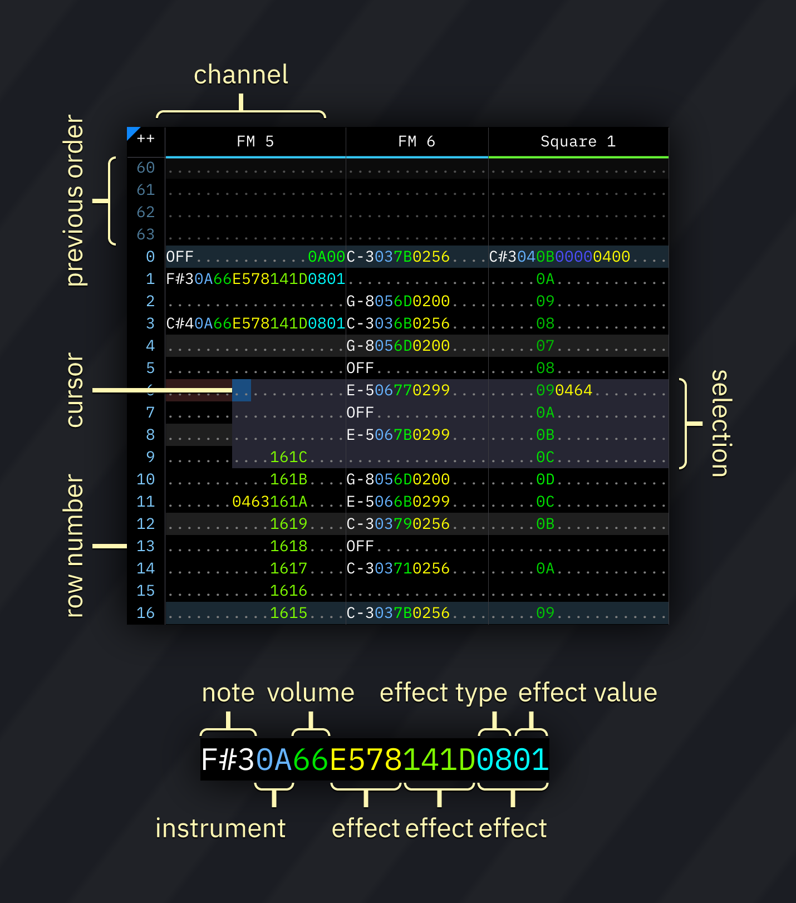
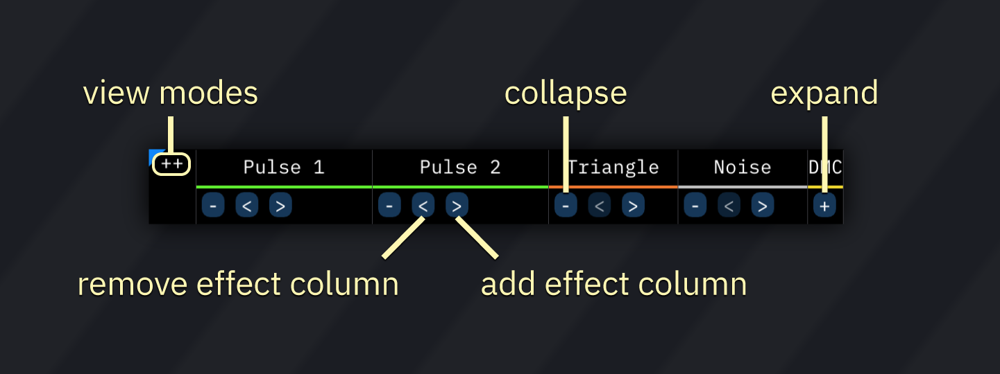
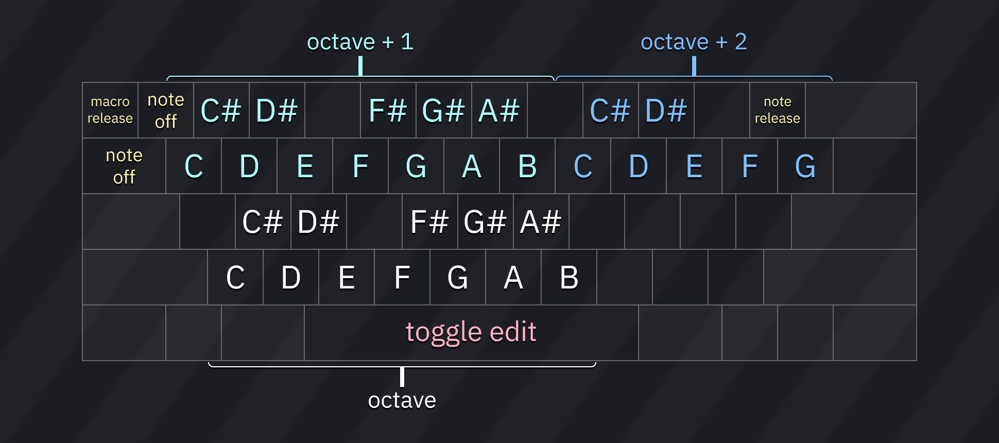

# pattern

the pattern view allows you to edit the song's patterns.

a pattern consists of columns ("channels") and numbered rows.
each column has several subcolumns in this order:

1. note
2. instrument
3. volume
4. effects, split into effect type and effect value

all columns are represented in hexadecimal, except for the note column.

row highlights show beats and measures, and are configured in the [the Speed window](../2-interface/song-info.md).

## cursor and selection

you may change the cursor position by clicking anywhere on the pattern.

to select an area, press and hold the left mouse button. then drag the mouse and release the button to finish selection.

right-clicking within the pattern view brings up a pop-up menu with most options from the [edit menu](../2-interface/menu-bar.md).

## channel bar

using the channel bar, you may adjust several aspects of the channel display.

clicking on a channel name mutes that channel.

double-clicking or right-clicking it enables solo mode, in which only that channel will be audible.

clicking the `++` at the top left corner of the pattern view pops up a small menu to set view modes:
- **Effect columns/collapse**: displays extra options for collapsing channels and adding/removing effect columns:
  - **-**: collapse visible columns. changes to **+** when columns are hidden; click to expand them.
  - **<**: disables the last effect column and hides it. effects are not deleted...
  - **>**: adds an effect column. if one previously existed, its contents will be preserved.
- **Pattern names**: displays pattern names (per channel). pattern names are also visible when hovering over a pattern in the order list.
- **Channel group hints**: display indicators when channels are paired in some way (e.g. OPL3 4-op mode).
- **Visualizer**: during playback, show visual effects in the pattern view.
  - also can be toggled by right-clicking on the `++` button.
- **Channel status**: displays icons that indicate activity in the channel. see the "channel status" section below.

to rename and/or hide channels, open [the Channels window](../8-advanced/channels.md) via the window menu.

### channel status

- note status:
  -  note off
  -  note on
  -  note on but macro released (`REL`)
  -  note released (`===`)
- pitch alteration:
  -  nothing
  -  pitch slide up
  -  pitch slide down
  -  portamento
  -  arpeggio
- volume alteration:
  -  nothing
  -  volume slide up
  -  volume slide down
  -  tremolo
- other icons may be present depending on the used chips.

## input

### note input

- pressing any of the respective keys will insert a note at the cursor's location, then advance to the next row (or otherwise according to the Edit Step.)
- **note off** (`OFF`) turns off the last played note in that channel (key off for FM/hardware envelope; note cut otherwise).
- **note release** (`===`) triggers macro release (and in FM/hardware envelope channels it also triggers key off).
- **macro release** (`REL`) does the same as above, but does not trigger key off in FM/hardware envelope channels.
- **toggle edit** enables and disables editing. when editing is enabled, the cursor's row will be shaded red.

### instrument/volume input

type any hexadecimal number (0-9 and A-F). the cursor will move by the Edit Step when a suitable value is entered.

### effect input

works like the instrument/volume input.

each effect column has two subcolumns: effect and effect value.
if the effect value is not present, it is treated as `00`.

most effects run until canceled using an effect of the same type with effect value `00`, with some exceptions.

here's [a list of effect types](effects.md).

## keyboard shortcuts

these are the default key functions. all keys are configurable in the Keyboard tab of the Settings window.

key         | action
------------|-----------------------------------------------------------------
Up/Down     | move cursor up/down by one row or the Edit Step (configurable)
Left/Right  | move cursor left/right
PageUp      | move cursor up by 16 rows
PageDown    | move cursor down by 16 rows
Home        | move cursor to beginning of pattern
End         | move cursor to end of pattern
Shift-Home  | move cursor up by exactly one row, overriding Edit Step
Shift-End   | move cursor down by exactly one row, overriding Edit Step
Shift-Up    | expand selection upwards
Shift-Down  | expand selection downwards
Shift-Left  | expand selection to the left
Shift-Right | expand selection to the right
Alt-Up      | move selection up by one
Alt-Down    | move selection down by one
Alt-Left    | move selection to previous channel
Alt-Right   | move selection to next channel
Backspace   | delete note at cursor and/or pull pattern upwards (configurable)
Delete      | delete selection
Insert      | create blank row at cursor position and push pattern
Ctrl-A      | auto-expand selection (select all)
Ctrl-X      | cut selection
Ctrl-C      | copy selection
Ctrl-V      | paste selection
Ctrl-Z      | undo
Ctrl-Y      | redo
Ctrl-F1     | transpose selection (-1 semitone)
Ctrl-F2     | transpose selection (+1 semitone)
Ctrl-F3     | transpose selection (-1 octave)
Ctrl-F4     | transpose selection (+1 octave)
Space       | toggle note input (edit)
