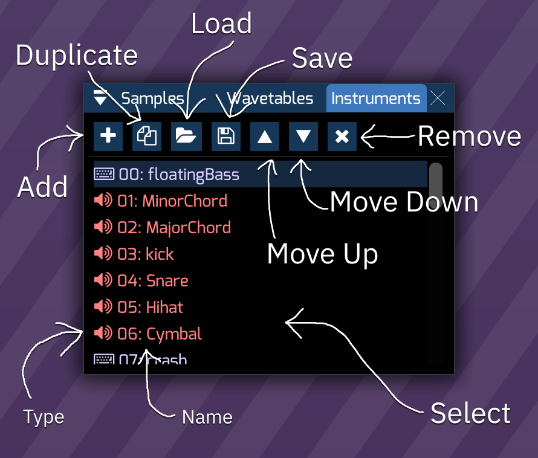
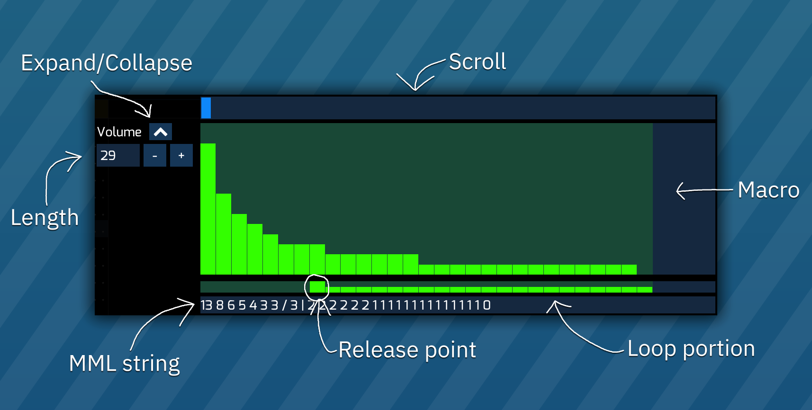

# instrument list

click on an instrument to select it.

double-click to open the instrument editor.

# instrument editor

every instrument can be renamed and have its type changed.

depending on the instrument type, there are currently 13 different types of an instrument editor:

- [FM synthesis](fm.md) - for use with YM2612, YM2151 and FM block portion of YM2610.
- [Standard](standard.md) - for use with NES and Sega Master System's PSG sound source and its derivatives. 
- [Game Boy](game-boy.md) - for use with Game Boy APU.
- [PC Engine/TurboGrafx-16](pce.md) - for use with PC Engine's wavetable synthesizer.
- [WonderSwan](wonderswan.md) - for use with WonderSwan's wavetable synthesizer.
- [AY8930](8930.md) - for use with Microchip AY8930 E-PSG sound source.
- [Commodore 64](c64.md) - for use with Commodore 64 SID.
- [SAA1099](saa.md) - for use with Philips SAA1099 PSG sound source.
- [TIA](tia.md) - for use with Atari 2600 chip.
- [AY-3-8910](ay8910.md) - for use with AY-3-8910 PSG sound source and SSG portion in YM2610.
- [Amiga/sample](amiga.md) for controlling Amiga and other sample based synthsizers like YM2612's Channel 6 PCM mode, NES channel 5, Sega PCM, X1-010 and PC Engine's sample playback mode.
- [Atari Lynx](lynx.md) - for use with Atari Lynx handheld console.
- [VERA](vera.md) - for use with Commander X16 VERA.
- [Seta/Allumer X1-010](x1_010.md) - for use with Wavetable portion in Seta/Allumer X1-010.
- [Konami SCC/Bubble System WSG](scc.md) - for use with Konami SCC and Wavetable portion in Bubble System's sound hardware.
- [Namco 163](n163.md) - for use with Namco 163.
- [Konami VRC6](vrc6.md) - for use with VRC6's PSG sound source.

# macros

one common feature to instruments is macros (also known as sequences).

these run on every tick and are useful for controlling parameters automatically.

to change the loop portion/point, click on the bar under the macro.
right click on it to disable macro loop.

to change the release point, shift-click the bar under the macro.
shift-right click on it to remove the release point.
