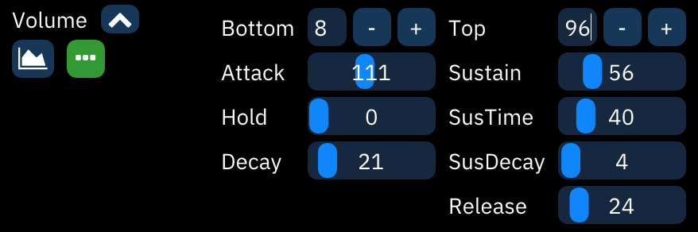
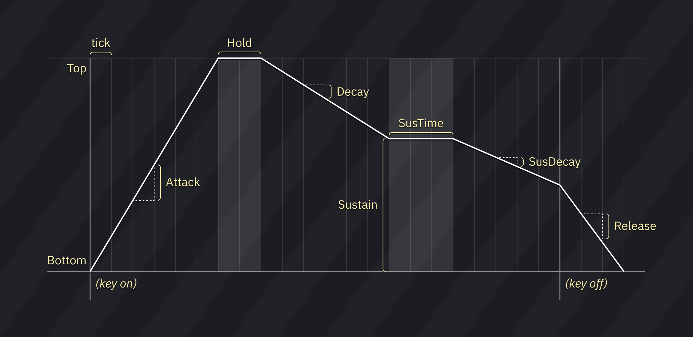
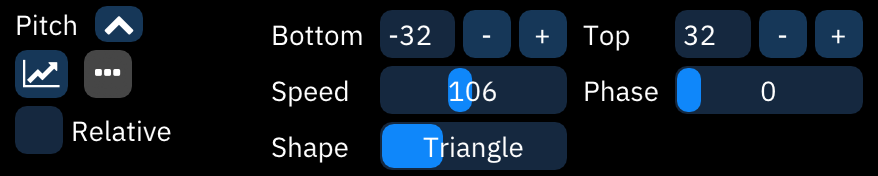

# instrument editor

every instrument can be renamed and have its type changed.

depending on the instrument type, there are many different types of instrument editor:

- [FM synthesis](fm.md) - for use with YM2612, YM2151 and FM block portion of YM2610.
- [PSG](psg.md) - for use with TI SN76489 and derivatives like Sega Master System's PSG.
- [NES](nes.md) - for use with NES.
- [Game Boy](game-boy.md) - for use with Game Boy APU.
- [PC Engine / TurboGrafx-16](pce.md) - for use with PC Engine's wavetable synthesizer.
- [WonderSwan](wonderswan.md) - for use with WonderSwan's wavetable synthesizer.
- [AY8930](8930.md) - for use with Microchip AY8930 E-PSG sound source.
- [Commodore 64](c64.md) - for use with Commodore 64 SID.
- [SAA1099](saa.md) - for use with Philips SAA1099 PSG sound source.
- [TIA](tia.md) - for use with Atari 2600 chip.
- [AY-3-8910](ay8910.md) - for use with AY-3-8910 PSG sound source and SSG portion in YM2610.
- [Amiga / sample](amiga.md) for controlling Amiga and other sample based synthsizers like YM2612's Channel 6 PCM mode, NES channel 5, Sega PCM, X1-010 and PC Engine's sample playback mode.
- [Atari Lynx](lynx.md) - for use with Atari Lynx handheld console.
- [VERA](vera.md) - for use with Commander X16 VERA.
- [Seta/Allumer X1-010](x1_010.md) - for use with Wavetable portion in Seta/Allumer X1-010.
- [Konami SCC / Bubble System WSG](scc.md) - for use with Konami SCC and Wavetable portion in Bubble System's sound hardware.
- [Namco 163](n163.md) - for use with Namco 163.
- [Konami VRC6](vrc6.md) - for use with VRC6's PSG sound source.
- [SNES](snes.md) - for use with SNES S-APU.
- [Casio PV-1000](pv1000.md) - for use with Casio PV-1000.

# macros

Macros are incredibly versatile tools for automating instrument parameters.

After creating an instrument, open the Instrument Editor and select the "Macros" tab. There may be multiple macro tabs to control individual FM operators and such.

The very first numeric entry sets the visible width of the bars in sequence-type macros. The scrollbar affects the view of all macros at once. There's a matching scrollbar at the bottom underneath all the macros.

Each macro has two buttons on the left.
- Macro type (explained below).
- Timing editor, which pops up a small dialog:
  - Step Length (ticks): Determines how many ticks pass before each change of value.
  - Delay: Delays the start of the macro until this many ticks have passed.

## macro types

Every macro can be defined though one of three methods, selectable with the leftmost button under the macro type label:

-  **Sequence:** displayed as a bar graph, this is a sequence of numeric values.
-  **ADSR:** this is a traditional ADSR envelope, defined by the rate of increase and decrease of value over time.
-  **LFO:** the Low Frequency Oscillator generates a repeating wave of values.

Some macros are "bitmap" style. They represent a number of "bits" that can be toggled individually, and the values listed represent the sum of which bits are turned on.

### sequence

The number between the macro type label and the macro type button is the macro length in steps. The `-` and `+` buttons change the length of the macro. Start out by adding at least a few steps.

The values of the macro can be drawn in the "bar graph" box.

Just beneath the box is a shorter bar that controls looping.
- Click to set the start point of a loop; the end point is the last value or release point. It appears as half-height bars. Right-click to remove the loop.
- Shift-click to set the release point. When played, the macro will hold here until the note is released. It appears as a full-height bar. Right-click to remove the release point.

Finally, the sequence of values can be directly edited in the text box at the bottom.
- The loop start is entered as a `|`.
- The release point is entered as a `/`.
- In arpeggio macros, a value starting with a `@` is an absolute note (instead of a relative shift). No matter the note entered in the pattern, `@` values will be played at that exact note. This is especially useful for noise instruments with preset periods.

### ADSR

- **Bottom** and **Top** determine the range of outputs generated by the macro. (Bottom can be larger than Top to invert the envelope!) All outputs will be between these two values.
- Attack, Decay, Sustain, SusDecay, and Release accept inputs between 0 to 255. These are scaled to the distance between Bottom and Top.
- **Attack** is how much the value moves toward Top with each tick.
- **Hold** sets how many ticks to stay at Top before Decay.
- **Decay** is how much the value moves to the Sustain level.
- **Sustain** is how far from Bottom the value stays while the note is held.
- **SusTime** is how many ticks to stay at Sustain until SusDecay.
- **SusDecay** is how much the value moves toward Bottom with each tick while the note is held.
- **Release** is how much the value moves toward Bottom with each tick after the note is released.

### LFO

- **Bottom** and **Top** determine the range of values generated by the macro. (Bottom can be larger than Top to invert the waveform!)
- **Speed** is how quickly the values change - the frequency of the oscillator.
- **Phase** is which part of the waveform the macro will start at, measured in 1/1024 increments.
- **Shape** is the waveform used. Triangle is the default, and Saw and Square are exactly as they say.

# wavetable

This tab appears for PC Engine, FDS, Namco WSG, and other wavetable-based instruments.

When **Enable synthesizer** is off, the only option is to select a wavetable entry with the text entry box beneath the **Wave 1** preview.

To use the wavetable synthesizer, refer to the bottom part of [the wavetable documentation](../5-wave/README.md).

# sample

This tab appears for Generic PCM, SNES, Amiga, and other sample-based instruments.

- **Initial Sample**: the sample that the instrument will use.
- **Use wavetable**: instead of samples, use wavetables. this causes the [Wavetables](../5-wave/README.md) tab to appear next to Sample.
  - depending on the system and use of the wavetable synthesizer, this may or may not be reproducible on hardware.
- **Use sample map**: assigns a sample to each note.
  - to set a note's sample, click the list entry in the "#" column then type the number of the sample.
  - to set the pitch at which a sample is played, click the list entry in the "note" column and press the key for the new note.

