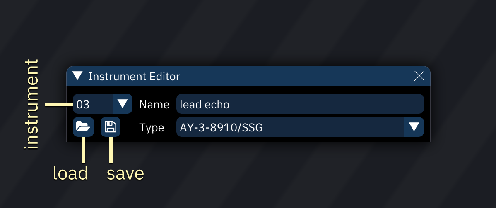
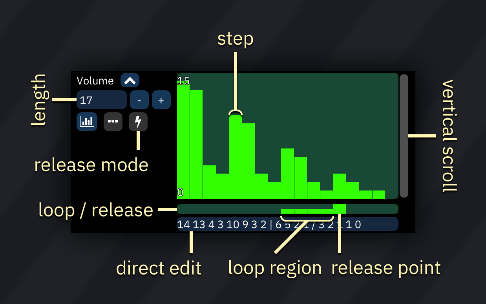

# instrument editor

the instrument editor allows you to edit instruments.
it can be activated by double-clicking on an instrument in the instrument list.

it can also be found by going to window > assets > instrument editor in the main menu bar.

## main

- **Select**: displays a list of instruments in the song.
- **Load**: open an instrument file.
- **Save**: save current instrument to a file.
  - right-click to see additional options, such as saving in DefleMask preset format (.dmp).
- **Name**: changes the instrument name.
- **Type**: changes the instrument type (usually chip-specific).
  - if changed, all applicable settings and macros will remain unchanged.
  - you may have to adjust them afterwards.

## instrument types

the following instrument types are available:

- [ADPCM-A](adpcm-a.md) - for use with ADPCM-A sample chip.
- [ADPCM-B](adpcm-b.md) - for use with ADPCM-B sample chip.
- [Atari Lynx](lynx.md) - for use with Atari Lynx handheld console.
- [AY-3-8910/SSG](ay8910.md) - for use with AY-3-8910 PSG sound source and SSG portion in YM2610.
- [AY8930](ay8930.md) - for use with Microchip AY8930 E-PSG sound source.
- [Beeper](beeper.md) - for use with PC Speaker and ZX Spectrum Beeper (SFX-like engine).
- [Bifurcator](bifurcator.md) - for use with Bifurcator chip.
- [C140](c140.md) - for use with C140 sample chip.
- [C219](c219.md) - for use with C219 sample chip.
- [C64](c64.md) - for use with Commodore 64 SID.
- [Dave](dave.md) - for use with Dave chip.
- [ES5506](es5506.md) - for use with Ensoniq ES5506 sound chip.
- [FDS](fds.md) - for use with Famicom Disk System sound source.
- [FM (ESFM)](fm-esfm.md) - for use with ESFM.
- [FM (OPL)](fm-opll.md) - for use with YM3526 (OPL), YM3812 (OPL2) and YMF262 (OPL3).
- [FM (OPLL)](fm-opll.md) - for use with YM2413.
- [FM (OPM)](fm-opm.md) - for use with YM2151.
- [FM (OPN)](fm-opn.md) - for use with YM2612, YM2203, YM2608, YM2610 and YM2610B.
- [FM (OPZ)](fm-opz.md) - for use with YM2414.
- [GA20](ga20.md) - for use with GA20 sample chip.
- [Game Boy Advance DMA](gbadma.md) - for use with Game Boy Advance in direct mode.
- [Game Boy Advance MinMod](gbaminmod.md) - for use with Game Boy Advance with the MinMod software mixing driver.
- [Game Boy](game-boy.md) - for use with Game Boy APU.
- [Generic Sample](sample.md) for controlling Amiga and other sample channels/chips like YM2612's Channel 6 PCM mode, NES channel 5, Sega PCM, X1-010 and PC Engine's sample playback mode.
- [K007232](k007232.md) - for use with K007232 sample chip.
- [K053260](k053260.md) - for use with K053260 sample chip.
- [Konami SCC/Bubble System WSG](scc.md) - for use with Konami SCC and Wavetable portion in Bubble System's sound hardware.
- [MSM5232](msm5232.md) - for use with MSM5232 PSG sound source.
- [MSM6258](msm6258.md) - for use with MSM6258 sample chip.
- [MSM6295](msm6295.md) - for use with MSM6295 sample chip.
- [MultiPCM/OPL4 PCM](multipcm.md) - for use with OPL4's sample part.
- [Namco 163](n163.md) - for use with Namco 163.
- [Namco WSG](wsg.md) - for use with Namco WSG wavetable chips, including C15 and C30.
- [NES](nes.md) - for use with NES.
- [PC Engine](pce.md) - for use with PC Engine's wavetable synthesizer.
- [PET](pet.md) - for use with Commodore PET.
- [Pokémon Mini/QuadTone](pokemini.md) - for use with these systems.
- [POKEY](pokey.md) - for use with Atari 8-bit computers and their POKEY sound source.
- [PowerNoise](powernoise.md) - for use with PowerNoise chip.
- [PV-1000](pv1000.md) - for use with Casio PV-1000.
- [QSound](qsound.md) - for use with QSound sample chip.
- [RF5C68](rf5c68.md) - for use with RF5C68 sample chip.
- [SAA1099](saa.md) - for use with Philips SAA1099 PSG sound source.
- [SegaPCM](segapcm.md) - for use with SegaPCM sample chip.
- [Seta/Allumer X1-010](x1_010.md) - for use with Wavetable portion in Seta/Allumer X1-010.
- [SID2](sid2.md) - for use with SID2 fantasy chip.
- [SID3](sid3.md) - for use with SID3 fantasy chip.
- [SM8521](sm8521.md) - for use with SM8521 chip, used in Tiger Game.com.
- [SN76489/Sega PSG](psg.md) - for use with TI SN76489 and derivatives like Sega Master System's PSG.
- [SNES](snes.md) - for use with SNES.
- [Sound Unit](su.md) - for use with Sound Unit chip.
- [T6W28](t6w28.md) - for use with Toshiba T6W28 PSG sound source.
- [TED](ted.md) - for use with Commodore Plus/4 and Commodore 16's TED chip.
- [TIA](tia.md) - for use with Atari 2600 chip.
- [VERA](vera.md) - for use with Commander X16 VERA.
- [VIC](vic.md) - for use with VIC-20 sound chip.
- [Virtual Boy](virtual-boy.md) - for use with Virtual Boy.
- [VRC6](vrc6.md) - for use with VRC6's PSG sound source.
- [Watara Supervision](watarasv.md) - for use with Watara Supervision.
- [WonderSwan](wonderswan.md) - for use with WonderSwan's wavetable synthesizer.
- [YMZ280B](ymz280b.md) - for use with YMZ280B sample chip.

## macros

macros are incredibly versatile tools for automating instrument parameters.

after creating an instrument, open the Instrument Editor and select the "Macros" tab. there may be multiple macro tabs to control individual FM operators and such.

the very first numeric entry sets the visible width of the bars in sequence-type macros. the scrollbar affects the view of all macros at once. there is a matching scrollbar at the bottom underneath all the macros.

each macro has the following parameters:
- macro type (explained below)
- timing options:
  - **Step Length (ticks)**: determines the number of ticks between macro steps. default is 1.
  - **Delay**: delays the macro until this many ticks have elapsed. default is 0.
  - the button is highlighted if either of these parameters is set to non-default values.

## macro types

there are three macro types:

-  **Sequence:** a sequence of numeric values.
-  **ADSR:** this is an attack/decay/sustain/release envelope.
-  **LFO:** Low Frequency Oscillator.

### sequence

this is the most basic macro type. when the instrument is played, every value in the macro will be output sequentially, from left to right.

the Length field allows you to set the number of steps in the sequence.

the sequence view allows you to edit the macro.
- press and hold the left mouse button to start drawing. release to stop drawing.
- press and hold the right mouse button to draw a line.
  - the start point will be set to the cursor position.
  - move the cursor to change the end point.
  - release to finish drawing the line.

the sequence view may be adjusted using the following combinations:
- hold Ctrl and use the scroll wheel to zoom horizontally.
- hold Ctrl-Shift and use the scroll wheel to zoom vertically.
- the scrollbar at the right allows you to scroll vertically (if possible).
- you may hold Shift and use the scroll wheel to scroll vertically as well.

right-click on the sequence view to open a menu:
- **copy**: copy this macro to clipboard.
- **paste**: pastes the macro.
- **clear**: clears the macro.
- **clear contents**: resets all values to 0.
- **offset**:
  - **X**: slides the data "horizontally" within the macro, filling the gap with zeroes. data moved past the start or end is lost.
  - **Y**: increases or decreases all values, clipping them if they would move past the allowed range.
- **scale**:
  - **X**: stretches the macro.
  - **Y**: multiplies all values by the scale factor, clipping them if they would exceed the allowed range.
- **randomize**: replaces all values with random values between **Min** and **Max**.

arpeggio and pitch macros may have values above or below the visible area. indicators will be shown until they are scrolled into view.

bitmask-style macros show labels for each of their bits. these are edited as toggles.
- drawing lines is not possible in these macros.

under the sequence view there is a bar that allows you to set loop and release points.
- click to set the loop start point; the end point is the last step or release point.
  - right-click to remove the loop point.
- shift-click to set the release point.
  - the macro will stop at the release point until the note is released (`===` or `REL`).
    - if the loop point is set, and it is placed before the release point, the macro will loop until note release instead.
  - shift-right-click to remove the release point.

arpeggio macros have an additional bar under the sequence view to set steps to "relative" or "fixed":
- by default, step values are offsets **relative** to the note.
- if clicked on, a step value becomes **fixed** and will be played at its corresponding note without regard to the currently playing note.
  - values are counted from `C-0`. for example, a fixed value of 48 produces a `C-4` note.
  - fixed values are especially useful for noise or percussion.

the sequence can be edited in the text input field at the very bottom. the following symbols have special meanings:
- `|`: loop point.
- `/`: release point.
- in arpeggio macros, `@` prefixed to a value indicates that it is a fixed value as described above.

in bitmask-style macros, the values are added up in binary and converted to decimal.

the release mode parameter determines how macro release (`===` or `REL` in the pattern) is handled:
- **Active**: jumps to release position on release.
- **Passive**: does not jump to release position. this will result in delay if release position has not been reached yet.

### ADSR

- **Bottom** and **Top** determine the macro's output range (Bottom can be larger than Top to invert the envelope!). all outputs will be between these two values.
- Attack, Decay, Sustain, SusDecay, and Release accept inputs between 0 to 255. these are scaled to the distance between Bottom and Top.
  - the output starts at Bottom.
  - **Attack** is how much the output moves toward Top with each tick.
  - **Hold** sets how many ticks to stay at Top before Decay.
  - **Decay** is how much the output moves to the Sustain level.
  - **Sustain** is how far from Bottom the value stays while the note is on.
  - **SusTime** is how many ticks to stay at Sustain until SusDecay.
  - **SusDecay** is how much the output moves toward Bottom with each tick while the note is on.
  - **Release** is how much the output moves toward Bottom with each tick after the note is released.

### LFO

- **Bottom** and **Top** determine the macro's output range (Bottom can be larger than Top to invert the waveform!).
- **Speed** is how quickly the LFO position moves.
- **Phase** defines the starting LFO position, measured in 1/1024 increments.
- **Shape** is the waveform of the LFO. there are three waveforms:
  - Triangle: Bottom > Top > Bottom.
  - Saw: moves from Bottom to Top, and then jumps back to Bottom.
  - Square: alternates between Bottom and Top.

## wavetable

this tab appears for PC Engine, FDS, Namco WSG, and other wavetable-based instruments.

when **Enable synthesizer** is off, the wavetable used for the instrument may be selected by creating a Waveform macro with a single value.

to use the wavetable synthesizer, refer to [the wavetable synthesizer section](wavesynth.md).

## sample

this tab appears for Generic PCM DAC, Amiga and SNES.

see the [Generic Sample section](sample.md) for more information.
