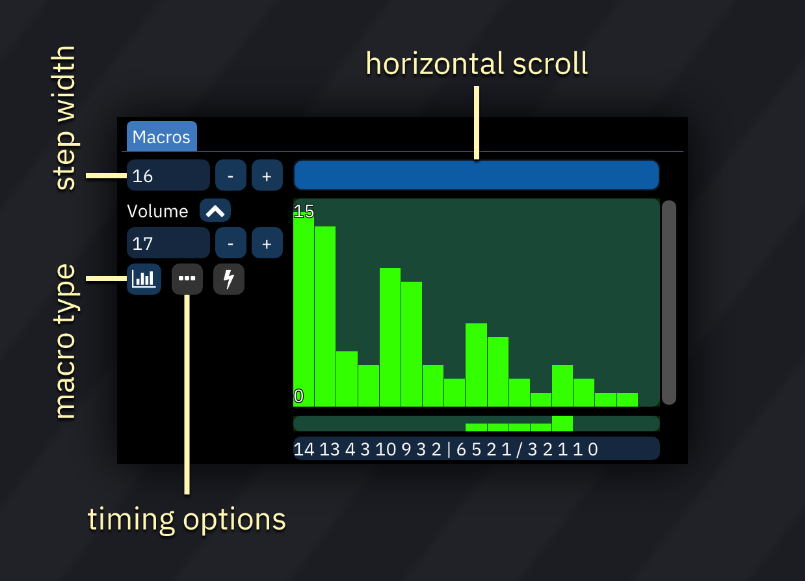
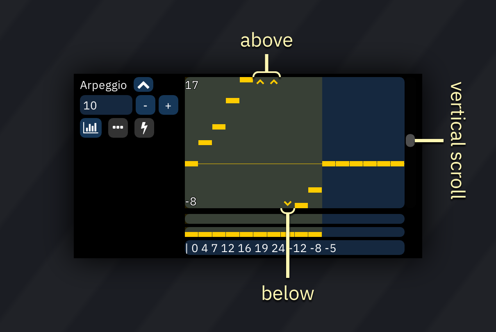
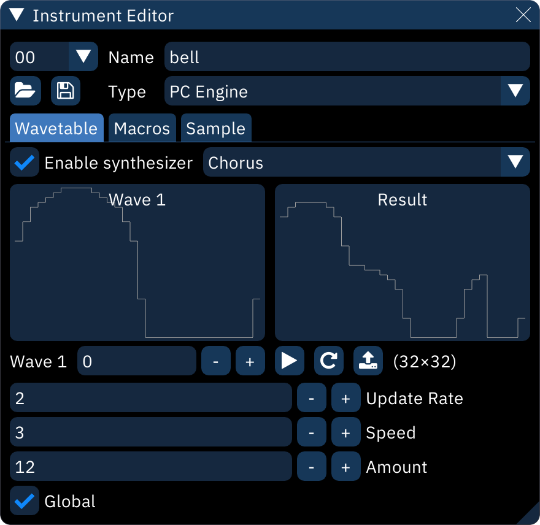

# instrument editor

the instrument editor always starts with this section:

- top-left numeric dropdown: instrument selector.
- folder icon: open an instrument file.
- save icon: save current instrument as a file.
  - right-clicking gives the option to save a .dmp format DefleMask preset.
- **Name**: instrument name.
- **Type**: the system for which the instrument is intended.
  - if changed, all applicable settings and macros will remain as they are. numbers will not be adjusted.

## instrument types

the following instrument types are available:

- [SN76489/Sega PSG](psg.md) - for use with TI SN76489 and derivatives like Sega Master System's PSG.
- [FM (OPN)](fm-opn.md) - for use with YM2612, YM2203, YM2608, YM2610 and YM2610B.
- [Game Boy](game-boy.md) - for use with Game Boy APU.
- [C64](c64.md) - for use with Commodore 64 SID.
- [Generic Sample](sample.md) for controlling Amiga and other sample channels/chips like YM2612's Channel 6 PCM mode, NES channel 5, Sega PCM, X1-010 and PC Engine's sample playback mode.
- [PC Engine](pce.md) - for use with PC Engine's wavetable synthesizer.
- [AY-3-8910/SSG](ay8910.md) - for use with AY-3-8910 PSG sound source and SSG portion in YM2610.
- [AY8930](ay8930.md) - for use with Microchip AY8930 E-PSG sound source.
- [TIA](tia.md) - for use with Atari 2600 chip.
- [SAA1099](saa.md) - for use with Philips SAA1099 PSG sound source.
- [VIC](vic.md) - for use with VIC-20 sound chip.
- [PET](pet.md) - for use with Commodore PET.
- [VRC6](vrc6.md) - for use with VRC6's PSG sound source.
- [FM (OPLL)](fm-opll.md) - for use with YM2413.
- [FM (OPL)](fm-opll.md) - for use with YM3526 (OPL), YM3812 (OPL2) and YMF262 (OPL3).
- [FDS](fds.md) - for use with Famicom Disk System sound source.
- [Virtual Boy](virtual-boy.md) - for use with Virtual Boy.
- [Namco 163](n163.md) - for use with Namco 163.
- [Konami SCC/Bubble System WSG](scc.md) - for use with Konami SCC and Wavetable portion in Bubble System's sound hardware.
- [FM (OPZ)](fm-opz.md) - for use with YM2414.
- [POKEY](pokey.md) - for use with Atari 8-bit computers and their POKEY sound source.
- [Beeper](beeper.md) - for use with PC Speaker and ZX Spectrum Beeper (SFX-like engine).
- [WonderSwan](wonderswan.md) - for use with WonderSwan's wavetable synthesizer.
- [Atari Lynx](lynx.md) - for use with Atari Lynx handheld console.
- [VERA](vera.md) - for use with Commander X16 VERA.
- [Seta/Allumer X1-010](x1_010.md) - for use with Wavetable portion in Seta/Allumer X1-010.
- [ES5506](es5506.md) - for use with Ensoniq ES5506 sound chip.
- [SNES](snes.md) - for use with SNES.
- [Sound Unit](su.md) - for use with Sound Unit chip.
- [Namco WSG](wsg.md) - for use with Namco WSG wavetable chips, including C15 and C30.
- [FM (OPM)](fm-opm.md) - for use with YM2151.
- [NES](nes.md) - for use with NES.
- [MSM6258](msm6258.md) - for use with MSM6258 sample chip.
- [MSM6295](msm6295.md) - for use with MSM6295 sample chip.
- [ADPCM-A](adpcm-a.md) - for use with ADPCM-A sample chip.
- [ADPCM-B](adpcm-b.md) - for use with ADPCM-B sample chip.
- [SegaPCM](segapcm.md) - for use with SegaPCM sample chip.
- [QSound](qsound.md) - for use with QSound sample chip.
- [YMZ280B](ymz280b.md) - for use with YMZ280B sample chip.
- [RF5C68](rf5c68.md) - for use with RF5C68 sample chip.
- [MSM5232](msm5232.md) - for use with MSM5232 PSG sound source.
- [T6W28](t6w28.md) - for use with Toshiba T6W28 PSG sound source.
- [K007232](k007232.md) - for use with K007232 sample chip.
- [GA20](ga20.md) - for use with GA20 sample chip.
- [Pokémon Mini/QuadTone](pokemini.md) - for use with these systems.
- [SM8521](sm8521.md) - for use with SM8521 chip, used in Tiger Game.com.
- [PV-1000](pv1000.md) - for use with Casio PV-1000.
- [K053260](k053260.md) - for use with K053260 sample chip.
- [TED](ted.md) - for use with Commodore Plus/4 and Commodore 16's TED chip.
- [C140](c140.md) - for use with C140 sample chip.
- [C219](c219.md) - for use with C219 sample chip.

## macros

macros are incredibly versatile tools for automating instrument parameters.

after creating an instrument, open the Instrument Editor and select the "Macros" tab. there may be multiple macro tabs to control individual FM operators and such.

the very first numeric entry sets the visible width of the bars in sequence-type macros. the scrollbar affects the view of all macros at once. there's a matching scrollbar at the bottom underneath all the macros.

each macro has two buttons on the left.
- macro type (explained below).
- timing editor, which pops up a small dialog:
  - **Step Length (ticks)**: determines how many ticks pass before each change of value. default is 1.
  - **Delay**: delays the start of the macro until this many ticks have passed. default is 0.
  - the button is highlighted if either of these is set differently from default.
- release mode. this determines how macro release is handled:
  - **Active**: jumps to release position.
  - **Passive**: does not jump to release position. if release position hasn't been reached yet, there will be a delay.

## macro types

every macro can be defined though one of three methods, selectable with the leftmost button under the macro type label:

-  **Sequence:** displayed as a bar graph, this is a sequence of numeric values.
-  **ADSR:** this is a traditional ADSR envelope, defined by the rate of increase and decrease of value over time.
-  **LFO:** the Low Frequency Oscillator generates a repeating wave of values.

### sequence

the number between the macro type label and the macro type button is the macro length in steps. the `-` and `+` buttons change the length of the macro. start out by adding at least a few steps.

the values of the macro can be drawn in the "bar graph" box.
- arpeggio and pitch macros may have values above or below the visible area; small chevrons will be shown until they are scrolled into view.
- bitmask-style macros show labels for each of their bits, and these are edited as toggles.

arpeggio macros have a short bar for setting whether to interpret the values as being "relative" or "fixed".
- by default, values are offsets **relative** to the note.
- if clicked on, a value becomes **fixed** and will be played at its corresponding note without regard to the note entered into the pattern.
  - values are counted from `C-0`. for example, a fixed value of 48 produces a `C-4` note.
  - fixed values are especially useful for noise instruments with preset periods.

below this is a short bar that controls macro loop and release.
- click to set the start point of a loop; the end point is the last value or release point. it appears as half-height bars. right-click to remove the loop.
- shift-click to set the release point. when played, the macro will hold here until the note is released. it appears as a full-height bar. right-click to remove the release point.

finally, the sequence of values can be directly edited in the text box at the bottom.
- the loop start is entered as a `|`.
- the release point is entered as a `/`.
- in arpeggio macros, a value starting with a `@` is a fixed value as described above.
- in bitmask-style macros, the values are added up in binary and converted to decimal. see [the hexadecimal guide](../1-intro/hex.md) for more info.

in all cases except bitmask macros, right-clicking on the graph opens up an editing menu:
- **copy**: copies the macro.
- **paste**: pastes the macro in the clipboard.
- **clear**: clears the macro.
- **clear contents**: resets all values to 0.
- **offset**:
  - **X**: slides the data "horizontally" within the macro, filling the gap with zeroes. data moved past the start or end is lost.
  - **Y**: increases or decreases all values, clipping them if they would move past the allowed range.
- **scale**:
  - **X**: stretches the macro.
  - **Y**: multiplies all values by the scale factor, clipping them if they would exceed the allowed range.
- **randomize**: replaces all values with random values between **Min** and **Max**.

### ADSR

- **Bottom** and **Top** determine the range of outputs generated by the macro. (Bottom can be larger than Top to invert the envelope!) All outputs will be between these two values.
- Attack, Decay, Sustain, SusDecay, and Release accept inputs between 0 to 255. these are scaled to the distance between Bottom and Top.
- **Attack** is how much the value moves toward Top with each tick.
- **Hold** sets how many ticks to stay at Top before Decay.
- **Decay** is how much the value moves to the Sustain level.
- **Sustain** is how far from Bottom the value stays while the note is held.
- **SusTime** is how many ticks to stay at Sustain until SusDecay.
- **SusDecay** is how much the value moves toward Bottom with each tick while the note is held.
- **Release** is how much the value moves toward Bottom with each tick after the note is released.

### LFO

- **Bottom** and **Top** determine the range of values generated by the macro. (Bottom can be larger than Top to invert the waveform!)
- **Speed** is how quickly the values change - the frequency of the oscillator.
- **Phase** is which part of the waveform the macro will start at, measured in 1/1024 increments.
- **Shape** is the waveform used. triangle is the default, and Saw and Square are exactly as they say.

## wavetable

this tab appears for PC Engine, FDS, Namco WSG, and other wavetable-based instruments.

when **Enable synthesizer** is off, the wavetable used for the instrument may be selected by creating a Waveform macro with a single value.

to use the wavetable synthesizer, refer to [the wavetable synthesizer section](wavesynth.md).

## sample

this tab appears for Generic PCM DAC, Amiga and SNES.

see the [Generic Sample section](sample.md) for more information.
