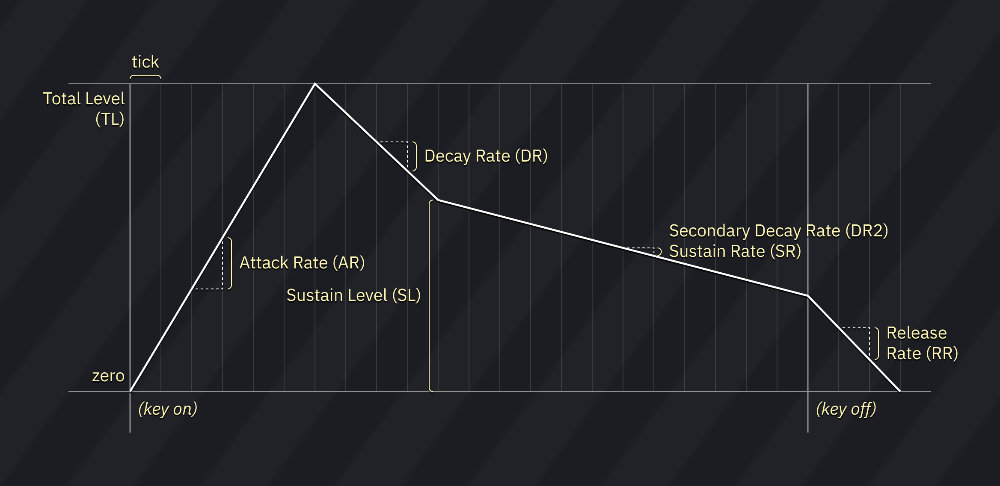

# ESFM instrument editor

the ESFM editor is divided into 6 tabs:

- **FM**: for controlling the basic parameters of FM sound source.
- **Macros (OP1)**: for macros controlling FM parameters of operator 1.
- **Macros (OP2)**: for macros controlling FM parameters of operator 2.
- **Macros (OP3)**: for macros controlling FM parameters of operator 3.
- **Macros (OP4)**: for macros controlling FM parameters of operator 4.
- **Macros**: for other macros (volume/arp/pitch/pan/operator 4 noise mode).

## FM

ESFM is four-operator, meaning it takes four oscillators to produce a single sound.

unlike most four-operator FM synthesizers, however, ESFM does not have an algorithm selection. instead, it uses a fixed operator arrangement, but allows you to independently control the output and modulation input levels of each operator. this allows it to reproduce a few common four-operator algorithms, as well as unique combinations where operators act as modulators and carriers at the same time.

these apply to the instrument as a whole:
- **OP4 Noise Mode**: determines the mode used to produce noise in operator 4.
  - Normal: noise is disabled.
  - Snare: takes the snare noise generation mode from OPL. square + noise.
  - HiHat: ring modulates with operator 3 and adds noise.
  - Top: ring modulates with operator 3 and double pitch modulation input.
  - these are normally used for the drum channels in ESFM's OPL3 compatibility mode.
    - however, in ESFM, operator 4 can be modulated by operator 3, whereas in OPL3 drum mode the rhythm channels cannot be modulated.
  - __note__: usage of noise mode "Top" is discouraged for now as it is not properly emulated yet, and results may change when the emulation gets fixed in the future.
- **operator routing preview**: shows how operators are connected with each other and with the audio output (at the bottom).
  - left-click pops up a small "operators changes with volume?" dialog where each operator can be toggled to scale with volume level.
  - right-click switches to a preview display of the waveform generated on a new note:
    - left-click restarts the preview.
    - middle-click pauses and unpauses the preview.
    - right-click returns to algorithm view.

these apply to each operator:
- the crossed-arrows button can be dragged to rearrange operators.
- **Amplitude Modulation (AM)**: makes the operator affected by LFO tremolo.
- **AM Depth (DAM/AMD)**: when enabled, LFO tremolo is deeper (1dB off; 4.8dB on).
- **Sustain flag (SUS)**: when enabled, the envelope pauses ("sustains") once it reaches the Sustain Level and does not proceed to the release phase until note off.
- **Envelope Delay (DL)**: determines the delay time before the envelope is triggered. the bigger the value, the longer the delay (0 to 7).
  - a change of one unit doubles or halves the delay time.
  - a value of 0 results in no delay.
- **Attack Rate (AR)**: determines the rising time for the sound. the bigger the value, the faster the attack (0 to 15).
- **Decay Rate (DR)**: determines the diminishing time for the sound. the higher the value, the shorter the decay. it's the initial amplitude decay rate (0 to 15).
- **Sustain Level (SL)**: determines the point at which the sound ceases to decay and changes to a sound having a constant level. the sustain level is expressed as a fraction of the maximum level (0 to 15).
- **Release Rate (RR)**: determines the rate at which the sound disappears after note off. the higher the value, the shorter the release (0 to 15).
- **Total Level (TL)**: represents the envelope’s highest amplitude, with 0 being the largest and 63 (decimal) the smallest. a change of one unit is about 0.75 dB.
- **Key Scale Level (KSL)**: also known as "Level Scale". determines the degree to which the amplitude decreases according to the pitch.

- **Key Scale Rate (KSR)**: also known as "Rate Scale". determines the degree to which the envelope execution speed increases according to the pitch.
- **Frequency Multiplier (MULT)**: sets the coarse pitch offset in relation to the note (0 to 15). the values follow the harmonic scale. for example, 0 is -1 octave, 1 is 0 octaves, 2 is 1 octave, 3 is 1 octave 7 semitones, and so on.
  - note that values 11, 13 and 14 behave as 10, 12 and 15 respectively.
- **Tune (CT)**: sets the semitone offset in relation to the note (-24 to 24).
  - this is a software effect.
- **Fine Detune (DT)**: shifts the pitch in fine steps (-128 to 127). 0 is the base pitch, -128 is -1 semitone, 127 is nearly +1 semitone.
  - this is a software effect.
- **Left (L)**: toggles output to the left channel from the operator to the audio output.
- **Right (R)**: toggles output to the right channel from the operator to the audio output.
- **Waveform Select (WS)**: changes the waveform of the operator (0 to 7).
- **Vibrato (VIB)**: makes the operator affected by LFO vibrato.
- **Vibrato Depth (DVB/FMD)**: when enabled, vibrato is deeper.

### routing controls

- **Output Level (OL)**: sets the output level from this operator to the audio output (0 to 7).
  - 7 is the loudest level and 1 is the softest, while 0 disables audio output.
  - a change of one unit is about 6 dB.
  - this output scaling factor is applied after TL and envelope scaling have been performed.
- **Modulation Input Level (MI)**: sets the modulation level from the previous operator to this operator (0 to 7).
  - 7 is the strongest level and 1 is the weakest, while 0 disables modulation.
  - a change of one unit is about 6 dB.
  - for operator 1 this controls the **feedback level**.
  - this modulation scaling factor is applied after the previous operator's TL and envelope scaling have been performed, but is unaffected by OL above.

### common algorithms

this table contains a list of modulation input/output level values which resemble common algorithms in Yamaha FM chips.

__note__: MI1 is not included as it is the feedback level.

| algorithm                      | OL1 | MI2 | OL2 | MI3 | OL3 | MI4 | OL4 |
|--------------------------------|:---:|:---:|:---:|:---:|:---:|:---:|:---:|
| OPN algorithm **0**            |  0  |  7  |  0  |  7  |  0  |  7  |  7  |
| OPN algorithm **4**            |  0  |  7  |  7  |  0  |  0  |  7  |  7  |
| OPN algorithm **6**            |  0  |  7  |  7  |  0  |  7  |  0  |  7  |
| OPN algorithm **7**            |  7  |  0  |  7  |  0  |  7  |  0  |  7  |
| OPL3 algorithm **1**           |  7  |  0  |  0  |  7  |  0  |  7  |  7  |
| OPL3 algorithm **3**           |  7  |  0  |  0  |  7  |  7  |  0  |  7  |
| OPL3 algorithm **1** (variant) |  0  |  7  |  0  |  7  |  7  |  0  |  7  |

### fixed frequency mode

each operator has a Fixed Frequency mode. once enabled, the operator runs at the specified frequency regardless of the note.

when fixed frequency mode is enabled, the Tune and Fine Detune sliders will be replaced by **Block (Blk)** and **FreqNum (F)**, which allow you to input a raw frequency value into the operator.
the actual frequency is determined by the formula: `FreqNum*(2^Block)`.

in other words, FreqNum defines the base frequency, while Block determines the scaling factor in octaves.

## macros

these macros allow you to control several parameters of FM per tick.

## OP1-OP4 Macros

most parameters are listed above.

### envelope delay macro tricks

due to a quirk in how the envelope delay feature works, the **Envelope Delay** macro can control the operator's key-on status for a limited amount of time after a note is played. a value of 0 represents key-on, while a value of 7 represents key-off.

note that the macro cannot exceed 659.1 ms in length - anything beyond that will be treated as a value of 0.

### operator arpeggio and pitch macros

among the available macros are **Op. Arpeggio** and **Op. Pitch**. these work like the **Arpeggio** and **Pitch** macros featured below, but are applied to the individual operator, overriding the **Arpeggio**/**Pitch** macros respectively.

the **Tune** and **Fine Detune** FM parameters are still respected when using these macros.

### fixed frequency macros

when fixed frequency is enabled for an operator, the **Op. Arpeggio** and **Op. Pitch** macros will be replaced by the **Block** and **FreqNum** macros. these can be used to change the operator's fixed frequency over time.

## Macros

- **Volume**: volume sequence.
- **Arpeggio**: pitch sequence.
- **OP4 Noise Mode**: operator 4 noise mode sequence.
- **Panning**: enables output on left/right channels.
  - note that each operator also has its own pan controls, which get masked by this global pan control.
- **Pitch**: fine pitch.
  - **Relative**: when enabled, pitch changes are relative to the current pitch.
- **Phase Reset**: restarts all operators and resets the waveform to its start.
