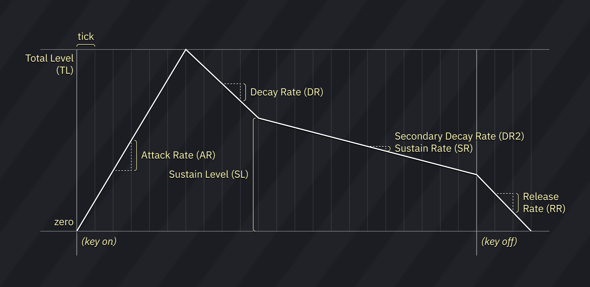

# OPLL FM synthesis instrument editor

the OPLL FM editor is divided into 5 tabs:

- **FM**: for controlling the basic parameters of FM sound source.
- **Macros (FM)**: for macros controlling algorithm, waveform and feedback.
- **Macros (OP1)**: for macros controlling FM parameters of operator 1.
- **Macros (OP2)**: for macros controlling FM parameters of operator 2.
- **Macros**: for other macros (volume/arp/pitch/patch).

## FM

the OPLL synthesizer is two-operator, meaning it takes two oscillators to produce a single sound.
however, unlike the other FM chips, only one custom patch may be set at a time, shared among all 9 channels.

but don't worry! there also are 15 preset patches that you may select at any time.

these apply to the instrument as a whole:
- **Feedback (FB)**: determines how many times operator 1 returns its output to itself (0 to 7).
- **Sustain (SUS)**: enables the sustain flag (sets the release rate to 5).
- **DC (half-sine carrier)**: sets the waveform produced by carrier operator to half-sine.
- **DM (half-sine modulator)**: sets the waveform produced by modulator operator to half-sine.
- **preset dropdown**: selects OPLL preset instrument.
  - this is the selector for the preset patches I mentioned before.
  - once a preset patch is selected, only the volume is configurable.
  - only one user-specified patch may be applied at a time!

if you select the special Drums patch, you may use the instrument in Drums mode of OPLL. an extra setting also appears:
- **Fixed frequency mode**: allows you to set a fixed frequency for the drum channels.

these apply to each operator:
- the crossed-arrows button can be dragged to rearrange operators.
- **Amplitude Modulation (AM)**: makes the operator affected by LFO tremolo.
- **Envelope generator sustain flag (EGS)**: when enabled, value of Sustain Level is in effect.
- **Attack Rate (AR)**: determines the rising time for the sound. the bigger the value, the faster the attack (0 to 15).
- **Decay Rate (DR)**: determines the diminishing time for the sound. the higher the value, the shorter the decay. it's the initial amplitude decay rate (0 to 15).
- **Sustain Level (SL)**: determines the point at which the sound ceases to decay and changes to a sound having a constant level. the sustain level is expressed as a fraction of the maximum level (0 to 15).
- **Release Rate (RR)**: determines the rate at which the sound disappears after note off. the higher the value, the shorter the release (0 to 15).
- **Total Level (TL)**: represents the envelope’s highest amplitude, with 0 being the largest and 63 (decimal) the smallest. a change of one unit is about 0.75 dB.
  - in the case of the second operator, it goes from 0 to 15 instead.
- **Key Scale Level (KSL)**: also known as "Level Scale". determines the degree to which the amplitude decreases according to the pitch.

- **Envelope Scale (KSR)**: also known as "Key Scale". determines the degree to which the envelope execution speed increases according to the pitch.
- **Frequency Multiplier (MULT)**: sets the coarse pitch offset in relation to the note (0 to 15). the values follow the harmonic scale. for example, 0 is -1 octave, 1 is 0 octaves, 2 is 1 octave, 3 is 1 octave 7 semitones, and so on.
  - note that values 11, 13 and 14 behave as 10, 12 and 12 respectively.
- **Vibrato (VIB)**: makes the operator affected by LFO vibrato.

## macros

these macros allow you to control several parameters of FM per tick.

## FM Macros

all parameters are listed above.

## OP1-OP4 Macros

all parameters are listed above.

## Macros

- **Arpeggio**: pitch change sequence.
- **Patch**: changes the playing preset mid-note.
  - through use of this macro, you may unlock different glitched sounds. useful for distortion guitars!
- **Pitch**: fine pitch.
  - **Relative**: when enabled, pitch changes are relative to the current pitch.
- **Phase Reset**: restarts all operators and resets the waveform to its start.

## links

[FM instrument tutorial](https://www.youtube.com/watch?v=wS8edjurjDw): A great starting point to learn how create and work with FM sounds. this was made for DefleMask, but all the same principles apply.
