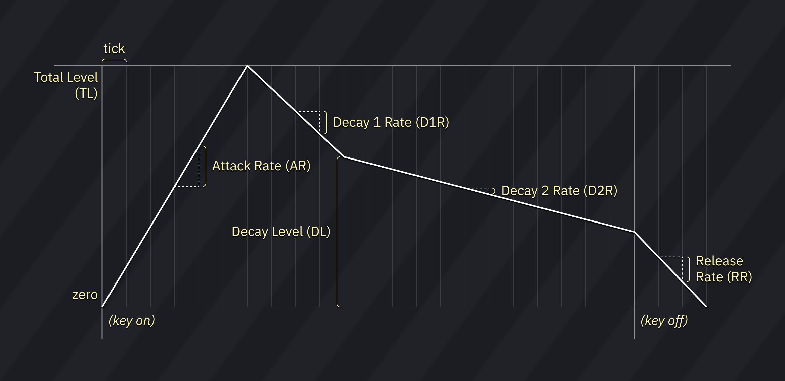

# MultiPCM instrument editor

the MultiPCM instrument editor contains three tabs: Sample, MultiPCM and Macros.

## Sample

for sample settings, see [the Sample instrument editor](sample.md).

## MultiPCM

MultiPCM contains an ADSR envelope, not unlike Yamaha OPN/OPM envelopes, and simple LFO, also similiar to that found in OPN.

you may use this tab to set up MultiPCM-specific parameters:

- **AR**: sets Attack Rate.
- **D1R**: sets Decay 1 Rate.
- **DL**: sets Decay Level (analogue of Sustain Level on OPN chips).
- **D2R**: sets Decay 2 Rate (a.k.a. SR, Sustain Rate).
- **RR**: sets Release Rate.

- **RC**: sets Rate Correction amount. similar to Key Scale or Rate Scale in FM parameters, this determines the degree to which the envelope execution speed increases according to the pitch.
- **LFO Rate**: sets speed of LFO.
- **PM Depth**: sets depth of LFO vibrato.
- **AM Depth**: sets depth of LFO tremolo/amplitude modulation.
- **Damp**: enforce quickly fading out the sample over 11 ms.
- **Pseudo Reverb**: enables reverb-like effect.
- **LFO Reset**: disables and resets LFO.
- **Disable volume change ramp**: if set to "on", volume change interpolation is disabled.

## Macros

- **Volume**: volume sequence.
- **Arpeggio**: pitch sequence.
- **Panning**: output level for left and right channels (from -3 to +3).
- **Pitch**: fine pitch.
- **Phase Reset**: trigger restart of waveform.
- **LFO Speed**: sequence of LFO speeds.
- **LFO Vib depth**: LFO vibrato sequence.
- **LFO Vib depth**: LFO tremolo sequence.
