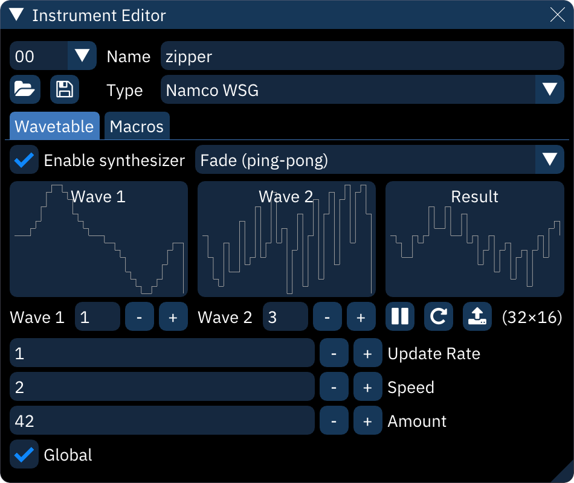

# wavetable synthesizer

within the "Wavetable" tab of the instrument editor, Furnace allows you to modulate or combine 1 or 2 waves to create unique "animated" sounds. think of it like a VST or a plugin, as it's basically an extension of regular wavetable soundchips that still allow it to run on real hardware.

this is accomplished by selecting a wave or two, a mode, and adjusting the settings as needed until you come up with a sound that you like, without taking up a load of space. this allows you to create unique sound effects or instruments, that, when used well, almost sound like they're Amiga samples.

unfortunately, on some chips like the HuC6280, you cannot use the wavetable synth to animate waveforms and have them sound smooth, as the chip resets the channel's phase when a waveform is changed while the channel is playing. on certain frequencies, this can be avoided, but not on most, unfortunately.

input waveforms should match the size of the wavetable or unexpected results may occur.

- **Enable synthesizer**: must be on for the rest of this to work.
- synthesizer type: selects the synthesis algorithm.
- waveform displays.
- **Wave 1**: selects input waveform.
  - this will turn yellow and display a warning sign to indicate that a Waveform macro is set, which will override the wavesynth.
- **Wave 2**: selects second input waveform. only appears when a dual-waveform synthesizer is selected.
- **Pause preview**: toggles live waveform preview.
- **Restart preview**: restarts preview from initial state.
- **Copy to new wavetable**: copies the currently displayed output waveform into the wavetable as a new entry.
- (width×height): size of wavetable.
- **Update Rate**: time in ticks between waveform changes.
- **Speed**: rate of change with each update.
- **Amount**: strength of synthesizer function.
- **Power**: only appears when synthesizer type is "Phase Modulation".
- **Global**:
  - if disabled, each note resets the synthesizer to the start.
  - if enabled, synthesis continues unbroken from note to note.
