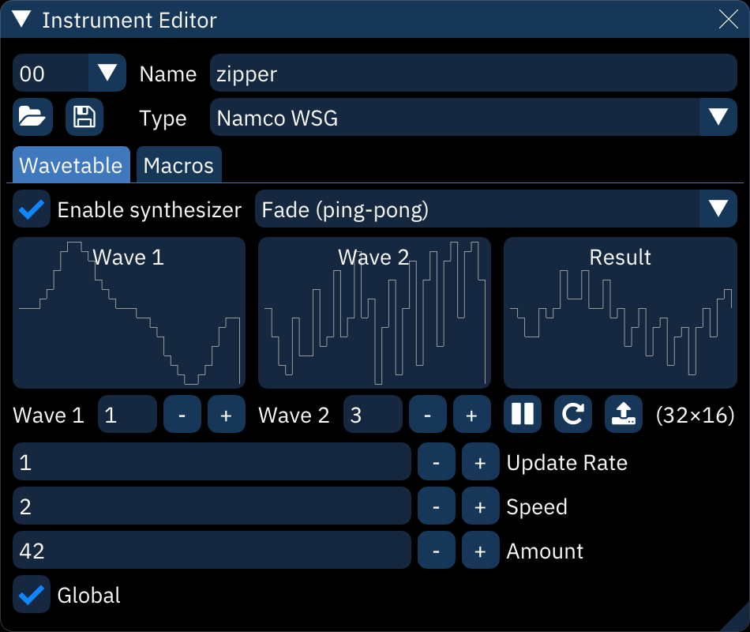

# wavetables

Wavetable synthesizers, in context of Furnace, are sound sources that operate on extremely short n-bit PCM streams. By extremely short, no more than 256 bytes. This amount of space is nowhere near enough to store an actual sampled sound, it allows certain amount of freedom to define a waveform shape.

Each chip has its own maximum size, shown in the following table. If a larger wave is defined for these chips, it will be squashed to fit within the constraints of the chips. Some hardware doesn't work well with the wavetable synthesizer (described below); these systems are marked in the "notes" column.

system              | width | height | notes
--------------------|------:|:-------|:------
Bubble System       |    32 | 16     | 
Game Boy            |    32 | 16     | phase reset on waveform change (clicking)
SM8521              |    32 | 16     | 
Namco WSG           |    32 | 16     | RAM only
WonderSwan          |    32 | 16     | 
Namco 163           |  ≤240 | 16     | limits differ depending on channel count 
SNES                |  ≤256 | 16     | 
PC Engine           |    32 | 32     | phase reset on waveform change (clicking)
Virtual Boy         |    32 | 64     | wavesynth unsupported
Famicom Disk System |    64 | 64     | 
Konami SCC          |    32 | 256    | 
Seta X1-010         |   128 | 256    | 
Amiga               |  ≤256 | 256    | 

# wavetable editor

controls across the top line:
- waveform number. the `-` and `+` buttons step through the list.
- open.
- save.
- **Steps**: view waveform as discrete blocks.
- **Lines**: view waveform as a continuous line.
- **Width**: length of the waveform data. maximum is 256.
- **Height**: depth of the waveform. maximum is 256.
- `<` / `>`: toggle tabs (described below).

waveform display:
- the waveform is directly editable with the mouse.
- hovering will display a tooltip with the waveform position and value.

controls across the bottom line:
- **Dec**: view MML stream as decimal.
- **Hex**: view MML stream as hexadecimal.
- `+` / `±`: toggle MML stream as unsigned/signed. also adjusts waveform display.
- MML stream: waveform data as an editable numeric sequence.

## tabs

each tab provides different ways of creating or altering a waveform.

### Shapes

this creates a waveform by adding together a few predefined basic wave shapes.
- shape: select shape from sine, triangle, saw, and square.
- **Duty**: only affects pulse waves, determining their width
- **Exponent**: applies an exponent (power) to the waveform (^2, ^3 and so on).
- **XOR Point**: determines the point where the waveform gets negated.
- **Amplitude/Phase**: add together up to 16 instances of the shape.
  - **Amplitude**: height of the shape.
  - **Phase**: position along the shape. for example, 0.250 starts the shape a quarter of the way along.

### FM

this creates a waveform using frequency modulation synthesis with up to four operators.

one can set carrier/modulation levels, frequency multipliers, connections between operators and FM waveforms of these operators.

### WaveTools

these are useful editing tools to fine-tune the waveform:
- **Scale X**: stretches the waveform to a new length.
- interpolation method: filters the waveform when stretching. choose from none, linear, cosine, and cubic interpolation.
- **Scale Y**: resizes the waveform to a new height. it will clip at the top and bottom.
- **Offset X**: slides the the waveform forward or back. it will wrap around.
- **Offset Y**: slides the waveform up or down. it will clip at the top and bottom.
- **Smooth**. smooths waveform.
- **Amplify**. changes the volume of the waveform. it will clip at the top and bottom.
- **Normalize**: stretches waveform to maximum within the wavetable height.
- **Invert**: flips waveform vertically.
- **Half**: halves the waveform's frequency by stretching its first half to fill the waveform length.
- **Double**: doubles the waveform's frequency by squashing it to half length then repeating it.
- **Convert Signed/Unsigned**. worth trying if an imported wave sounds corrupted.
- **Randomize**: generate a completely random waveform.

# wavetable synthesizer

Within the "Wavetable" tab of the instrument editor, Furnace allows you to modulate or combine 1 or 2 waves to create unique "animated" sounds. Think of it like a VST or a plugin, as it's basically an extension of regular wavetable soundchips that still allow it to run on real hardware.

This is accomplished by selecting a wave or two, a mode, and adjusting the settings as needed until you come up with a sound that you like, without taking up a load of space. This allows you to create unique sound effects or instruments, that, when used well, almost sound like they're Amiga samples.

Unfortunately, on some chips like the HuC6280, you cannot use the wavetable synth to animate waveforms and have them sound smooth, as the chip resets the channel's phase when a waveform is changed while the channel is playing. On certain frequencies, this can be avoided, but not on most, unfortunately.

input waveforms should match the size of the wavetable or unexpected results may occur.

- **Enable synthesizer**: must be on for the rest of this to work.
- synthesizer type: selects the synthesis algorithm.
- waveform displays.
- **Wave 1**: selects input waveform.
- **Wave 2**: selects second input waveform. only appears when a dual-waveform synthesizer is selected.
- **Pause preview**: toggles live waveform preview.
- **Restart preview**: restarts preview from initial state.
- **Copy to new wavetable**: copies the currently displayed output waveform into the wavetable as a new entry.
- (width×height): size of wavetable.
- **Update Rate**: time in ticks between waveform changes.
- **Speed**: rate of change with each update.
- **Amount**: strength of synthesizer function.
- **Power**: only appears when synthesizer type is "Phase Modulation".
- **Global**:
  - if disabled, each note resets the synthesizer to the start.
  - if enabled, synthesis continues unbroken from note to note.
