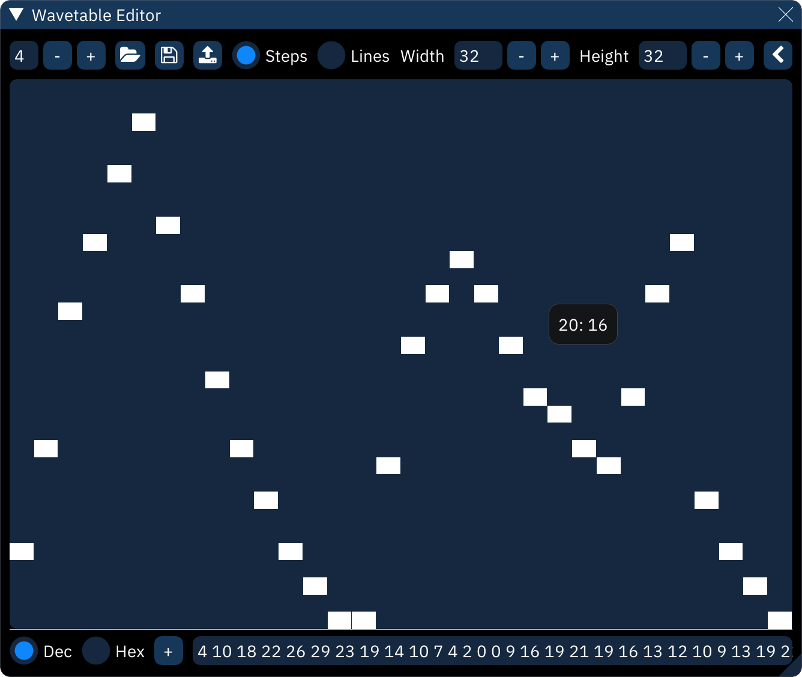
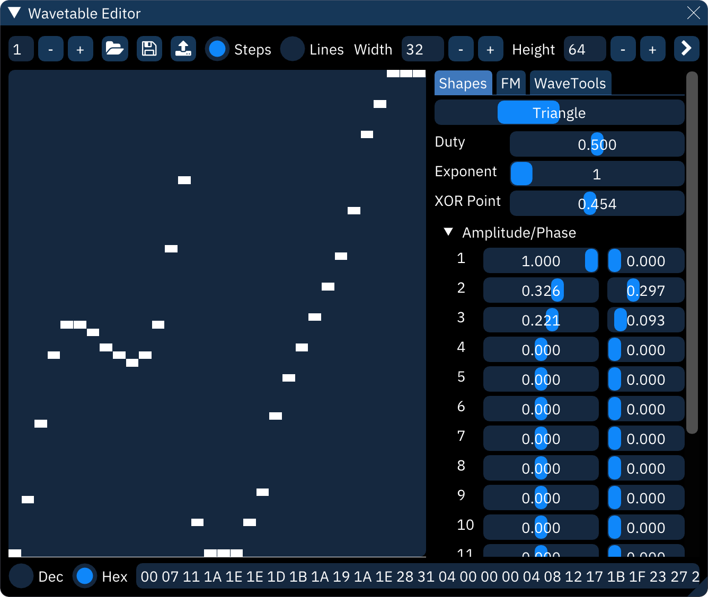

# wavetables

wavetable chips, in context of Furnace, are sound generators that operate on extremely short, looping sample streams. by extremely short, usually no more than 256 samples.
this amount of space is nowhere near enough to store an actual sampled sound, but it allows certain amount of freedom to define a waveform shape.

each chip has its own maximum size, shown in the following table. if a larger wave is defined for these chips, it will be scaled to fit within the constraints of the chips. some of these don't work well with the wavetable synthesizer (described below); these systems are marked in the "notes" column.

system        | width | height | notes
--------------|------:|:-------|:------
Bubble System |    32 | 16     |
Game Boy      |    32 | 16     | phase reset on waveform change (clicking)
SM8521        |    32 | 16     |
Namco WSG     |    32 | 16     | RAM only
WonderSwan    |    32 | 16     |
Namco 163     |  ≤240 | 16     | limits differ depending on channel count 
SNES          |  ≤256 | 16     |
PC Engine     |    32 | 32     | phase reset on waveform change (clicking)
Virtual Boy   |    32 | 64     |
FDS           |    64 | 64     |
Konami SCC    |    32 | 256    |
Seta X1-010   |   128 | 256    |
Amiga         |  ≤256 | 256    |

you may use up to 32768 wavetables in a module.

## wavetable editor

controls across the top line:
- waveform number: the `-` and `+` buttons step through the list.
- open: opens a file selector to choose the file to open.
- save: opens a file selector to choose the file to save to.
  - right-clicking brings up a menu:
    - **save as .dmw...**: saves the selected wavetable in DefleMask format.
    - **save raw...**: saves the selected wavetable as raw data.
- create sample from wavetable: copies wavetable to a new looped sample.
- **Steps**: view waveform as discrete blocks.
- **Lines**: view waveform as a continuous line.
- **Width**: length of the waveform data. maximum is 256.
- **Height**: height of the waveform. maximum is 256.
- `<` / `>`: show/hide waveform utilities (described below).

waveform display:
- the waveform is directly editable with the mouse.
- hovering will display a tooltip with the waveform position and value.

controls across the bottom line:
- **Dec**: view text input as decimal.
- **Hex**: view text input as hexadecimal.
- `+` / `±`: toggle text input as unsigned/signed. also adjusts waveform display.
- text input: waveform data as an editable numeric sequence. also called "MML stream".

## waveform utilities

these provide different ways of creating or altering a waveform.

### Shapes

this creates a waveform by adding together a few predefined basic wave shapes.
- shape: select shape from sine, triangle, saw, and square.
- **Duty**: only affects pulse waves, determining their width.
- **Exponent**: applies an exponent (power) to the waveform (^2, ^3 and so on).
- **XOR Point**: determines the point where the waveform gets inverted.
- **Amplitude/Phase**: add together up to 16 instances of the shape.
  - **Amplitude**: height of the shape.
  - **Phase**: position along the shape. for example, 0.250 starts the shape a quarter of the way along.

### FM

this creates a waveform using frequency modulation synthesis with up to four operators.

you can set carrier/modulation levels, frequency multipliers, connections between operators and FM waveforms of these operators.

### WaveTools

these are useful editing tools to fine-tune the waveform:
- **Scale X**: stretches the waveform to a new length.
- **interpolation method**: filters the waveform when stretching. choose from none, linear, cosine, and cubic interpolation.
- **Scale Y**: resizes the waveform to a new height. it will clip at the top and bottom.
- **Offset X**: slides the the waveform forward or back. it will wrap around.
- **Offset Y**: slides the waveform up or down. it will clip at the top and bottom.
- **Smooth**. averages values in the waveform.
- **Amplify**. changes the volume of the waveform. it will clip at the top and bottom.
- **Normalize**: stretches waveform to maximum within the wavetable height.
- **Invert**: flips waveform vertically.
- **Reverse**: flips waveform horizontally.
- **Half**: halves the waveform's frequency by stretching its first half to fill the waveform length.
- **Double**: doubles the waveform's frequency by squashing it to half length then repeating it.
- **Convert Signed/Unsigned**. worth trying if an imported wave sounds corrupted.
- **Randomize**: generate a completely random waveform.
