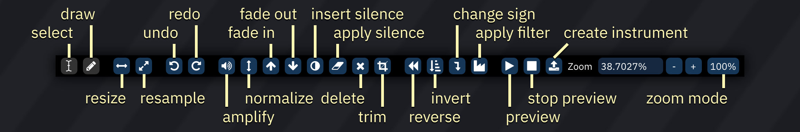

# samples

In the context of Furnace, a sound sample (usually just referred to as a sample) is a string of numbers that represent sampled PCM audio.

In Furnace, these samples can be generated by importing a .wav (think of it as an higher quality MP3) file.

## supported chips

the following sound chips have sample support:

- NES/Ricoh 2A03 (with DPCM support and only on channel 5)
- Sega Genesis/YM2612 (channel 6 only)
- PC Engine/TurboGrafx-16/HuC6280
- Amiga/Paula
- SegaPCM
- NEC PC-9801/YM2608 (ADPCM channel only)
- Neo Geo/Neo Geo CD/YM2610 (ADPCM channels only)
- Seta/Allumer X1-010
- Atari Lynx
- MSM6258 and MSM6295
- YMU759/MA-2 (last channel only)
- QSound
- ZX Spectrum 48k (1-bit)
- RF5C68
- SNES/S-DSP
- WonderSwan (second channel only)
- tildearrow Sound Unit
- VERA (last channel only)
- Y8950 (last channel only)
- Konami K007232
- Irem GA20
- Ensoniq OTTO/ES5506
- Yamaha PCMD8/YMZ280B
- MMC5 (last channel only)

## compatible sample mode (LEGACY)

**use of this mode is discouraged in favor of Sample type instruments.**

effect `17xx` enables/disables compatible sample mode where supported (e.g. on Sega Genesis or PC Engine).

in this mode, samples are mapped to notes in an octave from C to B, allowing you to use up to 12 samples.
if you need to use more samples, you may change the sample bank using effect `EBxx`.

## notes

due to limitations in some of those sound chips, some restrictions exist:

- Amiga: maximum frequency is 31469Hz, but anything over 28867 will sound glitchy on hardware. sample lengths and loop will be set to an even number, and your sample can't be longer than 131070.
- NES: if on DPCM mode, only a limited selection of frequencies is available, and loop position isn't supported (only entire sample).
- SegaPCM: your sample can't be longer than 65535, and the maximum frequency is 31.25KHz.
- QSound: your sample can't be longer than 65535, and the loop length shall not be greater than 32767.
- Neo Geo (ADPCM-A): no looping supported. your samples will play at 18.518KHz.
- Neo Geo (ADPCM-B): no loop position supported (only entire sample), and the maximum frequency is 55.555KHz.
- YM2608: the maximum frequency is 55.555KHz.
- MSM6258/MSM6295: no arbitrary frequency.
- ZX Spectrum Beeper: your sample can't be longer than 2048, and it always plays at ~55KHz.
- Seta/Allumer X1-010: frequency resolution is terrible in the lower end. your sample can't be longer than 131072.

furthermore, many of these chips have a limited amount of sample memory. check memory usage in window > statistics.

# the sample editor

you can actually tweak your samples in Furnace's sample editor, which can be accessed by clicking on `window` (at the top of the screen) then clicking on `sample editor`.

the changes you make will be applied as soon as you've committed them to your sample, but they can be undone and redone, just like text.

in there, you can modify certain data pertaining to your sample, such as the:
 - volume of the sample in percentage, where 100% is the current level of the sample (note that you can distort it if you put it too high)
 - the sample rate.
 - what frequencies to filter, along with filter level/sweep and resonance options (much like the C64)
 - and many more.

- top-left drop-down box: sample slot.
- **Open**: replaces current sample.
  - Right-clicking brings up a menu:
    - **import raw...**: brings up a file selector, then presents a dialog to choose the format of the selected file.
- **Save**: saves current sample to disk.
  - Right-clicking brings up a menu:
    - **save raw...**: brings up a file selector, then saves the sample as raw data.
- **Name**: name in sample list.
- button to left of **Info**: collapses and expands the info bar.
- **Type**: sample format. only 8-bit and 16-bit PCM samples are editable. selecting a format converts the sample data.
- **BRR emphasis**: boosts higher frequencies to compensate for the SNES low-pass filter. should not be enabled for BRR-type samples. only appears when applicable.
- **8-bit dither**: applies dithering to samples meant to play back at 8-bit resolution. only appears when applicable.

- **Rate**: switches to normal rate values.
- **Compat Rate**: switches to DefleMask-compatible rate values for sample mapping.
- **Hz**: base frequency of sample played at `C-4`.
- **Note**: note corresponding to Hz.
- **Fine**: fine tuning. ranges from -64 to 63, which maps to -1 to almost +1 semitone.

- **Loop**: enable or disable sample loop. only on supported chips.
- **Mode**: direction of loop. backward and ping pong loops are only natively available on some chips; on others, loop will be automatically unrolled as needed.
- **Start**: start of loop.
- **End**: end of loop.

- **Chips:** set assignment to chips and sample banks.
  - sample will only be uploaded to selected chips.
  - columns correspond to chips in use.
  - rows correspond to sample banks.

- **Edit mode: Select**: cursor selects portion of sample.
- **Edit mode: Draw**: cursor draws over wave.
- **Resize**: stretches sample. pops up a dialog to type new length.
- **Resample**: stretches sample. pops up a dialog box:
  - **Rate**: new sample rate.
  - **0.5x**: halves sample rate.
  - **==**: returns to original sample rate.
  - **2.0x**: doubles sample rate.
  - **Factor**: multiplier of original sample rate.
  - **Filter**: selects interpolation filter for resampling.
- **Undo**: undoes previous edit.
- **Redo**: redoes undone edit.
- **Amplify**: changes amplitude of selection. pops up a dialog to type amount.
- **Normalize**: adjusts amplitude of selection to maximum without clipping.
- **Fade in**: ramp amplitude of selection from 0 to original.
- **Fade in**: ramp amplitude of selection from original to 0.
- **Insert silence**: inserts silence. pops up a dialog to type length.
- **Apply silence**: reduces amplitude of selection to 0.
- **Delete**: removes selection.
- **Trim**: removes all but selection.
- **Reverse**: reverses direction of selection.
- **Invert**: flips selection "vertically".
- **Signed/unsigned exchange**: reinterprets selection data as being of the opposite sign. if a sample sounds fine elsewhere but is distorted on import, it may have been interpreted as signed when it should be unsigned, or vice versa; this will correct that.
- **Apply filter**: filters the selection. pops up a dialog box:
  - **From**: filter cutoff frequency at start of selection.
  - **To**: filter cutoff frequency at end of selection.
  - **Resonance**: emphasizes frequencies around filter cutoff.
  - **Power**: number of times resonance is applied.
  - **Low-pass**: amount to attenuate everything above cutoff.
  - **Band-pass**: amount to attenuate everything outside cutoff.
  - **High-pass**: amount to attenuate everything below cutoff.
- **Preview sample**: plays sample at base frequency.
- **Stop sample preview**: stops preview.
- **Create instrument from sample**: creates a new instrument with its initial sample set to the current sample.
- **Zoom**: shows and sets sample view zoom level.
- **Zoom mode**: switches between "Auto" (entire sample fits in window) and "100%" (each horizontal pixel represents one sample point).
