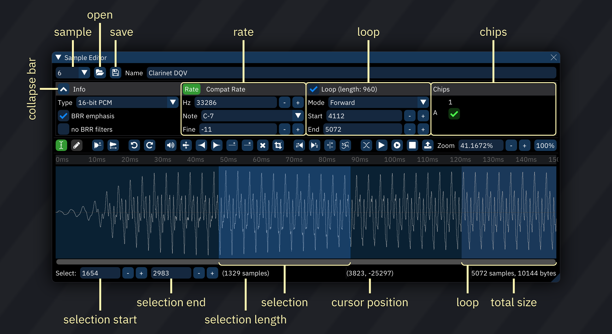

# samples

in the context of Furnace, a sound sample (usually just referred to as a sample) stores a sound.

in Furnace, these samples can be generated by importing a sample file in any supported format. you may use up to 32768 samples in a module.

## supported chips

the following sound chips have sample support:

- NES/Ricoh 2A03 (with DPCM support and only on channel 5)
- Sega Genesis/YM2612 (channel 6 only)
- PC Engine/TurboGrafx-16
- Amiga
- SegaPCM
- YM2608 (ADPCM channel only)
- YM2610(B) (ADPCM channels only)
- Seta/Allumer X1-010
- Atari Lynx
- MSM6258
- MSM6295
- QSound
- ZX Spectrum 48K (1-bit overlay)
- RF5C68
- SNES
- WonderSwan (channel 2 only)
- Sound Unit
- VERA (last channel only)
- Y8950 (last channel only)
- Konami K007232
- Konami K053260
- Irem GA20
- Ensoniq OTTO/ES5506
- Yamaha PCMD8/YMZ280B
- MMC5 (last channel only)
- VRC6 (software!)
- AY-3-8910 (software!)
- AY8930 (software!)
- Namco C140
- Namco C219
- Game Boy Advance
- Watara Supervision
- MultiPCM

## using samples

the simplest path to using a sample is:
- in the sample list, use the "Open" button (folder icon) to load the sample.
- double-click the sample in the list to open it in the sample editor.
- click the "Create instrument from sample" button (upload icon, to the left of "Zoom").
- use the created instrument in the track.

## notes

due to limitations in some of those sound chips, some restrictions exist:

- Amiga: maximum frequency is 31469Hz, but anything over 28867 will sound glitchy on hardware. sample lengths and loop will be set to an even number, and your sample can't be longer than 131070.
- NES: if on DPCM mode, only a limited selection of frequencies is available.
- SegaPCM: your sample can't be longer than 65535, and the maximum frequency is 31.25KHz.
- QSound: your sample can't be longer than 65535, and the loop length shall not be greater than 32767.
- ADPCM-A: no looping supported. your samples will play at around 18.518KHz.
- ADPCM-B/YM2608: no loop position supported (only entire sample), and the maximum frequency is 55.555KHz.
- MSM6258/MSM6295: no arbitrary frequency.
- ZX Spectrum Beeper: your sample can't be longer than 2048, and it always plays at ~55KHz.
- Seta/Allumer X1-010: frequency resolution is terrible in the lower end. your sample can't be longer than 131072.
- C219: sample lengths and loop will be set to an even number, and your sample can't be longer than 131070.

furthermore, many of these chips have a limited amount of sample memory. check memory usage in window > statistics.

## the sample editor

you can edit your samples in Furnace's sample editor, which can be accessed by clicking on `window` (at the top of the screen) then clicking on `sample editor`, or by double-clicking a sample in the sample list.

in there, you can modify certain data pertaining to your sample, such as the:
 - volume of the sample in percentage, where 100% is the current level of the sample (note that you can distort it if you put it too high)
 - the sample rate.
 - what frequencies to filter, along with filter level/sweep and resonance options (much like the C64)
 - and many more.

- top-left drop-down box: sample slot.
- **Open**: replaces current sample.
  - right-clicking brings up a menu:
    - **import raw...**: brings up a file selector, then presents a dialog to choose the format of the selected file.
    - **import raw (replace)...**: same as above, but instead of adding it to the sample list, it replaces the currently selected sample.
- **Save**: saves current sample to disk.
  - right-clicking brings up a menu:
    - **save raw...**: brings up a file selector, then saves the sample as raw data.
- **Name**: name in sample list.
- button to left of **Info**: collapses and expands the info section.
- **Type**: sample format.
  - only 8-bit and 16-bit PCM samples are editable.
  - selecting a format converts the sample data.
- **BRR emphasis**: boosts higher frequencies to compensate for the SNES low-pass filter.
  - should not be enabled for BRR-type samples.
  - only appears when applicable.
- **8-bit dither**: applies dithering to samples meant to play back at 8-bit resolution.
  - only appears when applicable.
- **no BRR filters**: when encoding to BRR, only use a "4-bit mode" with block filter set to 0.
  - this allows usage of sample offset effects on SNES.
  - only appears when applicable.

- **Rate**: switches to normal rate values.
- **Compat Rate**: switches to DefleMask-compatible rate values for sample mapping.
  - **use of this is discouraged!**
- **Hz**: base frequency of sample played at `C-4`.
- **Note**: note corresponding to Hz.
- **Fine**: fine tuning. ranges from -64 to 63, which maps to -1 to almost +1 semitone.

- **Loop**: enable or disable sample loop. only on supported chips.
- **Mode**: direction of loop. backward and ping pong loops are only natively available on some chips.
- **Start**: start of loop.
- **End**: end of loop.

- **Chips:** set assignment to chips and sample banks.
  - sample will only be uploaded to selected chips.
  - columns correspond to chips in use.
  - rows correspond to sample banks.

- **Edit mode: Select**: cursor selects portion of sample.
- **Edit mode: Draw**: cursor draws over wave.
- **Resize**: stretches sample. pops up a dialog to type new length.
- **Resample**: stretches sample. pops up a dialog box:
  - **Rate**: new sample rate.
  - **0.5x**: halves sample rate.
  - **==**: returns to original sample rate.
  - **2.0x**: doubles sample rate.
  - **Factor**: multiplier of original sample rate.
  - **Filter**: selects interpolation filter for resampling.
- **Undo**: undoes previous edit.
- **Redo**: redoes undone edit.
- **Amplify**: changes amplitude of selection. pops up a dialog to type amount.
- **Normalize**: adjusts amplitude of selection to maximum without clipping.
- **Fade in**: ramp amplitude of selection from 0 to original.
- **Fade in**: ramp amplitude of selection from original to 0.
- **Insert silence**: inserts silence. pops up a dialog to type length.
- **Apply silence**: reduces amplitude of selection to 0.
- **Delete**: removes selection.
- **Trim**: removes all but selection.
- **Reverse**: reverses direction of selection.
- **Invert**: flips selection "vertically".
- **Signed/unsigned exchange**: reinterprets selection data as being of the opposite sign.
  - if a sample sounds fine elsewhere but is distorted on import, it may have been interpreted as signed when it should be unsigned, or vice versa; this will correct that.
- **Apply filter**: filters the selection. pops up a dialog box:
  - **Sweep (2 frequencies)**: if checked, the "Frequency" slider is replaced with "From" and "To" sliders, and the filter cutoff sweeps between the two.
    - **Frequency**: filter cutoff frequency.
    - **From**: filter cutoff frequency at start of selection.
    - **To**: filter cutoff frequency at end of selection.
  - **Resonance**: emphasizes frequencies around filter cutoff.
  - **Power**: number of times resonance is applied.
  - **Low-pass**: amount to attenuate everything above cutoff.
  - **Band-pass**: amount to attenuate everything outside cutoff.
  - **High-pass**: amount to attenuate everything below cutoff.
- **Crossfade loop points**: applies a "fade" between the loop's starting point and the end.
  - **Number of samples**: how many samples in the loop region to take into account for crossfade.
  - **Linear <-> Equal power**: the curve used to crossfade.
- **Preview sample**: plays sample at base frequency.
- **Stop sample preview**: stops preview.
- **Create instrument from sample**: creates a new instrument with its sample set to the current sample.
- **Zoom**: shows and sets sample view zoom level.
- **Zoom mode**: switches between "Auto" (entire sample fits in window) and "100%" (each horizontal pixel represents one sample point).

in the sample viewer:
- left-click and drag to select a region of the sample.
- right-click to display a menu:
  - **cut**: puts the selection in the sample clipboard and deletes it from the sample.
  - **copy**: copies the selection into the sample clipboard.
  - **paste**: inserts the sample clipboard at the start of the selection.
  - **paste (replace)**: replaces the selection with the sample clipboard.
  - **paste (mix)**: mixes the sample clipboard into the existing sample, beginning at the start of the selection.
  - **set loop to selection**: changes loop region to match selection.
  - **create wavetable from selection**: copies the selection into a new wavetable entry.
