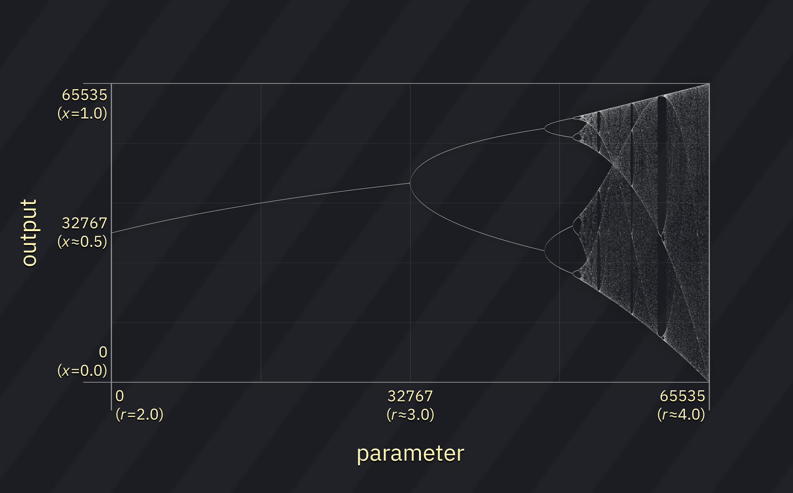

# Bifurcator

this is a fantasy sound chip which uses a unique sound generation method: [logistic map](https://en.wikipedia.org/wiki/Logistic_map) iterations.

## usage

the core of the Bifurcator is the (iterative) logistic map function:

_x__n_+1 = _rx__n_(1 - _x__n_)

which when iterated across 2 ≤ _r_ ≤ 4 produces this graph:

in Bifurcator the current output (and initial "load value") ranges from 0 to 65535, which maps directly to _x_ in the range 0.0 to 1.0. the parameter ranges from 0 to 65535, which maps directly to _r_ in the range 2.0 to approximately 4.0.

### load value

the first value of _x_ is set with the **load value**. it must be set to a non-zero value, otherwise the next iteration would also be zero... and the next one too... and so on, generating silence. default is 1.

different load values will cause different "attack" sounds before the iterations stabilize (if they do).

### parameter

by varying the parameter, the values of _x_ may change drastically, producing a variety of sounds. the higher the parameter, the more "chaos" is present, effectively yielding noise.

for most parameter values below 32768 the output converges to a single value (effectively no sound).

above 32768 the output starts to oscillate. from 32768 to 47496, it bifurcates to oscillate between between 2 values, generating a square wave. from 47497 to 51433, it bifurcates again and becomes a period of 4 values. beyond that, the system rapidly becomes chaotic (noise). there's an "island of stability" starting at around parameter value 59914 where the output oscillates between 3 values, then bifurcates from there.

the default parameter value is 47360.

## effects

- `10xx`: **set low byte of load state.**
- `11xx`: **set high byte of load state.**
- `12xx`: **set low byte of parameter.**
- `13xx`: **set high byte of parameter.**

## info

this chip uses the [Bifurcator](../4-instrument/bifurcator.md) instrument editor.
