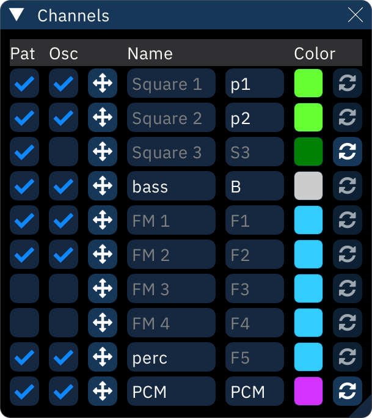

# channels

the "Channels" dialog allows manipulation of the song's channels.

each channel has the following options:
- **Pat**: uncheck the box to hide the channel from the pattern view. pattern data will be kept.
- **Osc**: uncheck the box to hide the channel from the per-channel oscilloscope view.
- : click and drag to rearrange pattern data throughout the song. shift-click and drag to copy pattern data.
  - note: this does **not** move channels around! it only moves the channel's pattern data.
- **Name**: the name displayed at the top of each channel in the pattern view.
- the next setting is "short name", which is displayed in the orders view and/or when a channel is collapsed.
- color: selects a custom color to be used in pattern view headers and other channel indicators.
- : resets channel color to default.
