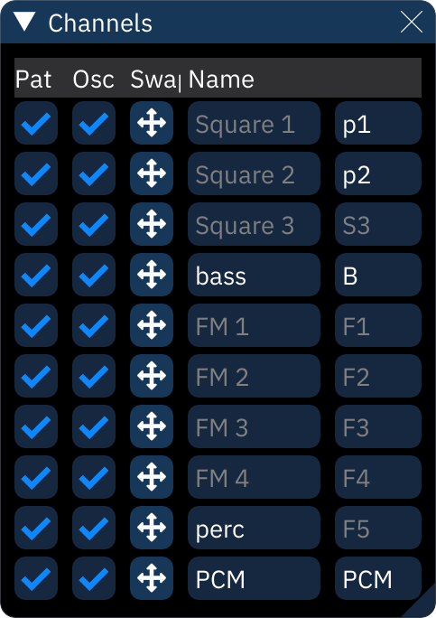

# channels

the "Channels" dialog allows manipulation of the song's channels.

each channel has the following options:
- **Visible**: uncheck the box to hide the channel from view. pattern data will be kept.
- crossed-arrows button: click and drag to rearrange pattern data throughout the song.
  - note: this does _not_ move channels around within a chip! it only affects pattern data.
- **Name** is the name displayed at the top of each channel in the tracker view.
- to the right of that is the abbreviation used above each channel in the order view.
