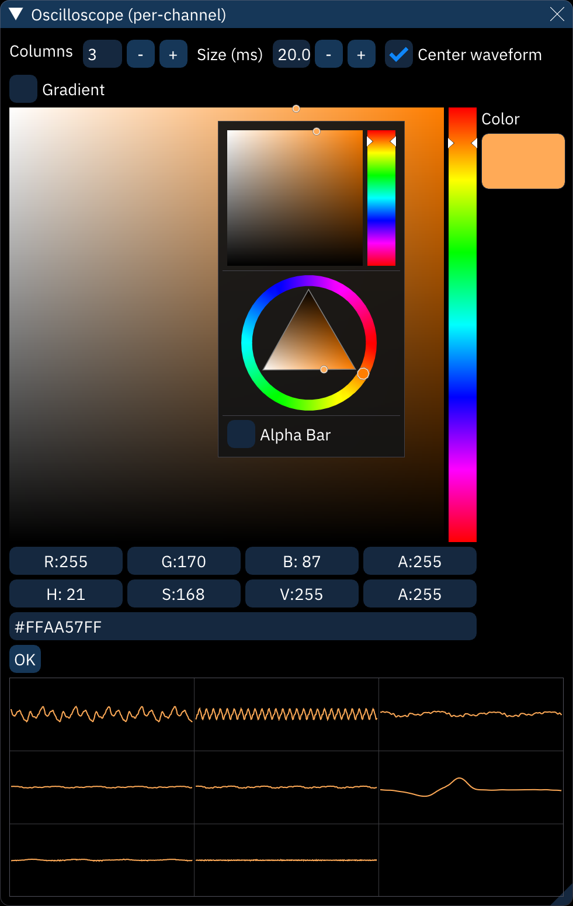
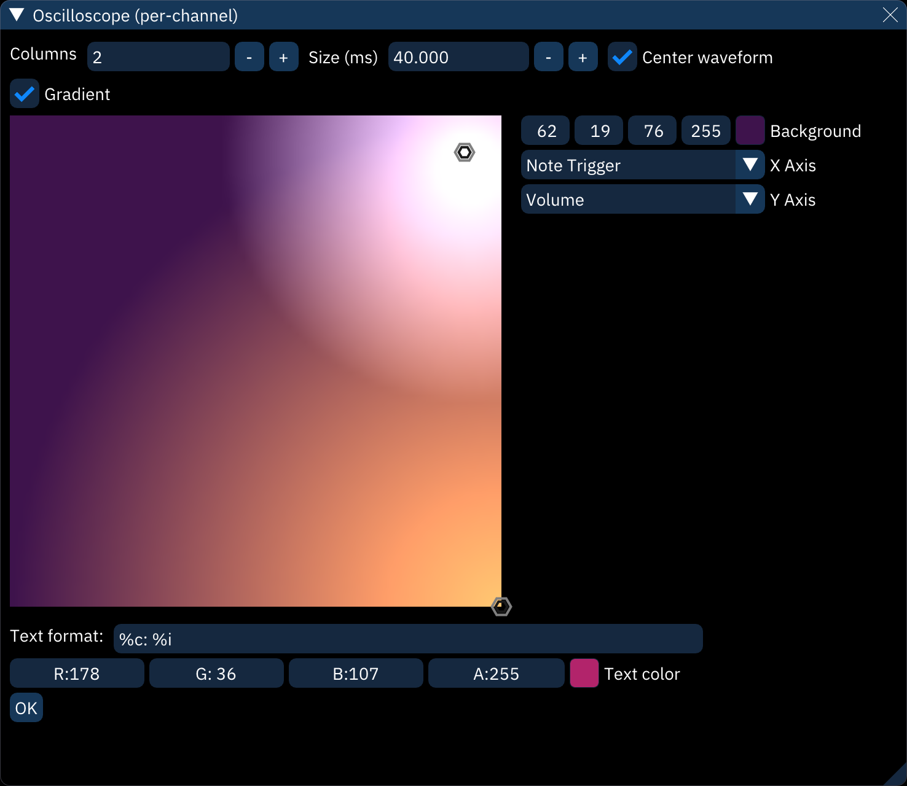

# oscilloscope (per-channel)

the "Oscilloscope (per-channel)" window displays several oscilloscope views (one per channel).

right-clicking the view will display the configuration view shown above:
- **Columns**: sets the amount of columns for the oscilloscope views.
- **Size (ms)**: sets how much of a channel's output is captured for the oscilloscope view.
- **Center waveform**: when enabled, the displayed waveforms will be centered using an auto-correlation algorithm.
- **Automatic columns**: sets the number of columns based on the number of channels.
  - **Off**: use the Columns setting.
  - **Mode 1**: always fewer columns than rows.
  - **Mode 2**: bias slightly toward more columns.
  - **Mode 3**: always more columns than rows.
- **Amplitude**: scales amplitude for all oscilloscope views.
- **Line size**: controls line thickness.
- **Gradient**: this allows you to use a gradient for determining the waveforms' colors instead of a single color. see the gradient section for more information.
  - if this option is off, a color selector will be displayed. right-click on it for some options:
    - select between the square selector and the color wheel selector.
    - **Alpha bar**: display an opacity bar.
- **Text format**: this allows you to display some text on each oscilloscope view. the following codes may be used:
  - `%c`: channel name
  - `%C`: channel short name
  - `%d`: channel number (starting from 0)
  - `%D`: channel number (starting from 1)
  - `%n`: channel note
  - `%i`: instrument name
  - `%I`: instrument number (decimal)
  - `%x`: instrument number (hex)
  - `%s`: chip name
  - `%p`: chip part number
  - `%S`: chip ID
  - `%v`: volume (decimal)
  - `%V`: volume (percentage)
  - `%b`: volume (hex)
  - `%l`: new line
  - `%%`: percent sign

click on OK to return to the main view.

## gradient

when enabling the Gradient setting, a gradient view is displayed in where circular "points" can be placed.
each point adds a color spot.
the resulting image is used to look up the waveform's color as determined by each axis.

- right-click to place a point.
- left-click on a point to change its color:
  - a color picker is displayed, alongside two settings.
  - **Distance**: the size of the circle.
  - **Spread**: the size of the solid center of the circle. increasing it fills more of the circle with the color.
- middle-click on a point to delete it.

- **Background**: sets the gradient's background color.
- **X Axis**: determines what the horizontal axis maps to.
- **Y Axis**: determines what the vertical axis maps to. these can be set to the following:
  - **None (0%)**: always left or bottom
  - **None (50%)**: always center
  - **None (100%)**: always right or top
  - **Frequency**: changes color with frequency
  - **Volume**: changes color with volume
  - **Channel**: changes color based on channel number (first channel is 0% and last is 100%)
  - **Brightness**: currently does nothing
  - **Note Trigger**: changes color when a new note is played
