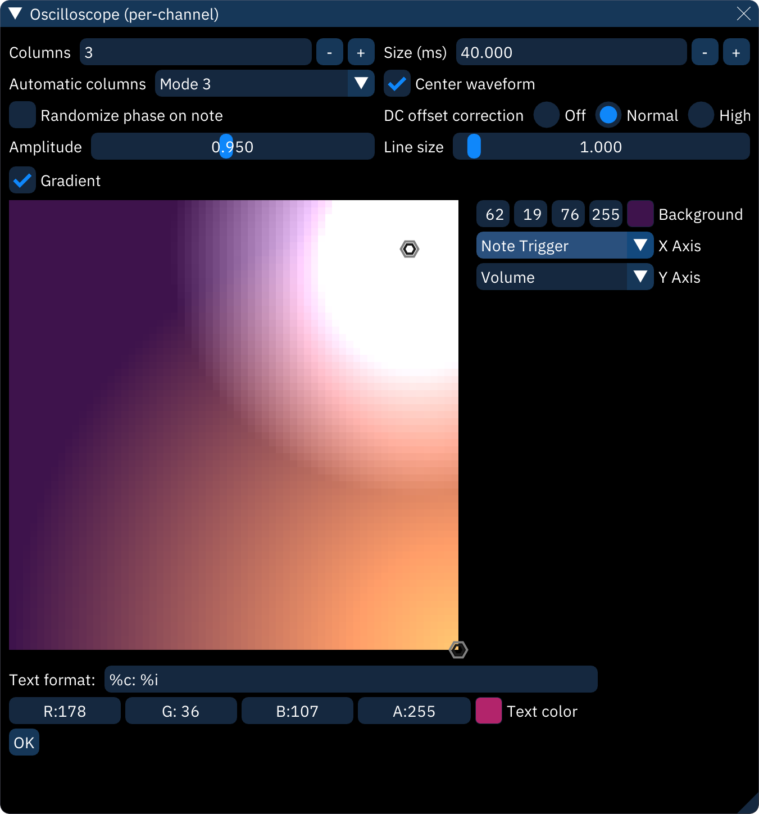

# oscilloscope (per channel)

the "Oscilloscope (per channel)" dialog shows an individual oscilloscope for each channel during playback.

right-clicking within the view will change it to the configuration view shown above:
- **Columns**: arranges oscilloscopes into this many columns.
- **Size (ms)**: sets what length of audio is visible in each oscilloscope.
- **Center waveform**: does its best to latch the waveform to the channel's note frequency and centers the display.
- **Gradient**: see below.
- the color selector sets the waveform color. right-clicking on it pops up an option dialog:
  - select between the square selector and the color wheel selector.
  - **Alpha bar**: adds a transparency selector.
- the boxes below that are for selecting colors numerically by red-green-blue-alpha, hue-saturation-value-alpha, and HTML-style RGBA in hex.
- **Text format**: this string determins what text is shown in the top-left of each oscilloscope. it can be any text, and the following shortcodes will be replaced with information about the channel:
  - `%c`: channel name
  - `%C`: channel short name
  - `%d`: channel number (starting from 0)
  - `%D`: channel number (starting from 1)
  - `%i`: instrument name
  - `%I`: instrument number (decimal)
  - `%x`: instrument number (hex)
  - `%s`: chip name
  - `%S`: chip ID
  - `%v`: volume (decimal)
  - `%V`: volume (percentage)
  - `%b`: volume (hex)
  - `%%`: percent sign
- The OK button returns from options view to the oscilloscopes.

## gradient

in this mode, the color selector is replaced by a square field onto which circular "stops" can be placed. each stop adds a soft circle of color. the resulting image is used to look up the oscilloscope color as determined by each axis.

- right-click to place a stop.
- left-click on a stop to change its color. the color selector is the same as above, with two additions:
  - **Distance**: the size of the circle.
  - **Spread**: the size of the solid center of the circle. increasing it fills more of the circle with the target color.

- **Background**: sets background color for entire field.
- **X Axis**: determines what the horizontal maps to, from left to right.\
  **Y Axis**: determines what the vertical maps to, from bottom to top. these can be set to the following:
  - **None (0%)**: stays at the left or bottom.
  - **None (50%)**: stays at the center.
  - **None (100%)**: stays at the right or top.
  - **Frequency**: changes color with note frequency.
  - **Volume**: changes color with volume.
  - **Channel**: changes color based on channel number.
  - **Brightness**: {{document this}}
  - **Note Trigger**: changes color when a new note is played.
