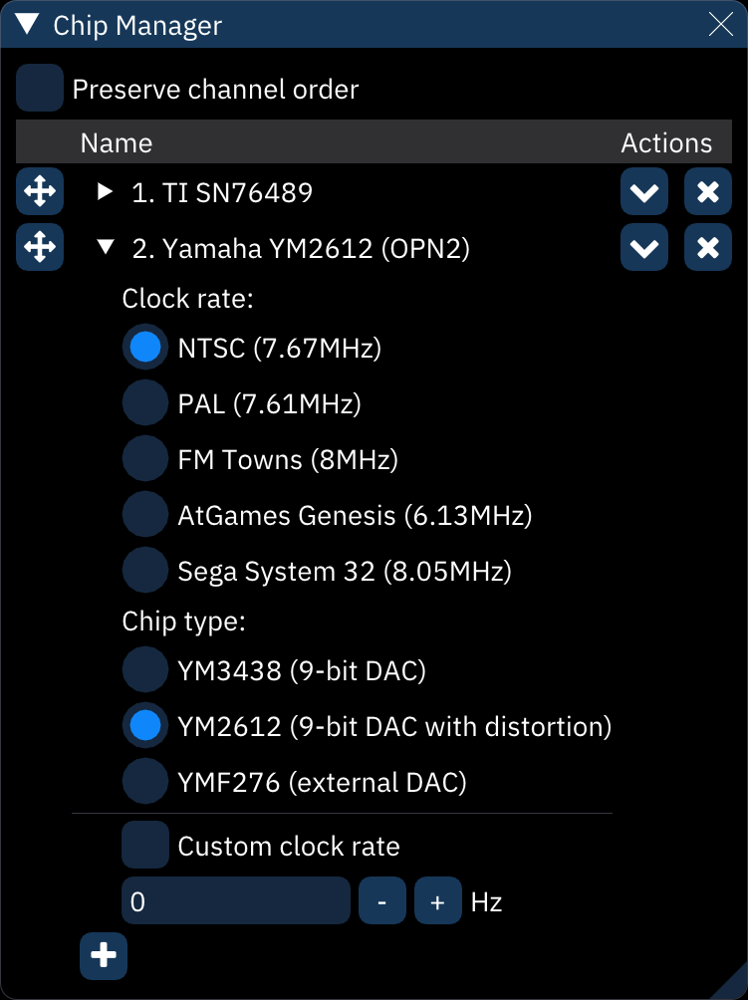

# chip manager

the **chip manager** window allows you to manage chips, including adding, changing, moving or removing them.

**Preserve channel order**: make existing pattern data stay in place even when chips are rearranged. when turned off, pattern data will be arranged to match (the default, and usually desired behavior).

**Clone channel data**: when cloning chips, also copy patterns, pattern names, channel names and other parameters to the clone.

**Clone at end**: instead of inserting the clone directly after the cloned chip, add it to the end.

each chip shows an "LED" row with segments corresponding to its channels. (they light up when a new note plays!)

to move a chip around, click and drag the  button to the left.

to clone a chip, click the  button to the right.

to replace a chip with a different one, click the  button. this will display the chip selector.

to remove a chip, click the  button.

to configure a chip, click the   to the right of the LEDs. this allows you to change chip options such as clock rate, chip type, and so on. refer to [each chip's documentation](../7-systems/README.md) for more information on its options. 
