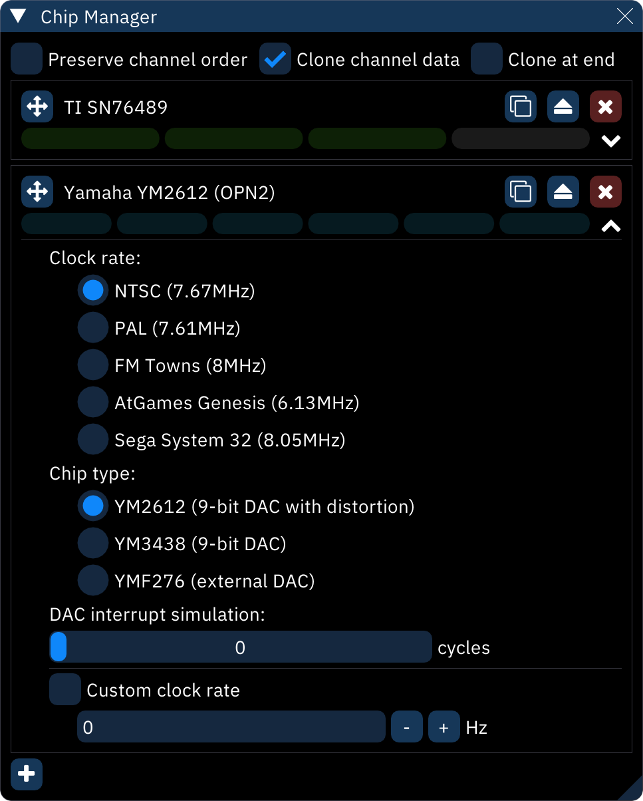

# chip manager

the **chip manager** window does exactly what it says.

**Preserve channel order**: make existing pattern data stay in place even when chips are rearranged. if turned off, pattern data will rearrange to match (the default, and usually the desired behavior).

to move a chip around, click and drag the  button to its left.

to replace a chip with a different one, click the  and select the replacement.

to remove a chip entirely, click the  button.

click a chip's name to open its options, where one can set clock rate, chip variant, and other specifics.