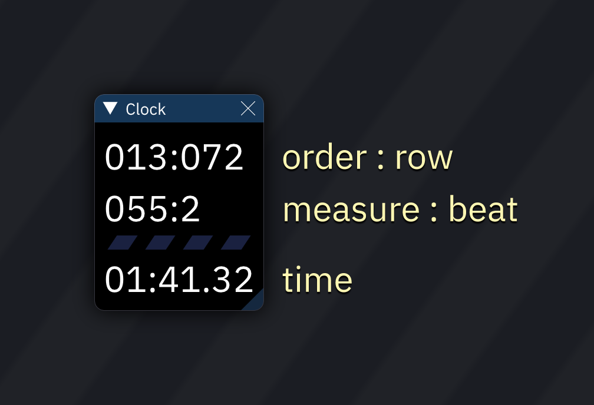

# clock

The clock shows the current playback position relative to the start of the song:

- order : row
- measure : beat (as defined by row highlight settings)
- beat
- elapsed time in minutes:seconds.hundredths
