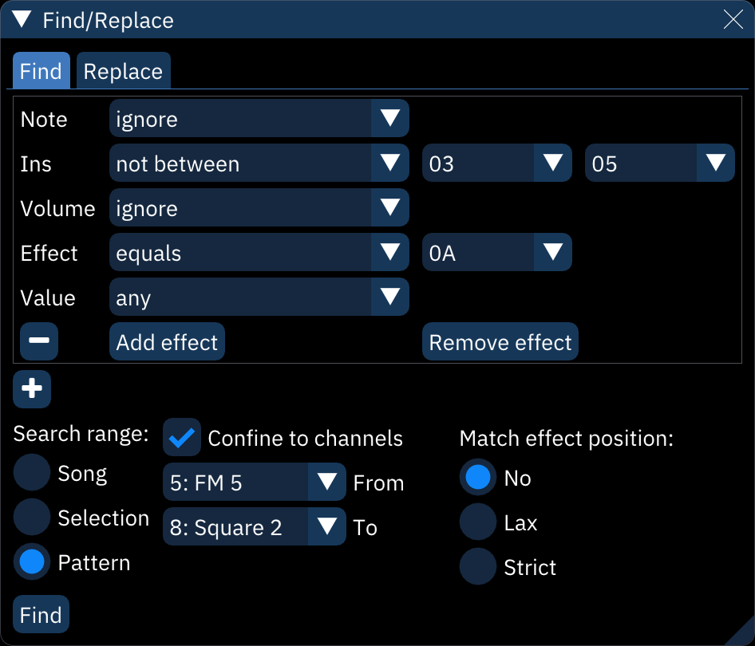
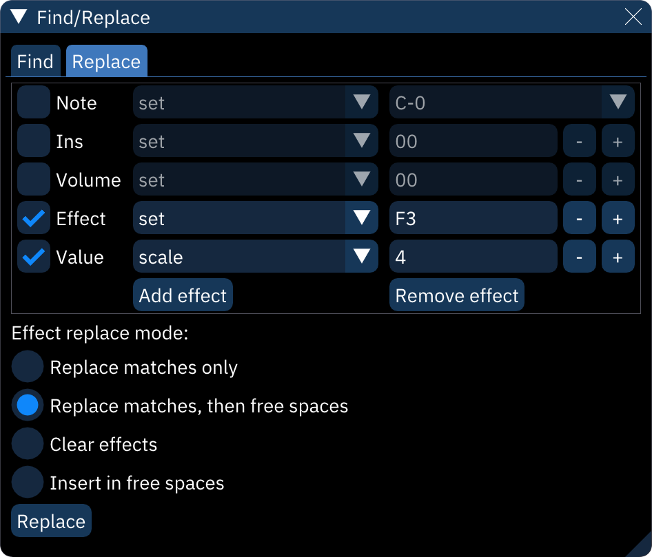

# find/replace

Furnace has a powerful find-and-replace function that can take the repetitive work out of mass editing.

## find

all data that can be found within a pattern can be searched for here.

a query contains:

- **Note**: note.
- **Ins**: instrument.
- **Volume**: volume.
- **Effect**: effect type.
- **Value**: effect value.

all of these have the following choices for what data will be found:

- **ignore**: ignore this.
- **equals**: match the given value exactly.
- **not equal**: match everything but the given value.
- **between**: match anything between and including the given values.
- **not between**: match anything outside the given range of values.
- **any**: match all values.
- **none**: match blanks only.

the following options also are available:

- **-**: remove query. if only one query exists, it is cleared.
- **Add effect**: adds another Effect and Value to the query, each set representing additional effects columns.
- **Remove effect**: removes last Effect and Value from the query.
- **+**: adds another query.

- **Search range**: restricts search range to the whole **Song**, the current **Selection**, or the currently viewed **Pattern**.
- **Confine to channels**: restricts to the selected channels and the channels between them.
- **Match effect position**: chooses how the order of effect types and effect values will matter when finding them.
  - **No**: no attention is paid to what order the effects appear in.
  - **Lax**: matches effects if they appear in the same order as selected above.
  - **Strict**: effects may only match in their corresponding effects columns.

- **Find**: finds everything that matches the query and displays it in a list.
  - the **order**, **row**, and **channel** columns are as they say.
  - the **go** column of buttons will take you to the location of the result.

## replace

you may select any of these to replace:

- **Note**: note.
- **Ins**: instrument.
- **Volume**: volume.
- **Effect**: effect type.
- **Value**: effect value.

all of these have the following choices for how they alter matches:

- **set**: changes matched data to this value.
- **add**: adds this value to matched data. it may be negative for subtraction. notes are calculated in semitones.
- **add (overflow)**: as "add" above, but values will wrap around; for example, adding 13 to `FF` will result in `0C`.
- **scale**: multiply value to this percentage; for example, scaling `1A` by `150` results in `27`. not available for "note".
- **clear**: erases matched data.

the following options also are available:

- **Add effect**: adds another Effect and Value to be replaced according to how they were found.
- **Remove effect**: removes last Effect and Value.
- **Effect replace mode**:
  - **Replace matches only**: replaces only the effect columns that match.
  - **Replace matches, then free spaces**: replaces matched effects; if there are effect columns without data, those will be filled in with the additional effect replacements.
  - **Clear effects**: overwrites effect data with replacement effects.
  - **Insert in free spaces**: replaces nothing; replacement effects are inserted in free effects columns when available.

- **Replace**: performs the query specified in the Find tab and replaces it as directed.
