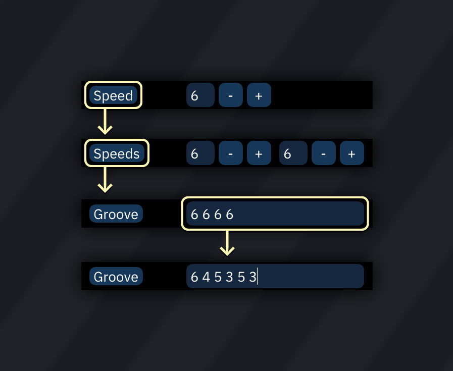
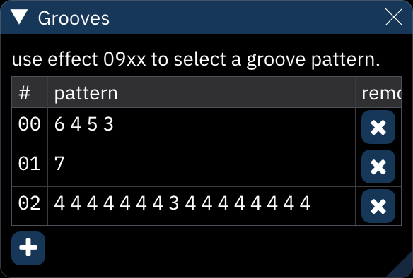

# grooves

a **groove** is the equivalent of repeating `0Fxx` effects on each row to get a cycle of speeds. for example, a groove of "6 4 5 3" makes the first row 6 ticks long, the next row 4 ticks, then 5, 3, 6, 4, 5, 3...

to set the song's groove:
- go to the [Speed](../2-interface/song-info.md#speed) window (window > tempo > speed).
- click the "Speed" button so it becomes "Speeds" (effectively a groove of two speeds).
- click again so it becomes "Groove".
- enter a sequence of up to 16 speeds.

the "Grooves" window displays the list of groove patterns in the song.
- the **`+`** button adds a new groove pattern; click in the groove pattern to edit it.
- the **`×`** buttons remove them.

a single `09xx` command will switch to the matching numbered groove pattern.

## tempo

this is a non-exhaustive list of grooves and their equivalent tempo in BPM when using NTSC or PAL tick rates (60 or 50) and row highlight values of 4 and 16. for more accurate tempos, differing tick rates, or differing row highlight values, use this [groove calculator](https://pineight.com/ft/calcgroove.html) (courtesy of Damian Yerrick).

BPM NTSC | BPM PAL | groove                 | | BPM NTSC | BPM PAL | groove
--------:|--------:|:-----------------------|-|---------:|--------:|:----------------------
  100.00 |   83.33 | 9                      | |   168.75 |  140.63 | 6, 5, 5
  102.86 |   85.71 | 9, 9, 9, 8             | |   171.43 |  142.86 | 6, 5, 5, 5
  103.85 |   86.54 | 9, 9, 8                | |   175.61 |  146.34 | 6, 5, 5, 5, 5, 5, 5, 5
  105.88 |   88.24 | 9, 8                   | |   180.00 |  150.00 | 5
  108.00 |   90.00 | 9, 8, 8                | |   184.62 |  153.85 | 5, 5, 5, 5, 5, 5, 5, 4
  109.09 |   90.91 | 9, 8, 8, 8             | |   189.47 |  157.89 | 5, 5, 5, 4
  112.50 |   93.75 | 8                      | |   192.86 |  160.71 | 5, 5, 4
  114.29 |   95.24 | 8, 8, 8, 8, 8, 8, 8, 7 | |   194.59 |  162.16 | 6, 4, 5, 4, 5, 4, 5, 4
  116.13 |   96.77 | 8, 8, 8, 7             | |   200.00 |  166.67 | 5, 4
  118.03 |   98.36 | 9, 7, 8, 7, 8, 7, 8, 7 | |   205.71 |  171.43 | 5, 4, 5, 4, 5, 4, 4, 4
  120.00 |  100.00 | 8, 7                   | |   207.69 |  173.08 | 5, 4, 4
  122.03 |  101.69 | 8, 7, 8, 7, 8, 7, 7, 7 | |   211.76 |  176.47 | 5, 4, 4, 4
  124.14 |  103.45 | 8, 7, 7, 7             | |   218.18 |  181.82 | 5, 4, 4, 4, 4, 4, 4, 4
  126.32 |  105.26 | 8, 7, 7, 7, 7, 7, 7, 7 | |   225.00 |  187.50 | 4
  128.57 |  107.14 | 7                      | |   232.26 |  193.55 | 4, 4, 4, 4, 4, 4, 4, 3
  130.91 |  109.09 | 7, 7, 7, 7, 7, 7, 7, 6 | |   240.00 |  200.00 | 4, 4, 4, 3
  133.33 |  111.11 | 7, 7, 7, 6             | |   245.45 |  204.55 | 4, 4, 3
  135.00 |  112.50 | 7, 7, 6                | |   248.28 |  206.90 | 5, 3, 4, 3, 4, 3, 4, 3
  135.85 |  113.21 | 8, 6, 7, 6, 7, 6, 7, 6 | |   257.14 |  214.29 | 4, 3
  138.46 |  115.38 | 7, 6                   | |   266.67 |  222.22 | 4, 3, 4, 3, 4, 3, 3, 3
  141.18 |  117.65 | 7, 6, 7, 6, 7, 6, 6, 6 | |   270.00 |  225.00 | 4, 3, 3
  142.11 |  118.42 | 7, 6, 6                | |   276.92 |  230.77 | 4, 3, 3, 3
  144.00 |  120.00 | 7, 6, 6, 6             | |   288.00 |  240.00 | 4, 3, 3, 3, 3, 3, 3, 3
  146.94 |  122.45 | 7, 6, 6, 6, 6, 6, 6, 6 | |   300.00 |  250.00 | 3
  150.00 |  125.00 | 6                      | |   327.27 |  272.73 | 3, 3, 3, 2
  153.19 |  127.66 | 6, 6, 6, 6, 6, 6, 6, 5 | |   337.50 |  281.25 | 3, 3, 2
  156.52 |  130.43 | 6, 6, 6, 5             | |   360.00 |  300.00 | 3, 2
  158.82 |  132.35 | 6, 6, 5                | |   385.71 |  321.43 | 3, 2, 2
  160.00 |  133.33 | 7, 5, 6, 5, 6, 5, 6, 5 | |   400.00 |  333.33 | 3, 2, 2, 2
  163.64 |  136.36 | 6, 5                   | |   450.00 |  375.00 | 2
  167.44 |  139.53 | 6, 5, 6, 5, 6, 5, 5, 5 | |   900.00 |  750.00 | 1 
