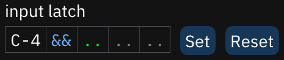

# input latch

input latch determines which data are placed along with a note. as in the pattern view, the columns are note (not changeable), instrument, volume, effect type, and effect value.
- `&&` fills in the currently selected instrument.
- `..` ignores the column.
- all columns (except note) can be reset with a right-click.
- **Set**: sets latch according to the data found at the cursor.
- **Reset**: resets all columns to default (selected instrument, ignore others).
- only the first effect type and effect value may be latched.
