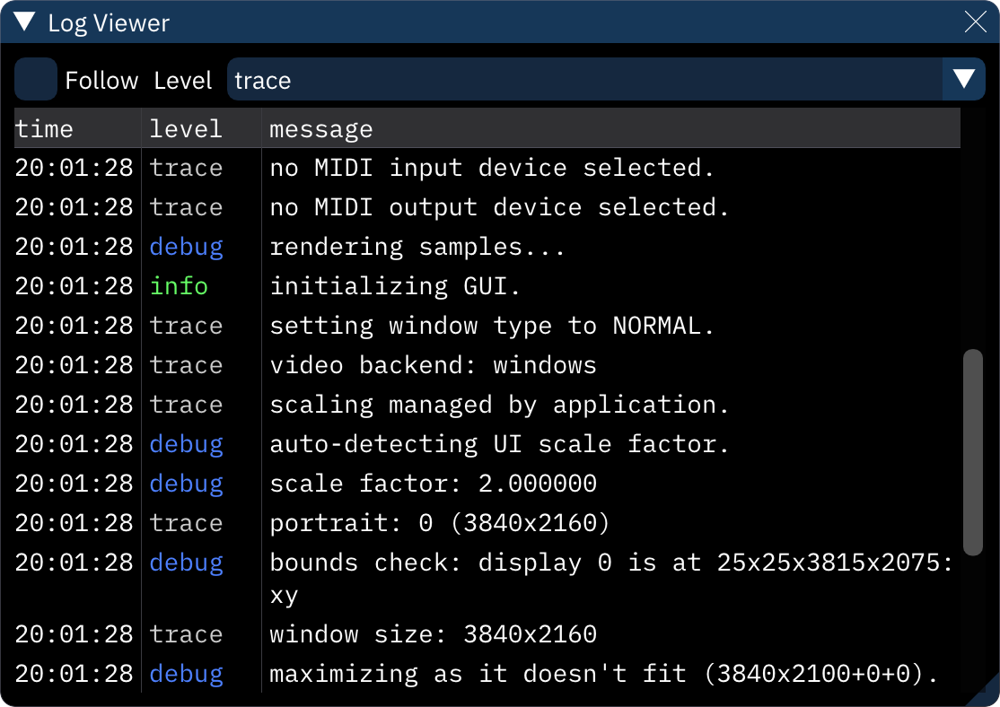

# log viewer

the log viewer provides a look at Furnace's internal messages. this can be useful for chasing down problems.

if the **Follow** checkbox is enabled, the log will snap to the bottom and continually scroll to show the newest messages. if disabled, it will stay put on what's currently shown.

the **Level** dropdown determines the minimum importance of the messages displayed.

| level | message shown |
|---|---|
| ERROR | serious problem |
| warning | may or may not be a problem |
| info | significant information |
| debug | general info about what Furnace is doing |
| trace | detailed info useful only to developers |
