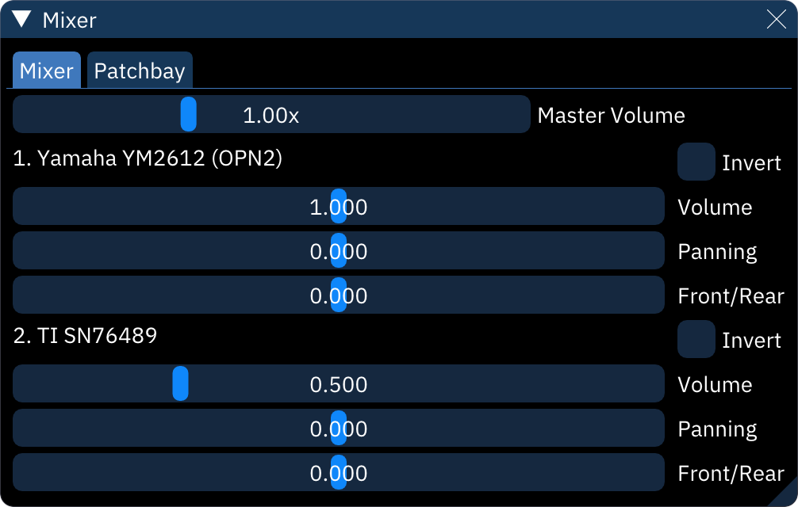

# mixer

the "Mixer" dialog provides options for overall sound mixing.

## "Mixer" tab

**Master Volume** controls the overall mix.

each chip has several options:
- **invert**: inverts the output wave.
- **volume**: controls the chip's volume relative to other chips.
- **panning**: left-right balance.
- **fade**: front-rear balance. only useful for setups with four or more speakers.

settings for the mixer display can be found in Settings > Appearance near the bottom.

## "Patchbay" tab

- **Automatic patchbay**: make appropriate connections when adding, removing, or changing chips and chip settings.
- **Display hidden ports**: shows all available connection ports. the "System" unit actually has 16 ports; 1 maps to the left channel, and 2 maps to the right.
- **Display internal**: hows two additional units, one for sample previews and one for the metronome sound.

the graph shows each existing unit along with their outputs, inputs, and the "patch cables" connecting them. connections can be made by dragging between an output and an input. right-clicking on a unit gives the option to disconnect all patches from that unit.
