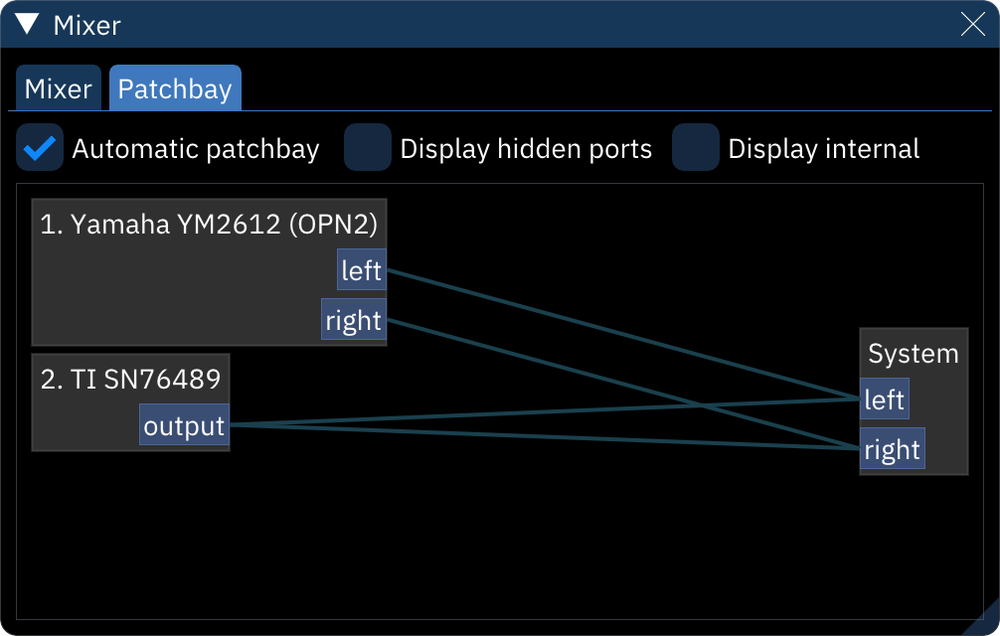

# mixer

the "Mixer" dialog provides options for overall sound mixing.

## "Mixer" tab

 <!--new image(s) needed!-->

**Master Volume** controls the overall mix.

each chip has several options:
- **Invert**: flips the output wave.
- **Volume**: controls the chip's volume relative to other chips.
- **Panning**: left-right sound control.
- **Front/Rear**: front-read sound control. only useful for setups with four or more speakers.

### Mixer-specific settings <!--in settings-->
- **Mixer layout**: how the mixer is shown.
  - **Horizontal**: arranges the "chips"<!--reword!--> horizontally, with vertical volume sliders.
  - **Vertical**: arranges the "chips"<!--ditto--> vertically, with horizontal volume sliders.
- **Mixer style**:
  - **No volume meters**: does not show per-chip volume meters.
  - **Volume meters separate**: shows per-chip volume meters below or to the right (depending on the layout) of the volume slider.
  - **Volume meters in volume sliders**: shows per-chip volume meters inside the volume sliders.

## "Patchbay" tab

- **Automatic patchbay**: make appropriate connections when adding, removing, or changing chips and chip settings.
- **Display hidden ports**: shows all available connection ports. the "System" unit actually has 16 ports; 1 maps to the left channel, and 2 maps to the right.
- **Display internal**: hows two additional units, one for sample previews and one for the metronome sound.

the graph shows each existing unit along with their outputs, inputs, and the "patch cables" connecting them. connections can be made by dragging between an output and an input. right-clicking on a unit gives the option to disconnect all patches from that unit.
