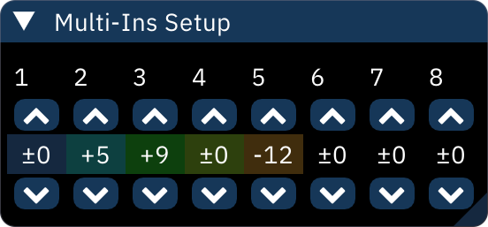

# multi-instrument playback

the instrument list allows you to select up to 8 instruments by shift-clicking. doing so engages multi-instrument playback mode, where note input will play multiple instruments at once (as channel limits allow).

the following window also appears.

clicking the arrows will set the note offset (in semitones) for each selected instrument. clicking a column resets it to zero. right-clicking the arrows will change their value by a full octave.

multi-instrument playback cannot be used while polyphony is set to "Mono".
