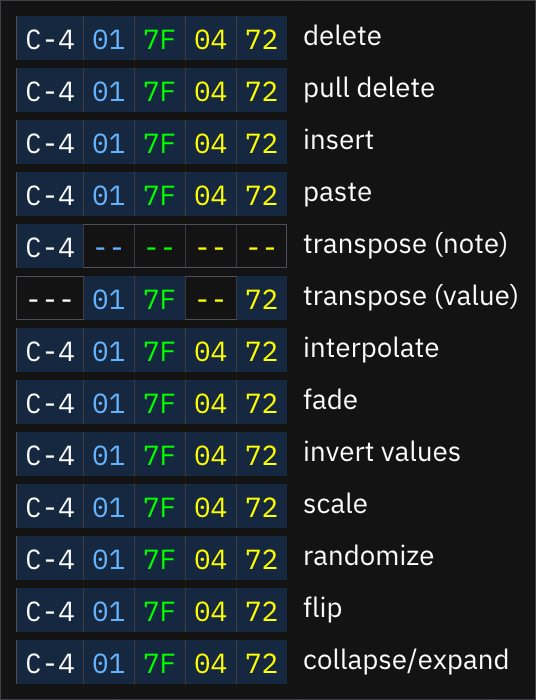

# operation mask

the operation mask toggles which columns will be affected by the listed operations. as in the pattern view, the columns are note, instrument, volume, effect types, and effect values. the effect toggles apply to all effect columns.

click any area to toggle it. a `---` or `--` means the operation will ignore any data in that column.