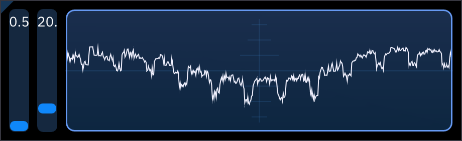

# oscilloscope

the Oscilloscope shows the audio output as a waveform.

right-clicking on the oscilloscope toggles adjustment sliders:
- waveform height (zoom)
- window size (how much of the output to display) in milliseconds.
- level () (hovering it shows the level as a horizontal line)
- trigger (off/rising edge/falling edge)

how trigger works
it aligns the waveform to where it crosses the level, like an analog oscilloscope
rising edge it aligns where the wave goes up
falling edge it aligns where the wave goes down

<!--maybe have some images of the different types?-->
<!--maybe document the relevant settings in settings here too?-->

