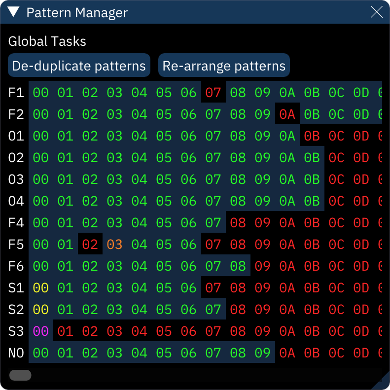

# pattern manager

the pattern manager is useful for cleaning up stray patterns and as an overview of pattern usage.

**De-duplicate patterns** looks for matching patterns, eliminates all but the first instance, and changes all references in the order list to match.

**Re-arrange patterns** renumbers patterns to be in sequence, along with changing all references in the order list to match.

**Sort orders** renumbers orders and re-arranges patterns so that they are in order.

**Make patterns unique** will clone all patterns that have been used more than once.

the pattern grid shows each channel and all its patterns. these are color-coded to show how much they're used in the song; these colors can be changed in Settings.

| default color | name in Settings | meaning |
| --- | --- | --- |
| grey | Unallocated | pattern doesn't exist yet |
| red | Unused | exists but isn't in order list |
| green | Used | used only once in order list |
| yellow | Overused | used multiple times |
| orange | Really overused | used in half or more orders |
| magenta | Combo Breaker | the only used pattern in this channel! |

right-clicking a pattern will permanently delete it.
