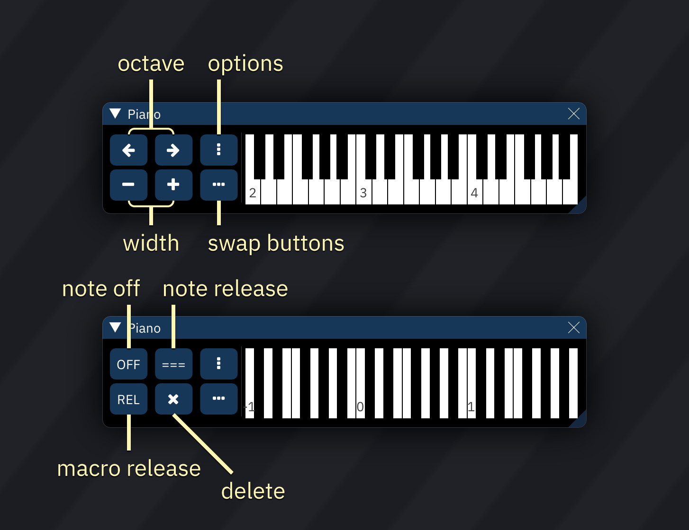

# piano / input pad

the piano serves as a non-keyboard interface to input notes.

the buttons at the left do the following:

|  |  |  |
| :---: | :---: | :---: |
| move one octave down | move one octave up | open options |
| fewer visible octaves | more visible octaves | swap buttons |

when swapped, the buttons do the following:

|  |  |  |
| :---: | :---: | :---: |
| input note off | input note release | open options |
| input macro release | delete | swap buttons |

every C key is labelled with its octave.

right-clicking on the piano keys will make the buttons disappear; right-clicking again brings them back.

## options

**Key layout:**
- **Automatic**
- **Standard**: black keys are 2/3 length.
- **Continuous**: black keys are full length.

**Value input pad:**
- **Disabled**
- **Replace piano**: replaces the piano with buttons for hexadecimal numeric entry when needed (when the pattern editor's cursor is in a hex column).
- **Split (automatic)**: displays a separate entry pad when needed.
- **Split (always visible)**: always displays the entry pad.

**Key labels:**
- **Off**
- **Octaves**
- **Notes**
- **Notes (with octave)**
- **Octaves (with C)**
- **Notes + Octaves**

**Key colors:**
- **Single color**
- **Channel color**
- **Instrument color**

**Share play/edit offset/range**: if disabled, the piano will keep different octave and range values for playback and non-playback states.

**Read-only (can't input notes)**: prevents note entry.
