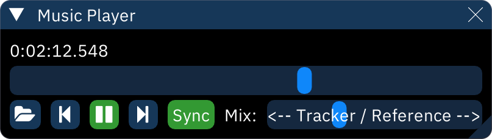

# reference music player

the Music Player window is a small audio player that can synchronize with the tracker playback.

below the time is the playback bar which can be used to scrub through the loaded file.

below that, from left to right:
- open file: choose an audio file to play.
- cue.
  - left click: set the cue position. this attaches the current time in the reference file to the position of the cursor in the pattern editor.
  - middle click: jump to the beginning of the reference track.
  - right click: opens a numeric entry box to set the cue position (offset between the tracker and the reference).
- play/pause.
- preview.
  - left click and hold to play the reference file from the correponding position of the current order.
  - right click and hold to play the reference file from the correponding position of the pattern editor's cursor.
  - **Sync**: toggles synchronization of reference playback with tracker playback.
  - **Mix:**: changes how loud the reference file is compared to the tracker.
  