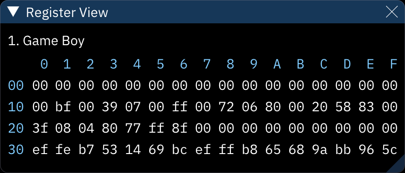

# register view

during playback, "Register View" shows the chips' registers (data involved with each operation).

the menu contains the following options:
- **Bytes per column**: sets the number of columns displayed. useful for aligning registers for convenient viewing and comparison.
