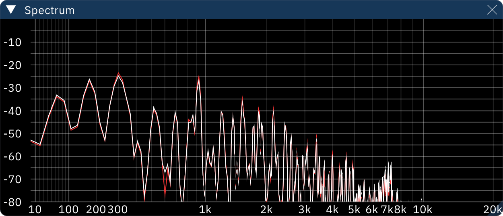

# spectrum

the Spectrum window shows the frequency spectrum of the audio output.

the X axis (horizontal logarithmic scale) is frequency in Hz, and the Y axis (vertical linear scale) is amplitude in decibels.

clicking the three-line "hamburger" button in the top right corner opens a configuration dialog.
- **Mono**: mix all output together to display a single line.
- **Bins**: number of bins for the FFT calculation. higher numbers increase frequency resolution but decrease temporal resolution (slower response).
- **X Zoom**: how much to zoom the X axis.
- **X Offset**: how much to move the X axis horizontally.
- **Y Offset**: how much to move the Y axis down.
- **Show X Grid**: whether to show the X axis grid lines.
- **Show Y Grid**: whether to show the Y axis grid lines.
- **Show X Scale**: whether to show the X axis scale.
- **Show Y Scale**: whether to show the Y axis scale.